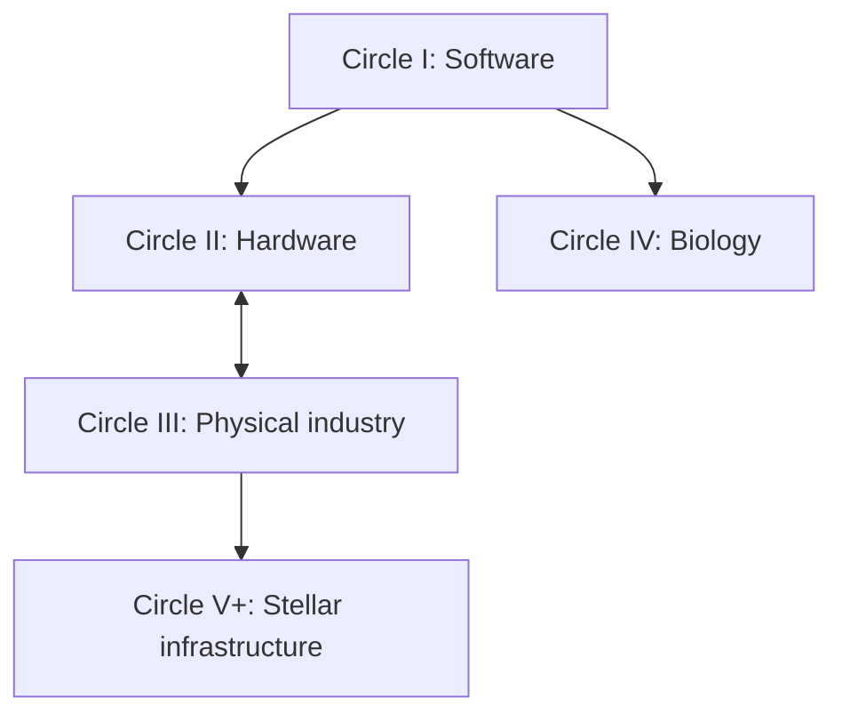

# AI-Level: From LLMs to a Type II Civilization

**Subtitle:** The Five Circles of Intelligence and the Grand Challenges on the Road to a Dyson Swarm

**Revised outline v2 — September 6, 2026 — for author review before chapter drafting**

## Revision basis

This revision preserves the seven-part structure of our first outline, as requested by the author, and incorporates the explicit challenge lists, loop-closure emphasis, evidence standards, and discussion of timescales from [book/OUTLINE_v0.md](https://github.com/integritynoble/sarsi-intelligence-level/blob/main/book/OUTLINE_v0.md), read at blob SHA `4125b31161d28a08017960b2af76a52915912e47`.

The linked ChatGPT conversation at `https://chatgpt.com/c/6a9ad40b-bb6c-83ea-b172-ff7b66e6848f` could not be retrieved in full. Related prior discussion was recovered, including candidate themes such as cancer, aging, regeneration, neurotechnology, autonomous factories, and off-world production. Those notes are contextual material, not a verified transcript of that exact conversation.

The principal change is structural: **each circle now has its own explicit portfolio of grand problems in the main contents, a dedicated grand-challenge chapter, candidate technologies, proposed evidence targets, and an invitation to contribute.** The portfolio contains forty proposed problems, eight per circle, as a manageable starting set for revision rather than a claim of completeness.

## Title and central thesis

**Recommended title:** AI-Level: From LLMs to a Type II Civilization

**Recommended subtitle:** The Five Circles of Intelligence and the Grand Challenges on the Road to a Dyson Swarm

Retain “Dyson sphere” as a familiar umbrella term within the book; develop the engineering argument around a swarm. Keep the title provisional until the author approves the revised contents.

**Central thesis:** Humanity expands its reach when humans and AI turn discoveries into reliable tools, organizations, and infrastructure that make previously unreachable problems tractable.

AI-Level theory describes the capabilities and development of the participating systems. Circle theory describes the substrates over which their improvement loops operate. The book connects those frameworks to concrete work: which problems matter, which approaches may solve them, how success can be recognized, and what each solution makes possible.

Intelligence development, energy scale, and human benefit remain separate assessments. A capability classification does not determine a civilization's purpose, and a growing precursor swarm does not by itself establish Type II energy use.

## Narrative map

These are the framework's principal enabling relationships. Full closure is not required before work on another domain can begin. Hardware and physical industry bootstrap each other; biology can advance alongside them; secondary feedbacks and shared technologies also matter. Track progress as a domain profile, not a single stage occupied by every person and institution.

The author's expression “centering into the next circle” can describe the growing importance of a new binding constraint after earlier capabilities become reliable. It should be defined as a change in the focus of a research and engineering program, not an automatic or simultaneous transition of humanity.

## How to read the grand-problem lists

The tables below are a proposed research agenda. Their evidence targets are directions for later operationalization, not already ratified benchmark thresholds or reports of achieved results. Each target must ultimately declare its domain, resource limits, reliability, controls, and independent evaluator.

The lists contain both enabling bottlenecks and major scientific or human-benefit goals. They do not assert that every problem is necessary for every path forward. Cancer treatment, for example, deserves sustained effort for human benefit without being a prerequisite for a Dyson swarm. Likewise, quantum computing, fusion, humanoid robots, and nanomanufacturing can be discussed as candidate technological routes without making any one of them mandatory.

## Prologue — From One Prompt to a Stellar Civilization

Begin with an explicitly imagined sequence: a useful answer becomes a reproducible method; the method becomes an instrument; the instrument improves a laboratory or factory; that institution produces capabilities that enable further discovery. Extend the view toward stellar infrastructure, then ask what must work at every link.

Use the bare LLM as the starting point. Do not introduce a formal “Circle 0,” which would change the established five-domain framework. Explain that a bare model's properties must be stated under its evaluation conditions and that an organizational coordinate should not be assigned as though a model were already an organization.

## Part I — AI-Level and the Circles of Progress

### Chapter 1. What Does an AI Level Measure?

Introduce cognition C, individual development I, organizational development O, task demand T, human cognitive intervention H, and operational self-awareness SA. Explain delegation at verified reliability, independently measured memory M, model–harness pairs, and gated U summaries. Distinguish ordinal capability levels from continuous index scores.

### Chapter 2. From Memory to Discovery

Introduce M0–M5/MΩ and I0–I5/IΩ. Explain persistence, learning, mechanism changes, improvement of improvement, discovery incorporation, and expansion of future discovery reach. Use controlled examples to show that storing information does not itself establish learning.

### Chapter 3. Organizations That Learn and Improve

Introduce O0–O5/OΩ and the seven roles: director, discoverer, instrument-maker, specialist, operator, referee, and promoter. Explain how humans and AI can fill complementary roles. Follow a discovery as it becomes a tool that less specialized agents can use reliably.

### Chapter 4. The Five Circles and Their Improvement Loops

Explain software, hardware, physical matter, biology, and stellar infrastructure. Introduce identify → implement → validate → deploy, partially compensated loops, external stop authority, and scope-specific closure. Present the hardware–physical bootstrap and parallel biological branch.

### Chapter 5. Progress, Bottlenecks, and Evidence

Explain loop period, resources, reliability, retained capabilities, independent evaluation, and physical constraints. Separate cognitive assistance from authorization. Show how a proposed theory can fail a test and be revised without moving the standard whenever a favored system fails.

## Part II — Circle I: Software That Improves Its Own Capabilities

**Circle question:** Can software reliably improve its operative capabilities through repeated, independently assessed cycles?

### Chapter 6. From a Language Model to a Reliable Agent

Planning, tools, grounded state, uncertainty, recovery, and extended project execution. Compare the same model in different harnesses.

### Chapter 7. Memory, Learning, and Continuity

Persistence across restarts, provenance, stale-state suppression, consolidation, repair, cross-project knowledge, and evidence that experience improves future behavior.

### Chapter 8. Improving the Mechanism and the Improvement Process

Develop the distinction between I3 changes to a declared cognitive mechanism Θ and I4 changes to the improvement process Ψ. Include retained capability, bounded write scope, cost-adjusted gain, and generation-by-generation comparisons.

### Chapter 9. Verification and Collective Software Discovery

Independent assessment and adoption, valid benchmarks, software correctness, collective research, and organizations that improve their own workflows.

### Chapter 10. The Circle I Grand Challenges

| ID | Grand problem | Candidate technologies and approaches | Proposed evidence target |
|---|---|---|---|
| I-01 | **Memory that supports reliable lifelong learning** | Persistent stores, provenance, consolidation, retrieval, memory repair | Experience improves unseen future tasks across genuine restarts, while protected earlier knowledge remains usable. |
| I-02 | **Dependable reasoning and long-horizon action** | Planning, world models, calibrated uncertainty, tool use, recovery | Extended tasks succeed under changing conditions within declared human-assistance and resource limits. |
| I-03 | **Verified cognitive self-improvement** | Versioned mechanisms, bounded changes, hidden evaluation, rollback | A genuine change to the operative cognitive mechanism improves held-out outcomes and preserves required capabilities. |
| I-04 | **Improvement of the improvement process** | Meta-optimization, candidate selection, experiment design, generation tracking | A changed improvement process produces better validated downstream gains per stated total cost than its control. |
| I-05 | **Autonomous discovery that expands future competence** | Hypothesis generation, experiments, theorem or algorithm discovery, reusable instruments | Novel results are independently verified and their incorporation enables further tasks or discoveries. |
| I-06 | **Verification that resists self-certification** | Independent evaluators, protected tests, external instruments, promotion rules | False acceptance and downstream regression are measured and reduced on independently assessed workloads. |
| I-07 | **Organizations of agents that learn and redesign themselves** | Persistent evidence, role allocation, routing, organizational experiments | With member models controlled, a changed coordination structure produces independently verified improvement. |
| I-08 | **A trustworthy measurement system for AI progress** | AI-Level Bench, anchored index designs, contamination controls, uncertainty estimates | Results are reproducible and distinguish capability, harness contribution, resource expenditure, and unearned claims. |

**Full closure target:** Within a declared software scope, identify, implement, independently validate, and adopt improvements as the operative baseline in repeated ordinary cycles without requiring a human decision to proceed in each cycle. External halt authority remains possible. One improved task score is insufficient evidence.

**What this enables:** Stronger research agents, scientific tools, engineering workflows, and organizational capabilities throughout the other circles.

**Call to this circle's contributors:** Build systems that retain, learn, improve, and report honest evidence. Accessible starting work includes restart-based memory comparisons, reliable completion tests, and independently evaluated improvement campaigns.

## Part III — Circle II: Intelligence Builds Its Computing Substrate

**Circle question:** Can an intelligent organization repeatedly produce and integrate the computing hardware needed for further development?

### Chapter 11. Designing the Next Computing System

Hardware–software co-design, architectures, electronic design automation, verification, and design for manufacture. Discuss alternative computing approaches by the bottlenecks they address.

### Chapter 12. From Design Files to a Working Fabrication Process

Qualification, contamination control, yield, metrology, drift correction, equipment maintenance, and reliable materials supply.

### Chapter 13. Compute, Energy, and Physical Reliability

Memory, interconnects, packaging, cooling, power, system lifetime, and integration. Distinguish useful workload performance from isolated component specifications.

### Chapter 14. The Circle II Grand Challenges

| ID | Grand problem | Candidate technologies and approaches | Proposed evidence target |
|---|---|---|---|
| II-01 | **End-to-end verified chip design** | EDA agents, formal verification, hardware–software co-design | Designs meet declared specifications when fabricated and tested, including integration requirements. |
| II-02 | **Autonomous fabrication operations** | Robotic equipment handling, process automation, fault recovery | Repeated production runs operate within declared intervention limits and recover from representative faults. |
| II-03 | **Measurement, yield, and process-drift control** | Inline metrology, process models, feedback control | Functional yield and quality remain within preregistered bounds under measured drift and disturbances. |
| II-04 | **Better devices, materials, and interconnects** | Device research, materials discovery, packaging, alternative architectures | Reproducible hardware gains survive manufacture, integration, and workload-level comparison. |
| II-05 | **More useful computation per unit of energy** | Efficient architectures, reduced data movement, algorithm–hardware co-design | Verified workload outcomes improve per measured system energy at comparable reliability. |
| II-06 | **Cooling and long-term hardware reliability** | Thermal engineering, monitoring, resilient packaging | Sustained operation meets thermal, error, lifetime, and maintenance targets at declared load. |
| II-07 | **Dependable equipment and materials supply** | Autonomous maintenance, qualified inputs, traceable supply chains | Critical inputs and equipment are replenished or repaired, with external dependencies explicitly reported. |
| II-08 | **Running on the hardware the system produced** | Characterization, deployment orchestration, compatible software stacks | Manufactured devices enter the producing system's real compute infrastructure and deliver verified useful work. |

**Full closure target:** Specify, design, fabricate at a declared viable yield, test, and integrate computing hardware into the system's own operations across repeated cycles. Designing a chip alone closes only part of this loop.

**What this enables:** Expanded computing capability and dependable electronics for physical automation.

**Call to this circle's contributors:** Connect AI design research to fabrication evidence, metrology, power, thermal engineering, and working systems.

## Part IV — Circle III: Industry That Maintains and Reproduces Itself

**Circle question:** Can a physical production system maintain itself and reproduce essential productive capabilities from declared resources?

### Chapter 15. Robots That Work Through Uncertainty

Perception, manipulation, adaptable control, diagnosis, repair, and operation outside prepared demonstrations. Choose robot forms by required work.

### Chapter 16. From Raw Materials to Functional Machines

Mining, refining, materials processing, precision tools, fabrication, assembly, logistics, and inspection. Treat the industrial network as the relevant system boundary.

### Chapter 17. Repair, Reproduction, and Industrial Lineage

Maintenance, replacement, productive copies, resource accounting, hidden imported dependencies, and the electronics needed for successor systems. Define what a copy must be able to do.

### Chapter 18. The Circle III Grand Challenges and the Hardware Bootstrap

| ID | Grand problem | Candidate technologies and approaches | Proposed evidence target |
|---|---|---|---|
| III-01 | **Robust perception and physical manipulation** | Embodied models, tactile sensing, adaptable control | Machines perform useful work across specified unfamiliar objects and environments, with failures counted. |
| III-02 | **Diagnosis, maintenance, and repair under unforeseen failure** | Condition monitoring, repair planning, modular design | Systems identify and recover from held-out faults while preserving verified productive capability. |
| III-03 | **Integrated production from raw materials** | Mining, refining, chemistry, materials processing | Declared feedstocks become functional components through an auditable, reproducible process. |
| III-04 | **Precision manufacture of complex machines and components** | Machine tools, additive processes, inspection, advanced manufacturing | Complete assemblies meet functional tolerances and reliability requirements, including critical electronics. |
| III-05 | **Logistics and resource cycles that sustain production** | Inventory models, scheduling, transport, recycling | Material flows remain accounted for and sustain operation under supply disruption and waste constraints. |
| III-06 | **Reproduction of productive capability** | Modular production cells, automated assembly, shared standards | A bounded system produces working successors with essential capabilities and all imported dependencies declared. |
| III-07 | **Reliable energy and supporting infrastructure** | Generation, storage, grids, water systems, resilient infrastructure | Industrial operation meets declared energy, reliability, cost, and environmental requirements. |
| III-08 | **Independent verification of physical outcomes** | Calibrated instruments, independent inspection, simulation-to-reality tests | Physical performance agrees with externally checked measurements rather than only a system's own simulation or report. |

**Full closure target:** Within a declared industrial boundary, identify needs, design and manufacture machinery, operate through failure, maintain or replace components, and reproduce essential productive functions using accounted-for resources. A universal self-replicator is a stronger claim than a bounded demonstration.

**What this enables:** Scalable infrastructure on Earth and production capabilities that can be adapted to off-world resources.

**Call to this circle's contributors:** Build and measure complete production chains. Improvements in robots support fabrication, and improved electronics support robots; develop the pair together.

## Part V — Circle IV: Biological Discovery That Improves Human Life

**Circle question:** Can scientific organizations repeatedly convert biological unknowns into validated knowledge and sustained human benefit?

### Chapter 19. AI Scientists and Causal Models of Life

Mechanistic questions, multiscale models, hypothesis generation, discriminating experiments, uncertainty, and transfer across biological contexts.

### Chapter 20. Laboratories That Learn From Experiments

Automated experiments, assay development, measurement, negative findings, replication, persistent evidence graphs, and new instruments.

### Chapter 21. From Discovery to Effective Interventions

Treatment design, delivery, manufacture, biological validation, clinical outcomes, monitored use, and access. Follow a discovery through the complete evidence chain.

### Chapter 22. The Circle IV Grand Challenges

| ID | Grand problem | Candidate technologies and approaches | Proposed evidence target |
|---|---|---|---|
| IV-01 | **Predictive and causal understanding across biological scales** | Mechanistic models, multi-omics, perturbation experiments | Predictions of intervention effects replicate in declared biological settings and reveal their limits of transfer. |
| IV-02 | **Autonomous discovery with reproducible experiments** | Self-driving laboratories, assay development, active learning | Independently replicated discoveries emerge from complete hypothesis–experiment–evidence cycles and inform later work. |
| IV-03 | **Better prevention and durable control of cancer** | Mechanism research, early detection, treatment discovery | Predefined cancer-specific programs demonstrate relevant clinical benefit and generalization; no single result is labeled a cure for all cancers. |
| IV-04 | **Understanding aging and extending healthy life** | Aging-mechanism research, longitudinal studies, validated interventions | Benefits appear in meaningful health and function outcomes, with risks and durability evaluated. |
| IV-05 | **Regeneration and replacement of damaged tissues and organs** | Regenerative medicine, tissue engineering, organ models | Restored function is independently demonstrated with durability, integration, and relevant safety endpoints. |
| IV-06 | **Understanding and treating brain and neurodegenerative disorders** | Neuroscience, neural measurement, disease models, targeted interventions | Reproducible mechanistic findings lead to measurable improvements in defined functional or clinical outcomes. |
| IV-07 | **Designing and delivering effective interventions** | Drug discovery, delivery systems, biologics, manufacturing | Therapeutic effects, targeting, reproducibility, and manufacturing quality hold under the declared deployment conditions. |
| IV-08 | **Translation into accessible, monitored population benefit** | Evidence systems, clinical evaluation, scalable manufacture, outcome monitoring | Benefits persist in practice across relevant populations, with access and adverse outcomes measured. |

**Closure and milestones:** The repository's full biological closure target extends from autonomous discovery through experimental and clinical validation to deployment, monitoring, and iteration. Laboratory milestones should be reported separately from that stronger target, with the roles of clinicians, consent, and accountable institutions explicit.

**What this enables:** Healthier lives, reduced suffering, resilience, and improved scientific understanding. These goals justify a parallel program regardless of the timing of stellar engineering.

**Call to this circle's contributors:** Organize around defined biological and clinical questions, replication, meaningful outcomes, and reusable instruments. Treat cancer, aging, and brain disorders as families of tractable subproblems rather than promises of a single universal solution.

## Part VI — Circle V+: From Orbital Industry to a Type II Civilization

**Circle question:** Can an orbital industrial system use harvested energy to expand its productive capacity faster than maintenance and failures consume it?

### Chapter 23. Establishing Industry Beyond Earth

Transport, prospecting, local feedstocks, extraction, refining, assembly, and progressively reduced dependence on Earth. Evaluate alternative locations without assuming a predetermined development path.

### Chapter 24. The Dyson Swarm as an Expanding Production System

Collectors, orbital manufacturing, productive reinvestment, component lifetime, repair, replacement, and recycling. Distinguish a collector installation from a self-expanding industrial loop.

### Chapter 25. Heat, Orbits, and Useful Energy

Energy conversion, use or transmission, waste-heat rejection, material limits, station-keeping, collision avoidance, and system stability.

### Chapter 26. Intelligence and Institutions Across Light-Minutes

Local autonomy, delayed messages, distributed evidence, fault containment, organizational adaptation, and durable human purposes. Present global-workspace bounds with their assumptions rather than as a universal definition of every possible mind.

### Chapter 27. The Circle V+ Grand Challenges and the Type II Milestone

| ID | Grand problem | Candidate technologies and approaches | Proposed evidence target |
|---|---|---|---|
| V-01 | **Viable off-world supply chains** | Transport, prospecting, local extraction, refining | Declared off-world resources support useful production with transport costs and imported dependencies accounted for. |
| V-02 | **Autonomous orbital construction and productive expansion** | Robotic assembly, orbital factories, component manufacture | Captured energy and available materials support sustained net growth after maintenance and replacement losses. |
| V-03 | **Durable, resource-efficient collectors** | Lightweight structures, photovoltaic or thermal systems, materials research | Useful energy output and lifetime meet stated resource, degradation, and maintenance requirements. |
| V-04 | **Conversion, distribution, and productive use of captured energy** | Power electronics, local consumption, storage, optional transmission | Net useful power supports declared workloads after conversion, distribution, and operating losses. |
| V-05 | **Waste-heat rejection at scale** | Radiators, thermal design, workload placement | Sustained industrial and computational activity remains within measured thermal limits. |
| V-06 | **Orbital stability and collision avoidance** | Navigation, traffic coordination, station-keeping | Infrastructure operates within independently assessed orbital and collision-risk bounds as density grows. |
| V-07 | **Long-duration repair, replacement, and reliability** | Fault diagnosis, resilient components, autonomous servicing | Productive function persists across realistic failures, degradation, and replacement cycles. |
| V-08 | **Reliable organization across distance and generations** | Delay-tolerant coordination, distributed verification, durable institutions | The network maintains evidence integrity, local resilience, and accountable coordination under delays and turnover. |

**Circle closure target:** An orbital production loop designs, builds, operates, and maintains collectors while using harvested energy to sustain net expansion of productive collection capacity.

**Separate Type II assessment:** Report the fraction of stellar output captured and used, useful power, maintained productive capacity, and sustained operation. An early self-expanding system does not establish stellar-scale energy use. Kardashev categories must not be identified with circle-closure categories; in particular, Type I does not mean that Circles I–IV are closed.

**What this enables:** Infrastructure and scientific activity supported by energy on a stellar scale, conditional on solving the engineering and organizational problems.

**Call to this circle's contributors:** Build the materials, production, thermal, orbital, and coordination capabilities needed for a system that can sustain itself and grow. Keep their nearer applications and independently testable milestones visible.

## Part VII — A Grand-Challenge Agenda for Humanity

### Chapter 28. A Living Atlas of Grand Problems

Build a proposed registry connecting the forty starting challenges to subproblems, dependencies, candidate approaches, demonstrations, replications, and unresolved objections. Give every problem a stable identifier and every claim an evidence status.

### Chapter 29. Institutions That Can Solve Hard Problems

Shared testbeds, independent evaluators, reproducibility funding, open tools, durable evidence, research prizes, and coordination across disciplines. Identify the resources and incentives that allow discoveries to become useful instruments.

### Chapter 30. Circle Time: Choosing Work Across Different Horizons

Explain how computation, fabrication, material transformation, biological endpoints, and infrastructure replacement create different project timescales. Use conditional scenarios rather than predicted dates for entire circles. Distinguish constraints fixed for a particular experiment from universal physical laws.

Prioritize by enabling value, human benefit, neglectedness, tractability, evidence quality, and cost. Protect exploratory research while developing immediate bottlenecks. Multiple circles can deserve sustained effort at the same time.

### Chapter 31. An Invitation to Build the Next Capability

Give concrete entry points to researchers, engineers, students, entrepreneurs, funders, and public institutions. Ask each contributor to choose a significant problem, identify dependencies, establish a test, produce evidence, and make the resulting capability usable by others.

The book's invitation: **Choose a problem whose solution creates a new capability. Demonstrate that it works. Make it available for the next person to build on.**

## Epilogue — The Future We Choose to Make Possible

Return to the chain in the prologue. Show the people, experiments, machines, institutions, and sustained work needed at each link. Keep useful human outcomes present throughout the journey, with the Dyson swarm as a long-term horizon.

## Connecting AI-Level to each circle

Use this table as a functional guide, not as a claim of proven minimum levels. Every concrete level claim needs the framework's own controls, retention requirements, resource envelope, and independent certification.

| Circle | Individual and memory contributions | Organizational contributions | World evidence |
|---|---|---|---|
| I | Persistent project state; experience-based learning; I3 mechanism change; I4 improvement-process change; discovery and instrument creation | Independent verification and adoption; adaptive allocation; tested workflow redesign | Executed software, hidden tests, retained capability, deployment records |
| II | Design reasoning, process memory, improved design tools, device and materials discovery | Coordination of design, fabrication, qualification, maintenance, and compute integration | Functional chips, yield, system energy, reliability, integration |
| III | Grounded control, machine history, adaptive operation, diagnostics, improved physical tools | Coordination of materials, machines, logistics, inspection, maintenance, and reproduction | Measured products, working successors, resource balance, independently inspected performance |
| IV | Mechanistic reasoning, M5 research lineage, persistent discovery processes, new assays and methods | Distributed scientific discovery, replication, laboratory redesign, translation into deployment | Replicated experiments, causal evidence, relevant biological and clinical outcomes |
| V+ | Local engineering reasoning, persistent infrastructure state, diagnosis, local method improvement | Delayed coordination, distributed evidence, fleet adaptation, sustained institutional continuity | Net productive growth, useful power, maintenance, orbital performance, captured stellar output |

Cognitive reasoning C, operational self-awareness SA, and the T/H delegation surface contribute in every circle. M remains independently tested alongside I. A high level in one coordinate does not establish loop closure, and OΩ or IΩ should not be declared necessary for every domain without a supporting argument.

## Standard problem-card format for later chapter drafting

1. **ID and name.** A stable identifier, such as IV-03.
2. **Human or enabling purpose.** Why this problem matters.
3. **Scope and boundary.** Which system, population, environment, or workload is included.
4. **Current evidence.** What is measured, replicated, simulated, or merely proposed, dated to the research review.
5. **Dependencies.** What must work first and what can proceed in parallel.
6. **Candidate technologies.** Multiple plausible routes where available.
7. **AI-Level contribution.** The roles and capabilities to test; avoid assuming a universal minimum.
8. **Solved when.** A falsifiable success criterion at a specified reliability and resource envelope.
9. **Who verifies it.** Criteria and evidence independent of the proposer.
10. **What it enables.** The next capability made reachable.
11. **Who can contribute now.** Concrete research or engineering entry points.

Each circle's challenge chapter should include a dependency map, a short list of near-term demonstration targets, and one worked problem card. The complete registry can live in the appendices or an accompanying maintained resource, while the grand problems themselves stay in the main text.

## Appendices

- **A. AI-Level reference:** C, I, M, O, SA, T/H, HG, and U, with invariants and certification conditions.
- **B. Circle × role matrices:** Individual and organizational functions within each substrate.
- **C. Master grand-problem registry:** The forty initial cards and their dependencies.
- **D. Evidence and measurement:** Benchmarks, control arms, retention, replication, uncertainty, and resources.
- **E. Circle closure and partial progress:** Scope declarations, intervention accounting, and field-demonstration criteria.
- **F. Conditional scenarios and theory revision:** Assumptions, falsifiers, revision history, and unresolved disagreements.
- **G. Glossary and source notes.**

## Editorial choices incorporated in v2

| Element | Decision |
|---|---|
| Overall structure | Keep the original seven-part organization and accessible chapter progression. |
| Grand problems | Put explicit numbered lists inside every circle and devote a chapter to them. |
| Other outline's strongest additions | Retain full deploy-inclusive closure, measurement discipline, circle timescales, and a master challenge registry. |
| Biological ambition | Name cancer, aging, regeneration, brain disorders, discovery, delivery, and population benefit as research families. |
| “Circle 0” | Use the LLM in the prologue and early software chapters without adding a formal substrate circle. |
| Type II | Preserve the distinction between early net-positive orbital expansion and energy use at stellar scale. |
| AI-Level assignments | Describe and test functional contributions; do not present speculative domain minima as established facts. |
| Present-day claims | Date and verify them during chapter research; do not inherit blanket claims that every current system occupies one cell. |
| Timescales | Explain process-specific constraints and conditional scenarios; avoid universal biological durations and unqualified civilization deadlines. |
| Stage of work | This is the revised outline and challenge portfolio. Chapter prose remains for the next author-approved stage. |

## Sources

- [Alternative book outline, OUTLINE_v0.md](https://github.com/integritynoble/sarsi-intelligence-level/blob/main/book/OUTLINE_v0.md), read September 6, 2026.
- [Intelligence Inside the Circles](https://github.com/integritynoble/sarsi-intelligence-level/blob/main/Circle_Indexed_Individual_and_Organizational_Intelligence.pdf), read for the first outline.
- [Unified Intelligence Theory and AI-Level v2.4](https://github.com/integritynoble/sarsi-intelligence-level/blob/main/unified_v24/main.tex), read for the first outline.
- [Recursive Self-Improvement Is Substrate-Indexed, v3](https://github.com/integritynoble/sarsi-intelligence-level/blob/main/SARSI-L_Paper_v3.md), read for the first outline.
- [Level Problem Queues](https://github.com/integritynoble/sarsi-intelligence-level/blob/main/Level_Problem_Queues.md), read for the first outline.
- [Substrate Indexing Is an Axis Shift](https://github.com/integritynoble/sarsi-intelligence-level/blob/main/Substrate_Indexing_Is_An_Axis_Shift.md), read for the first outline.
- [Wright, Dyson Spheres](https://arxiv.org/abs/2006.16734), consulted for the first outline's distinction between swarm engineering and Kardashev energy scale.

The forty challenge formulations and their evidence targets are editorial proposals derived from this synthesis. They are not copied benchmark definitions or a declaration that any entire circle is currently solved.
