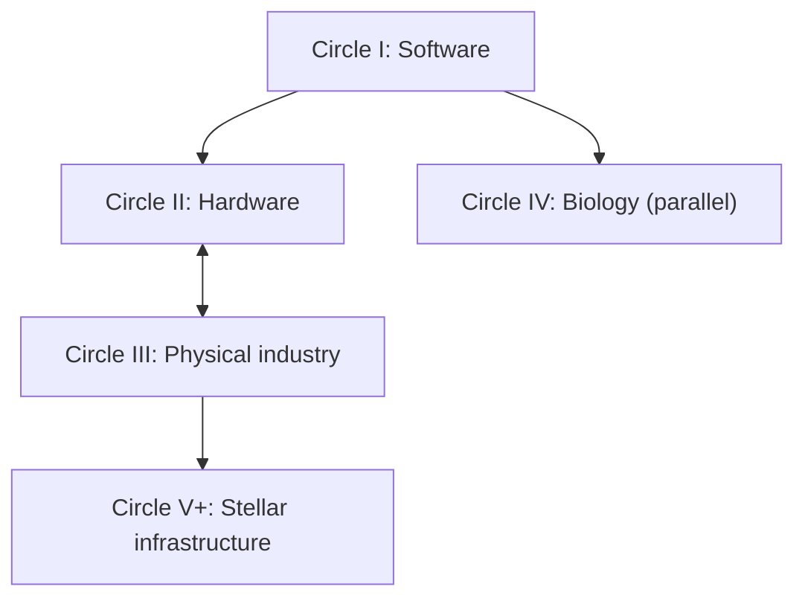

# AI-Level: From LLMs to a Type II Civilization

**Subtitle:** The Five Circles, the One Problem That Gates Each, and the Work of Our Time

**Outline v3 — September 6, 2026 — for author review before chapter drafting**

## What v3 changes, in one paragraph

v2 is a complete inventory: seven parts, forty problems, evidence targets, a card format. v3 keeps all of that and adds what an inventory cannot supply — an argument. Every part now makes a claim a reader can disagree with. Every circle now names **one gating problem** (the problem that decides whether the loop closes) apart from its bottlenecks and its portfolio, so the book can say what to work on first rather than listing eight things of equal weight. "Centering into the next circle" becomes a **test** rather than a metaphor. Each circle carries a **compensated-loop ledger** — which of the four loop steps humans supply today — which is both the honest state of the art and the concrete call. The measured episodes the instrument has already produced become narrative anchors instead of citations. And Part VII answers the author's question directly: whose time is it, and what should they do.

## Title and thesis

**Title:** AI-Level: From LLMs to a Type II Civilization
**Subtitle:** The Five Circles, the One Problem That Gates Each, and the Work of Our Time
(Alternative subtitle, closer to v2: *The Five Circles of Intelligence and the Grand Challenges on the Road to a Dyson Swarm.* "Dyson sphere" stays as the familiar umbrella term; the engineering argument is about a swarm.)

**Thesis.** An LLM is an individual at the entrance of Circle I. A Dyson swarm is the closure of Circle V+. Between them lie five substrate circles — software, hardware, matter, biology, stellar — each defined not by how clever the intelligence is but by which substrate its improvement loop (identify → implement → validate → deploy) can close over. AI-Level theory says what kind of intelligence each step needs; circle theory says which substrate the step must reach. Three results organize the book:

1. **Validate and deploy are organizational in every circle.** A system that certifies and authorizes its own change has self-certified. So no individual intelligence, however high, closes any loop alone.
2. **The individual axis saturates; the organizational axis keeps climbing.** Reading the five closure criteria against the level definitions, the individual requirement tops out around I3–I5 while the organizational requirement rises to OΩ, and the outermost circle admits no individual coordinate at all (a structure spanning an astronomical unit exceeds any single mind's coherence bound by eight orders of magnitude). The outer circles are won by organizations.
3. **Each circle has one gating problem.** Not eight equal problems: one that decides closure, a few bottlenecks behind it, and a portfolio of worthy parallel work. Naming the gate is what lets a generation choose.

Intelligence development, energy scale and human benefit remain separate assessments. A capability level does not determine a civilization's purpose, and a growing precursor swarm does not by itself establish Type II energy use.

## The centering test

The author's phrase "centering into the next circle" is the book's organizing motion, so it needs a test, not a metaphor.

> A civilization has centered into circle *N* when (a) circle *N−1*'s loop closes in ordinary cycles with humans holding only halt authority — its compensated-loop ledger reads zero — and (b) the loop period of circle *N*, not of *N−1*, now bounds the rate of progress.

Two consequences. Centering is a property of a research-and-engineering program, not a simultaneous transition of everyone. And it is measurable: count the loop steps humans still supply in *N−1*, and identify where the binding constraint sits. Today's answer (Part II) is that humanity has not centered into Circle I; it is inside Circle I with humans supplying validate and deploy.

## Narrative map and dependency spine

The arrows are enabling relationships, not a queue; full closure is never required before work on the next domain begins. Beneath the map runs a **dependency spine of gating problems**: the referee problem of Circle I (verification independent of the improver) is the same problem that appears as the yield loop in Circle II, as independent inspection of physical outcomes in Circle III, as the clinical validate step in Circle IV, and as distributed verification under light-latency in Circle V+. The book's single deepest claim is that *the validate step is the recurring gate*, and that it is organizational every time.

## How to read the grand-problem lists

Each circle's problems are tiered. The **gating problem** decides closure and gets its own chapter. **Bottleneck problems** must be solved for the gate to be reachable. **Portfolio problems** deserve sustained effort and can proceed in parallel; some (cancer, aging) are justified by human benefit regardless of any circle. Evidence targets are directions for later operationalization, not ratified thresholds; each must eventually declare its domain, resource envelope, reliability, controls and independent evaluator. Forty problems remain, with v2's identifiers kept so the two outlines map onto each other.

## Prologue — From One Prompt to a Stellar Civilization

Open with the chain: a useful answer becomes a reproducible method; the method becomes an instrument; the instrument improves a laboratory or a factory; the institution produces capabilities that enable further discovery; extend the chain to orbit and ask what must work at every link. Then break the chain deliberately at the second link: the instrument's *validation* — who checked it, and could the thing that made it have checked itself? That question is the book.

The bare LLM is the starting point, stated under its evaluation conditions: a model called through its API reads cognition and self-awareness in minutes and is I0, M0 and O0 by construction. No "Circle 0" is introduced; the LLM stands at the entrance of Circle I.

## Part I — AI-Level and the Circles of Progress

**Part claim:** "Level of intelligence" names five different questions, and progress toward a Type II civilization is a profile across them, never a number.

### Chapter 1. What Does an AI Level Measure?
Cognition C, individual development I, organizational development O, task demand T, human cognitive intervention H, operational self-awareness SA; delegation at verified reliability; memory M measured separately and joined to I by a one-way gate; the model–harness pair as the experimental unit; ordinal levels versus the continuous index. Levels stated as contrasts that must hold, never as difficulty thresholds — so the ruler does not move while the road is walked.

### Chapter 2. From Memory to Discovery
M0–M5/MΩ and I0–I5/IΩ. Persistence is not learning; learning within a mechanism is not changing the mechanism (Θ); changing the mechanism is not improving the improvement process (Ψ); a discovery remembered is not a discovery incorporated. Controlled examples with the ablated arm as the control: the restart test, the no-experience arm, the matched control after restart.

### Chapter 3. Organizations That Learn and Improve
O0–O5/OΩ and the seven roles — director, discoverer, instrument-maker, specialist, operator, referee, promoter. The result that anchors the book: in the improvement loop, *validate* is organizational by necessity and *deploy* is organizational always. Ten I1 agents in parallel are still O1; a redesign pipeline that grades itself is O1 plus an unverified claim.

### Chapter 4. The Five Circles and Their Improvement Loops
Software, hardware, physical matter, biology, stellar infrastructure; a circle is what substrate the loop reaches, not how clever the cognition is. Closure criteria stated to the step. Compensated half-loops. The hardware–physical bootstrap; the biological branch in parallel. Circle status is a vector.

### Chapter 5. The Two Asymmetries
The individual requirement saturates; the organizational requirement climbs; the coherence bound removes the individual coordinate from Circle V+. The matter bottleneck: after cognition accelerates, physical-process floors dominate. Why lower levels become *more* valuable as compression rises. These are the book's predictions, and Chapter 5 states how each could be falsified.

## Part II — Circle I: Software That Improves Its Own Capabilities

**Circle question:** Can software improve its operative capabilities through repeated cycles that something other than itself validates and authorizes?

**Closure target:** within a declared scope, identify, implement, independently validate and adopt improvements as the operative baseline in ordinary cycles, with humans holding only halt authority. Deploy is part of closure. One improved score is not evidence.

**Compensated-loop ledger, today:** identify — human and AI together; implement — AI; validate — human, through tests the AI did not write; deploy — human. Two of four steps compensated. This is where every current agent system sits, at I1 and O0–O1.

### Chapter 6. From a Language Model to a Reliable Agent
The same model through different harnesses: what a registered acceptance check and a snapshot-and-retry rung add, and to whom. The measured episode: two models a tenfold cost apart both at the instrument's ceiling on the Core, separated by 46 points once four harder witnesses were admitted — and the harness helping only the model whose failures were catchable.

### Chapter 7. Memory, Learning, and Continuity
Persistence across restarts with provenance; stale-state suppression; consolidation that survives hiding the episodes; repair against a health oracle the system cannot write to; cross-project lineage. The distinction the whole ladder rests on: storage never promotes learning.

### Chapter 8. Improving the Mechanism and the Improvement Process
I3 (a declared mechanism Θ changes, under sealed evaluation, with the promoter outside the write set) and I4 (the process Ψ that proposes changes itself improves). Retained capability, bounded write scope, cost-adjusted gain, recursive depth reported beside the level and never folded into it.

### Chapter 9. The Referee Problem — Circle I's gate
Verification that resists self-certification: computed keys the executor never sees; the named wrong method shown to fail on every seed; the delivered-outcome primitive that prices a confident wrong answer below a declared inability; the false-completion and false-rejection pair on solvable–blocked twins, so that neither bluffing nor blanket refusal can win; the promoter separated from the proposer. The measured episode: a discovery campaign on a cancer dataset whose first result was refuted at sealed validation, whose second survived, and whose incorporation gate then refused because the gain fell short of the preregistered margin — the referee working as designed. Why the referee is the scarcest role in AI today.

### Chapter 10. The Circle I Grand Challenges

| Tier | ID | Grand problem | Candidate technologies | Evidence target |
|---|---|---|---|---|
| **Gate** | I-06 | **Verification that resists self-certification** | independent evaluators, computed keys, twin items, promotion rules, sealed suites | false acceptance and downstream regression measured and reduced on independently assessed workloads; no loop step self-graded |
| Bottleneck | I-01 | Memory that supports lifelong learning | persistent stores, provenance, consolidation, repair | experience improves unseen tasks across genuine restarts; the ablated arm fails |
| Bottleneck | I-03 | Verified cognitive self-improvement (I3) | versioned Θ, bounded write set, hidden evaluation, rollback | a mechanism change improves held-out outcomes with lower levels retained |
| Bottleneck | I-07 | Organizations of agents that redesign themselves (O2–O3) | persistent evidence, role separation, routing, organizational experiments | with member models controlled, a changed structure produces independently verified improvement; the single-role arm fails |
| Bottleneck | I-08 | A trustworthy ruler for AI progress | invariant levels, refreshed witnesses, frozen anchors, bands not ranks | reproducible readings that distinguish capability, harness contribution and unearned claims |
| Portfolio | I-02 | Dependable long-horizon action | planning, world models, calibrated uncertainty, recovery | extended tasks succeed within declared assistance and resource limits |
| Portfolio | I-04 | Improvement of the improvement process (I4) | meta-optimization, candidate selection, generation tracking | a changed Ψ yields better validated gains per stated cost than its control |
| Portfolio | I-05 | Discovery that expands future competence (I5) | hypothesis generation, autonomous experiments, reusable instruments | independently verified results whose incorporation enables further work |

**Transition test for centering out of Circle I:** the ledger reads zero on validate and deploy for a declared scope, in repeated cycles, with an external halt.
**What it enables:** research agents, scientific instruments and organizational forms for every other circle.
**Call:** build the referee, not only the builder. Entry points: restart-based memory comparisons, twin-item trustworthiness tests, sealed-suite improvement campaigns, and running the ruler on your own system.

## Part III — Circle II: Intelligence Builds Its Computing Substrate

**Circle question:** Can an intelligent organization repeatedly produce and integrate the hardware its own further development runs on?

**Closure target:** specify, design, fabricate at a declared viable yield, test, and integrate hardware into the system's own operations across repeated cycles. Designing a chip closes only the identify–implement half.

**Ledger, today:** identify — human; implement — design AI-assisted, fabrication human-operated; validate — human; deploy — human. Design is largely informational and moving fast; everything after it enters physical infrastructure.

### Chapter 11. Designing the Next Computing System
Co-design, architecture, EDA, formal verification, design for manufacture; alternative computing approaches classified by the bottleneck each addresses.

### Chapter 12. The Yield Loop — Circle II's gate
The design-to-fabrication gap is the first appearance of the matter bottleneck: a process that must learn at the timescale of wafers, not of tokens. Inline metrology, drift, contamination, qualification, equipment maintenance — an improvement loop whose validate step is a physical measurement and whose period is set by physics. Why this, and not chip design, is what decides Circle II.

### Chapter 13. Compute, Energy, and Physical Reliability
Useful work per unit of energy as the true ceiling; memory, interconnect, packaging, cooling, lifetime, integration. Workload performance versus component specifications.

### Chapter 14. The Circle II Grand Challenges

| Tier | ID | Grand problem | Candidate technologies | Evidence target |
|---|---|---|---|---|
| **Gate** | II-02/03 | **The yield loop: autonomous fabrication with process-drift control** | robotic handling, inline metrology, process models, feedback control, fault recovery | repeated runs within declared intervention limits; functional yield within preregistered bounds under measured drift |
| Bottleneck | II-01 | End-to-end verified chip design | EDA agents, formal verification, co-design | designs meet declared specifications when fabricated and tested |
| Bottleneck | II-08 | Running on the hardware the system produced | characterization, deployment orchestration, compatible stacks | manufactured devices enter the producing system's real compute and deliver verified work |
| Bottleneck | II-05/06 | Useful computation per unit of energy, sustained | efficient architectures, reduced data movement, thermal engineering, resilient packaging | verified workload outcomes per measured system energy at declared reliability, thermal and lifetime targets |
| Bottleneck | II-07 | Dependable equipment and materials supply | autonomous maintenance, qualified inputs, traceable supply | critical inputs replenished or repaired with external dependencies declared |
| Portfolio | II-04 | Better devices, materials, interconnects | device research, materials discovery, alternative architectures | reproducible gains that survive manufacture, integration and workload comparison |

**Transition test:** a fabrication cycle from specification to integrated compute completes with humans holding halt authority only.
**What it enables:** expanding compute, and the electronics Circle III's machines need.
**Call:** connect design research to fabrication evidence. Work that shortens the yield loop's period is worth more than work that widens the design space.

## Part IV — Circle III: Industry That Maintains and Reproduces Itself

**Circle question:** Can a physical production system maintain itself and reproduce its essential productive capability from declared resources?

**Closure target:** within a declared industrial boundary, identify needs, design and manufacture machinery, operate through unforeseen failure, maintain or replace components, and reproduce essential productive functions from accounted-for resources. A universal replicator is a stronger claim than a bounded demonstration and is not required.

**Ledger, today:** all four steps human, with automation inside implement. The matter bottleneck in full: transport, materials, qualification and failure physics set floors cognition cannot compress.

### Chapter 15. Robots That Work Through Uncertainty
Perception, manipulation, adaptable control, diagnosis and repair outside prepared demonstrations; robot form chosen by required work.

### Chapter 16. From Raw Materials to Functional Machines
Mining, refining, materials, precision tools, fabrication, assembly, logistics, inspection; the industrial network as the system boundary.

### Chapter 17. Reproduction With Declared Dependencies — Circle III's gate
What a copy must be able to do; hidden imported dependencies as the usual way a "self-reproducing" claim fails; resource accounting; the electronics needed for successors — which is where Circle II re-enters. The hardware–physical bootstrap treated as one problem with two faces.

### Chapter 18. The Circle III Grand Challenges

| Tier | ID | Grand problem | Candidate technologies | Evidence target |
|---|---|---|---|---|
| **Gate** | III-06 | **Reproduction of productive capability with all dependencies declared** | modular production cells, automated assembly, shared standards, resource accounting | a bounded system produces working successors with essential capabilities; every imported dependency listed and costed |
| Bottleneck | III-01 | Robust perception and manipulation | embodied models, tactile sensing, adaptable control | useful work across specified unfamiliar objects and environments, failures counted |
| Bottleneck | III-02 | Diagnosis and repair under unforeseen failure | condition monitoring, repair planning, modular design | recovery from held-out faults with verified productive capability preserved |
| Bottleneck | III-03 | Integrated production from raw materials | mining, refining, chemistry, materials processing | declared feedstocks become functional components through an auditable process |
| Bottleneck | III-08 | Independent verification of physical outcomes | calibrated instruments, independent inspection, sim-to-real tests | performance agrees with externally checked measurement, never only the system's own report |
| Portfolio | III-04 | Precision manufacture of complex machines | machine tools, additive processes, inspection | assemblies meet tolerances and reliability, including critical electronics |
| Portfolio | III-05 | Logistics and resource cycles | inventory models, scheduling, transport, recycling | material flows accounted for and sustained under disruption |
| Portfolio | III-07 | Reliable energy and supporting infrastructure | generation, storage, grids, water | operation meets declared energy, reliability, cost and environmental requirements |

**Transition test:** a successor system is produced and verified by instruments the producer does not control, with its dependency ledger published.
**What it enables:** scalable infrastructure on Earth, and the production capability Circle V+ must carry off-world.
**Call:** build and measure complete chains, not components; develop robots and electronics as a pair.

## Part V — Circle IV: Biological Discovery That Improves Human Life

**Circle question:** Can scientific organizations repeatedly convert biological unknowns into validated knowledge and sustained human benefit?

**Closure target:** autonomous hypothesis generation and testing, intervention design, validation through experimental and clinical pathways, population-scale deployment, monitoring and iteration. Laboratory milestones are reported separately from this stronger target, with clinicians, consent and accountable institutions explicit.

**Ledger, today:** human throughout; AI assists identify and analysis. Circle IV runs in parallel — it needs Circle I cognition and is not a prerequisite for Circle V+ — and it carries physical floors of its own: organism response and clinical endpoints.

### Chapter 19. AI Scientists and Causal Models of Life
Mechanistic questions, multiscale models, discriminating experiments, uncertainty, transfer across contexts.

### Chapter 20. Laboratories That Learn From Experiments
Self-driving laboratories, assay development, negative findings, replication, persistent evidence graphs, new instruments; the incorporation gate as the difference between a lab that discovers and a lab that remembers.

### Chapter 21. The Clinical Validate Step — Circle IV's gate
Biological time cannot be compressed by cognition: organism response, endpoints, consent, accountability. Why the gate here is not discovery but validation at organism timescale, and how a discovery loop can run fast inside a validation loop that cannot. The measured episode from Chapter 9, read from the biology side.

### Chapter 22. The Circle IV Grand Challenges

| Tier | ID | Grand problem | Candidate technologies | Evidence target |
|---|---|---|---|---|
| **Gate** | IV-08 | **Validation and translation at organism and population timescale** | evidence systems, clinical evaluation, scalable manufacture, outcome monitoring | benefits persist in practice across relevant populations; access and adverse outcomes measured |
| Bottleneck | IV-01 | Predictive and causal understanding across scales | mechanistic models, multi-omics, perturbation experiments | intervention effects replicate in declared settings and reveal their limits of transfer |
| Bottleneck | IV-02 | Autonomous discovery with an incorporation gate | self-driving labs, assay development, active learning | independently replicated discoveries from complete cycles, and a later gain over a matched control |
| Bottleneck | IV-07 | Designing and delivering effective interventions | drug discovery, delivery systems, biologics, manufacturing | effect, targeting, reproducibility and manufacturing quality under declared deployment conditions |
| Portfolio | IV-03 | Prevention and durable control of cancer | mechanism research, early detection, treatment discovery | predefined programs show clinical benefit and generalization; no single result called a cure |
| Portfolio | IV-04 | Aging and healthy lifespan | aging-mechanism research, longitudinal studies | benefits in health and function, with risk and durability evaluated |
| Portfolio | IV-05 | Regeneration of tissues and organs | regenerative medicine, tissue engineering | restored function with durability, integration and safety endpoints |
| Portfolio | IV-06 | Brain and neurodegenerative disorders | neuroscience, neural measurement, targeted interventions | reproducible mechanism leading to measurable functional outcomes |

**Transition test:** a discovery moves from an autonomous lab through validation to monitored benefit with the human steps named and the timescale reported honestly.
**What it enables:** healthier lives and the scientific understanding of the one intelligence that is already at the coherence bound.
**Call:** organize around defined questions, replication and meaningful outcomes; treat cancer, aging and brain disorders as families of tractable subproblems, never as a promised single solution.

## Part VI — Circle V+: From Orbital Industry to a Type II Civilization

**Circle question:** Can an orbital industrial system use harvested energy to expand its productive capacity faster than maintenance and failure consume it?

**Closure target:** an orbital production loop that designs, builds, operates and maintains collectors and uses the harvested energy to sustain net expansion of productive collection capacity. A swarm as a loop, not a structure.

**Ledger, today:** no step autonomous; nothing in orbit reproduces. The coherence bound means this circle has no individual coordinate: its intelligence is organizational or it is nothing.

### Chapter 23. Establishing Industry Beyond Earth
Transport, prospecting, local feedstocks, extraction, refining, assembly; progressively reduced dependence on Earth; locations compared without a predetermined path.

### Chapter 24. The Dyson Swarm as an Expanding Production System
Collectors, orbital manufacturing, productive reinvestment, lifetime, repair, replacement, recycling; a collector installation versus a self-expanding loop.

### Chapter 25. Heat, Orbits, and Useful Energy
Conversion, use or transmission, waste-heat rejection, material limits, station-keeping, collision avoidance, stability.

### Chapter 26. Organization Across Light-Minutes — Circle V+'s gate
Local autonomy under delayed messages; distributed evidence and verification; fault containment; organizational adaptation over generations; durable human purposes. The referee problem at its final scale: verification that no node can perform alone and no centre can perform in time. Global-workspace and coherence bounds stated with their assumptions.

### Chapter 27. The Circle V+ Grand Challenges and the Type II Milestone

| Tier | ID | Grand problem | Candidate technologies | Evidence target |
|---|---|---|---|---|
| **Gate** | V-08 | **Reliable organization across distance and generations** | delay-tolerant coordination, distributed verification, durable institutions | evidence integrity, local resilience and accountable coordination under delay and turnover |
| Bottleneck | V-02 | Autonomous orbital construction with net-positive expansion | robotic assembly, orbital factories, component manufacture | sustained net growth after maintenance and replacement losses |
| Bottleneck | V-01 | Viable off-world supply chains | transport, prospecting, extraction, refining | useful production from declared off-world resources with transport and imports accounted for |
| Bottleneck | V-07 | Long-duration repair and reliability | fault diagnosis, resilient components, autonomous servicing | productive function persists across realistic failure and replacement cycles |
| Bottleneck | V-03 | Durable, resource-efficient collectors | lightweight structures, photovoltaic or thermal systems | useful output and lifetime meet resource, degradation and maintenance requirements |
| Portfolio | V-04 | Conversion, distribution and use of captured energy | power electronics, local consumption, storage, transmission | net useful power after losses supports declared workloads |
| Portfolio | V-05 | Waste-heat rejection at scale | radiators, thermal design, workload placement | sustained activity within measured thermal limits |
| Portfolio | V-06 | Orbital stability and collision avoidance | navigation, traffic coordination, station-keeping | operation within independently assessed collision-risk bounds as density grows |

**Separate Type II assessment:** report the fraction of stellar output captured and used, useful power, maintained productive capacity and sustained operation. An early self-expanding system does not establish stellar-scale energy use; Kardashev categories are never identified with circle-closure categories, and Type I does not mean Circles I–IV are closed. Energy capture is an indicator of civilizational level and never its definition — the same rule that keeps the AI-Level from being an energy score.

**Transition test:** net-positive growth of collection area over a declared period, with the organization's decisions verifiable after the fact by parties who could not have made them in time.
**What it enables:** activity supported by energy on a stellar scale, conditional on the engineering and organizational problems.
**Call:** build the coordination protocols and verification institutions before the hardware needs them; the institutions are the long pole.

## Part VII — A Grand-Challenge Agenda for Humanity

**Part claim:** it is Circle I's time; the gating problem of our generation is the referee; and the human role migrates outward through the seven roles as each circle closes.

### Chapter 28. A Living Atlas of Grand Problems
The forty cards as a maintained registry with stable identifiers, dependencies, evidence status, replications and open objections; the gating problems as the atlas's spine.

### Chapter 29. Institutions That Can Solve Hard Problems
Shared testbeds, independent evaluators, reproducibility funding, open instruments, prizes, cross-discipline coordination. The referee as an institution: separation of proposer, evaluator and promoter, from a software campaign to an orbital swarm.

### Chapter 30. Circle Time
Loop periods differ by substrate — computation, fabrication, material transformation, biological endpoints, infrastructure replacement — and set what a generation can finish. Conditional scenarios rather than dates. Prioritize by gate-relevance first, then enabling value, human benefit, neglectedness, tractability, evidence quality and cost; protect exploratory work while attacking the current gate. The argument that it is Circle I's time: its ledger is the only one close to zero, its gate is the one the other four inherit, and the II–III bootstrap and Circle IV can start now in parallel because they need Circle I's cognition, not its closure.

### Chapter 31. How the Human Role Migrates
As a circle closes, humans move from operator to specialist to referee to director; what each role requires; why the referee is scarce today and the director scarce later; what a person, a laboratory, a company and a public institution can do in the next five years, stated as entry points on specific cards.

### Chapter 32. An Invitation to Build the Next Capability
**Choose a problem whose solution creates a new capability. Demonstrate that it works, to a referee who is not you. Make it available for the next person to build on.**

## Epilogue — The Future We Choose to Make Possible
Return to the prologue's chain with the referee restored at every link; keep useful human outcomes present throughout, with the swarm as the long horizon.

## Connecting AI-Level to each circle

| Circle | Individual and memory contributions | Organizational contributions | Gate | World evidence |
|---|---|---|---|---|
| I | persistent state; learning; I3 mechanism change; I4 process change; discovery and instruments | independent verification and adoption; adaptive allocation; workflow redesign | the referee | executed software, hidden tests, retention, deployment records |
| II | design reasoning; process memory; device and materials discovery | coordination of design, fabrication, qualification, integration | the yield loop | functional chips, yield, system energy, integration |
| III | grounded control; machine history; diagnostics; tool improvement | coordination of materials, machines, logistics, inspection, reproduction | reproduction with declared dependencies | products, successors, resource balance, independent inspection |
| IV | mechanistic reasoning; M5 lineage; persistent discovery; new assays | distributed discovery, replication, translation | the clinical validate step | replicated experiments, causal evidence, clinical outcomes |
| V+ | local engineering reasoning; infrastructure state; diagnosis | delayed coordination, distributed evidence, fleet adaptation, institutional continuity | organization across light-minutes | net productive growth, useful power, captured stellar output |

C, SA and the T/H delegation surface contribute in every circle; M is tested beside I; a high level on one coordinate never establishes closure; OΩ or IΩ is not declared necessary for a domain without an argument.

## Problem-card format (v3: three fields added)

1. ID and name. 2. **Tier** — gate, bottleneck or portfolio, with the reason. 3. Human or enabling purpose. 4. Scope and boundary. 5. **Which loop step it closes**, and **who supplies that step today**. 6. Current evidence, dated. 7. Dependencies, including the card's place on the dependency spine. 8. Candidate technologies. 9. AI-Level contribution, without assuming a universal minimum. 10. Solved when — a falsifiable criterion at a stated reliability and resource envelope. 11. Who verifies it, independent of the proposer. 12. What it enables. 13. Who can contribute now.

Each circle's challenge chapter carries a dependency map, near-term demonstration targets, its compensated-loop ledger, and one worked card — for Circle I, the referee card, worked from the measured episodes.

## Appendices
A. AI-Level reference (C, I, M, O, SA, T/H, HG, U) with invariants and certification conditions. B. Circle × role matrices. C. Master registry of the forty cards with tiers and dependencies. D. Evidence and measurement: benchmarks, control arms, retention, replication, uncertainty, resources; the instrument's own studies (recovery, resolution, anchoring, saturation). E. Circle closure and partial progress: scope declarations, intervention accounting, the ledger, field-demonstration criteria. F. Conditional scenarios and theory revision: assumptions, falsifiers, revision history, open disagreements. G. Glossary and source notes.

## Editorial choices in v3

| Element | Decision |
|---|---|
| Structure | v2's seven parts and chapter progression kept; one chapter per circle promoted to its gate |
| Grand problems | forty kept with v2's identifiers; re-tiered into one gate, bottlenecks and portfolio per circle; II-02/03 and II-05/06 merged as single problems |
| Thesis | replaced the general statement with three results the reader can contest: validate/deploy organizational; individual axis saturates; one gate per circle |
| Centering | defined as a test with two conditions and a measurable ledger |
| Today's state | stated per circle as a compensated-loop ledger, dated, rather than a blanket claim |
| Measured episodes | the Core-to-Core-H saturation, the two-model harness contrast and the refused cancer campaign used as narrative anchors |
| Part VII | answers whose time it is and how the human role migrates; prioritization puts gate-relevance first |
| Type II | v2's separation kept verbatim in substance |
| Timescales | conditional scenarios; loop period per substrate; no dates for whole circles |

## Sources
- *Unified Intelligence Theory and the Artificial Intelligence Level* v2.4 (`unified_v24/`); *AI-Level Bench* (`paper2_hilbench_v02/`); *The AI-Level Index v2.0* (`ail_index_v2/`).
- *Intelligence Inside the Circles* (`Circle_Indexed_Individual_and_Organizational_Intelligence.pdf`); *Substrate Indexing Is an Axis Shift* (`Substrate_Indexing_Is_An_Axis_Shift.pdf`); *Recursive Self-Improvement Is Substrate-Indexed* v3 (`SARSI-L_Paper_v3.md`); *Level Problem Queues* (`Level_Problem_Queues.md`).
- `book/AI-Level_Book_Outline_v2.md` and `book/OUTLINE_v0.md`, September 6, 2026.
- Wright, *Dyson Spheres* (arXiv:2006.16734), for the swarm-versus-energy-scale distinction.

The forty formulations and their evidence targets are editorial proposals from this synthesis, not copied benchmark definitions and not a declaration that any circle is currently closed.
