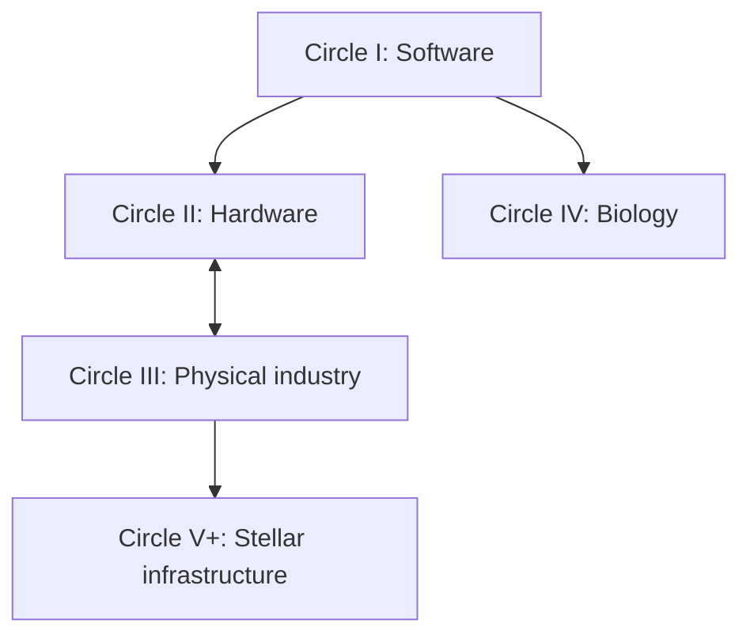

# AI-Level: From LLMs to a Type II Civilization

**Subtitle:** The Five Circles and the Grand Challenges on the Road to a Dyson Swarm

**Outline v4 — September 6, 2026 — for author review before chapter drafting**

## Editorial direction

Keep v3's seven parts, thirty-two chapters, explicit grand problems, narrative cases, and practical invitation. Strengthen its argument by making the claimed bottlenecks testable. A circle has a demanding integration milestone; the constraint currently blocking that milestone can change with the system, location, resources, and stage of development. Verification is a recurring requirement, but its recurrence does not prove that it always determines the pace of progress.

This revision preserves all forty problem identifiers as forty separate entries. Each circle includes a mission, an argument, chapter summaries, the eight grand problems, candidate constraints, a flagship demonstration, the capabilities it enables, and concrete entry points. The problem lists remain in the main text.

The book is an accessible argument and research agenda. Full certification laws, formal scoring, source audits, and detailed engineering protocols belong in appendices. Each chapter should begin with a concrete problem and end with the next question it makes possible.

## Title, thesis, and reader promise

**Title:** AI-Level: From LLMs to a Type II Civilization

**Subtitle:** The Five Circles and the Grand Challenges on the Road to a Dyson Swarm

**Thesis:** Intelligence expands civilization's possibilities when people and AI convert knowledge into reliable instruments, effective organizations, and productive infrastructure. Progress depends on finding the constraints that actually limit that conversion, demonstrating improvements in the world, and making the resulting capabilities useful to others.

The book advances three propositions as a research program:

1. **Intelligence has several relevant dimensions.** Reasoning, memory, persistent learning, organizational development, delegation, and self-awareness contribute differently to a project. An index can summarize a declared assessment; it cannot substitute for its underlying capability and resource profile.
2. **Progress crosses substrates through integrated systems.** Better cognition can improve designs and procedures, but a working chip, a repaired machine, a useful intervention, and a growing orbital industry also require equipment, energy, materials, measurement, and coordination.
3. **Priorities should follow measured constraints and human purposes.** A good research program identifies what currently limits its mission, tests whether a proposed improvement changes that limit, and updates its priorities when evidence changes.

The reader should leave able to identify a meaningful grand problem, understand its dependencies, distinguish a promising demonstration from a completed capability, and choose an achievable contribution.

## The five missions

| Circle | Civilizational mission | Integration milestone | Candidate constraints to investigate |
|---|---|---|---|
| I — Software | Reliable learning, discovery, and improvement of cognitive tools | Sustained, independently assessed improvement of operative software | Improvement quality, evaluation validity, retained capability, adoption, total cost |
| II — Hardware | Produce and integrate the computing substrate | Qualified manufacture of useful hardware deployed into working compute | Yield, process control, equipment availability, inputs, integration, energy |
| III — Physical industry | Maintain and reproduce essential productive capability | A bounded industrial system produces functional successors and maintains their capabilities | Precision components, electronics, energy, materials, repair, logistics |
| IV — Biology | Convert biological knowledge into sustained human benefit | A defined intervention pathway delivers independently verified outcomes and learns from monitoring | Causal understanding, measurement, intervention effectiveness, delivery, endpoints, adoption |
| V+ — Stellar infrastructure | Sustain productive expansion beyond Earth | An orbital industrial loop grows useful capacity after accounting for losses and dependencies | Resource supply, manufacture, energy use, heat rejection, orbital operation, maintenance, coordination |

These candidate constraints are hypotheses to examine, not a measured ranking of today's entire field. Every project must name its own system boundary and evidence.

## How the circles connect

The diagram summarizes the framework's principal enabling relationships. It does not make full software closure a prerequisite for useful biology, impose a strict temporal sequence, or exclude feedback from instruments, energy, and physical experimentation into software. Hardware and physical automation bootstrap each other. Biology has a substantial parallel mission grounded in human benefit.

### A better definition of “centering”

**A program centers on a new circle when its supporting capabilities are reliable enough for its declared mission, and evidence shows that constraints in the new domain now govern further progress.**

Apply this to a named program, not to all humanity or to circle N minus one. For a hardware–physical program, the center can alternate between domains. A biological program can become limited by an assay or an endpoint while still using human-operated software and equipment.

Operationally, report four things:

1. The mission, system boundary, output, resource envelope, and observation period.
2. The supporting capabilities that meet declared reliability and dependency budgets.
3. The remaining constraint, tested by a controlled intervention where possible, or otherwise supported by a documented engineering analysis with uncertainty.
4. Evidence that relaxing the proposed constraint changes useful output, reliability, cost, or mission time; retain rival explanations and state what would change the priority.

**Centering and full autonomous closure are separate claims.** A program can shift its research focus before every supporting loop becomes autonomous. Full closure under the repository's definition remains a stricter claim about ordinary end-to-end operation without a required human decision to proceed. Human-governed systems can produce major benefits without meeting that criterion.

### Replace a zero-count ledger with a record of the actual work

For each named case, record the four loop steps separately. Do not publish guessed global labels such as “all four steps are human today.”

| Step | What the record must show |
|---|---|
| Identify | Who supplies the goal, diagnosis, hypothesis, design choice, or strategy; what was proposed autonomously |
| Implement | Which software and physical actions execute; human minutes, external services, materials, energy, and exception handling |
| Validate | Who controls the criteria, data, instruments, and verdict; how correlated errors and evaluator failure are checked |
| Deploy | Who adopts the change; routine and exceptional approvals; rollback, observed outcomes, and dependencies after adoption |

Alongside these fields, report accepted and rejected attempts, failure severity, retention, total elapsed time, human cognitive assistance, authorization delays, resource costs, and censored or unfinished work. “Not measured” is a valid entry. Four autonomous labels do not establish effectiveness, and zero recorded approval events does not establish independent validation.

## Prologue — The Answer, the Instrument, and the World

Begin with a useful AI answer that must become a reproducible method before anyone can rely on it. Follow the proposed chain from method to instrument, from instrument to laboratory or factory, and from productive infrastructure to further discovery. At each link, ask what was actually built, what was measured, and which constraint remains.

Extend the horizon to a Dyson swarm while keeping the nearer benefits visible. Mark imagined future scenes as scenarios. Do not invent measured outcomes, quotations, or completed industrial systems to carry the narrative.

A bare LLM provides the starting example. A strictly ephemeral evaluation contract can imply M0/I0; an API endpoint alone does not establish those properties, cognition, or self-awareness. Report the organizational coordinate as inapplicable to a singleton unless a declared protocol assesses an organizational system. Do not add a formal Circle 0.

## Part I — AI-Level and the Circles of Progress

**Part argument:** A useful account of progress connects capability, organization, and physical reach while measuring each on its own terms.

### Chapter 1. What Does an AI Level Measure?

Introduce C, I, O, T, H, SA, and independently measured M through one task attempted by different model–harness pairs. Explain gated U-levels and the distinction between ordinal certification and continuous index readings. Resource spending, energy scale, and human benefit remain separately reported.

### Chapter 2. From Memory to Discovery

Explain M0–M5/MΩ and I0–I5/IΩ. Separate memory contents from learning mechanisms, Θ changes from Ψ changes, and a validated discovery from demonstrated incorporation into later competence. Make the restart and matched-control examples central. Sophisticated memory does not by itself certify individual learning.

### Chapter 3. Organizations That Learn and Improve

Introduce the seven roles and O0–O5/OΩ. Explain why independent evidence and adoption matter, and how organizations turn discoveries into reproducible instruments and ordinary procedures. Separation concerns effective control of criteria, evidence, and adoption; it does not necessarily require different model brands or separate machines. Ten agents alone establish no particular O-level.

### Chapter 4. The Five Circles and Their Improvement Loops

Introduce identify, implement, validate, and deploy in each substrate. Explain bounded scope, partial closure, dependency accounting, hardware–physical co-development, and biology's parallel mission. Distinguish the circle coordinate from I, O, U, and Kardashev classifications.

### Chapter 5. How to Find the Constraint That Matters

Define a required capability, a binding bottleneck, an accelerator, and a human-benefit mission. Explain counterfactual tests and engineering sensitivity analysis: what changes if this step gets faster or more reliable? Present individual-capability saturation and the growing importance of coordination as hypotheses with assumptions and possible counterexamples, not universal laws already established across all domains.

## Part II — Circle I: Software That Improves Its Own Capabilities

**Mission:** Make learning, discovery, and software self-improvement dependable enough to support further work.

**Part argument:** Self-improvement is earned through useful retained changes under independent assessment. Generating more candidates, or removing approval steps, does not by itself establish it.

### Chapter 6. From a Language Model to a Reliable Agent

Compare planning, tools, grounded state, acceptance checks, and recovery under declared resources. Use the repository's Core-to-Core-H episode as a preliminary example of an instrument reaching its ceiling and then distinguishing configurations on harder items. Preserve the configurations, suite version, limited sample, and adaptive item-development history; avoid presenting the episode as a general ranking of base models.

### Chapter 7. Memory, Learning, and Continuity

Persistent state, provenance, stale-state suppression, consolidation, repair, and cross-project knowledge. Trace one project across restarts, with and without the learned state. Explain when a failure comes from memory content, retrieval, an altered mechanism, or the evaluation apparatus itself.

### Chapter 8. Improving the Mechanism and the Improvement Process

I3 changes to Θ; I4 changes to Ψ; baseline comparisons, lower-capability retention, causal attribution, resource guards, and repeated generations. Distinguish repeated self-editing from demonstrated improvement of the process that produces edits.

### Chapter 9. The Referee, the Builder, and the Adoption Decision

Examine verification and adoption as potentially binding constraints in a bounded software loop. Compare independent protected checks with other sources of failure, including poor candidates, incomplete specifications, and regressions. Explain false completion and false rejection together. A referee can be wrong; evaluate the instrument and the reviewer as well as the proposer.

### Chapter 10. The Circle I Grand Challenges

| ID | Grand problem | Candidate approaches and evidence of progress |
|---|---|---|
| I-01 | **Memory that supports lifelong learning** | Provenance, consolidation, retrieval, repair; experience improves unseen future work across real restarts while protected prior capabilities are retained. |
| I-02 | **Dependable reasoning and long-horizon action** | Planning, world models, tools, uncertainty, recovery; extended tasks meet declared reliability and human-assistance limits under changed conditions. |
| I-03 | **Verified cognitive self-improvement** | Versioned Θ, bounded changes, protected evaluation, rollback; active mechanism changes improve held-out performance with relevant controls. |
| I-04 | **Improvement of the improvement process** | Versioned Ψ, experimental design, candidate selection; validated downstream gains improve relative to a matched process and total cost. |
| I-05 | **Discovery that expands future competence** | New methods, representations, and instruments; independently validated findings enable subsequent work after controlled incorporation. |
| I-06 | **Verification that resists self-certification** | Protected criteria, test suites, external checks, separate adoption; acceptance errors and downstream regressions are assessed independently. |
| I-07 | **Organizations that learn and redesign themselves** | Persistent evidence, routing, allocation, workflow experiments; changes improve outcomes with member capability and resources controlled. |
| I-08 | **Trustworthy measurement of AI progress** | Valid tasks, calibrated indices, fixed historical references, uncertainty; independent readings distinguish capability, harness effects, and resource spending. |

**Priority hypothesis:** In a software system already generating useful improvements, validation and adoption may dominate. In another system, candidate quality, memory, or reliable execution may dominate. Compare I-03/I-06/I-07 as an integration cluster; measure the actual cause before naming a gate. I-04 and I-05 can expand the frontier without being necessary for every narrow closed loop.

**Flagship demonstration:** Declare a software mechanism and workload; preserve an independently controlled evaluator and adoption process; run repeated proposed improvements against matched baselines; report retention, mistakes, total cost, and ordinary versus exceptional human work. Publish the number of completed cycles and the uncertainty, not only the best change.

**Closure distinction:** Independent adoption without a required human decision in ordinary cycles can satisfy the framework's autonomy condition in this declared scope. Human-approved improvement remains useful measured progress but carries a different autonomy report.

**Enables:** Better engineering tools, scientific agents, and organizational methods across the other circles.

**First contributions:** Restart-and-ablation memory studies; completion-versus-refusal tests; controlled Θ campaigns; an adoption ledger that records actual review and downstream performance.

## Part III — Circle II: Intelligence Builds Its Computing Substrate

**Mission:** Produce, qualify, and integrate useful computing hardware through increasingly capable design and manufacturing systems.

**Part argument:** A design becomes additional computing capability only after fabrication, qualification, maintenance, and integration succeed together.

### Chapter 11. Designing the Next Computing System

Architecture, co-design, EDA, verification, and manufacturability. Compare alternative devices and computing approaches according to a workload and physical constraints. New architectures are candidate routes, not automatic prerequisites for progress.

### Chapter 12. The Yield Loop: From Design to Qualified Manufacture

Metrology, contamination, process drift, equipment uptime, qualified inputs, and functional yield. Present the yield loop as a candidate constraint for a specified process, and ask when supply, thermal limits, or integration would instead govern output.

### Chapter 13. Compute, Energy, and Physical Reliability

Memory movement, interconnects, packaging, cooling, lifetime, software compatibility, and useful performance per measured system energy. Include capital requirements, equipment access, and maintenance in the engineering account rather than assuming they follow automatically from a good design.

### Chapter 14. The Circle II Grand Challenges

| ID | Grand problem | Candidate approaches and evidence of progress |
|---|---|---|
| II-01 | **End-to-end verified chip design** | EDA, formal checks, co-design; fabricated devices meet declared functional and integration specifications. |
| II-02 | **Autonomous fabrication operations** | Equipment automation, robotic handling, fault recovery; repeated runs meet intervention and process-execution limits. |
| II-03 | **Metrology, yield, and process-drift control** | Inline measurement and feedback; functional yield and quality remain within stated bounds under documented disturbances. |
| II-04 | **Better devices, materials, and interconnects** | Device and materials research, packaging, alternative architectures; gains survive production and integrated-workload comparison. |
| II-05 | **More useful computation per unit of energy** | Architecture and software co-design, lower data movement; useful outcomes improve at measured whole-system energy and reliability. |
| II-06 | **Cooling and long-term hardware reliability** | Thermal design and monitoring; declared load is sustained within temperature, error, lifetime, and maintenance requirements. |
| II-07 | **Dependable equipment and materials supply** | Repair, qualified inputs, traceability; critical services and inputs remain available with imported dependencies disclosed. |
| II-08 | **Running on the hardware the system produced** | Characterization, integration, compatible software; manufactured devices perform useful work in the producing system's compute infrastructure. |

**Priority hypothesis:** For an accessible fabrication process, II-02/II-03 may jointly limit qualified output. Their priority changes if equipment access, II-07 supply, or II-08 integration determines delivered compute. Cooling and power are operating requirements, even when they are not currently binding. II-04 is an accelerator or a requirement according to the selected architecture.

**Flagship demonstration:** Within a declared process and supply boundary, produce functional hardware across repeated cycles, integrate it, and measure delivered useful compute, yield, quality, energy, downtime, and human work. Show where external equipment and materials enter the loop.

**Enables:** More useful compute and control electronics for physical automation.

**First contributions:** A process-drift benchmark linked to physical measurements; a verified design-to-device case; a joint design, qualification, and integration record. Evidence that improving yield does not increase delivered compute should redirect attention to the next constraint.

## Part IV — Circle III: Industry That Maintains and Reproduces Itself

**Mission:** Maintain and reproduce essential productive capabilities from explicit resources and dependencies.

**Part argument:** A reproduction claim is about a functioning industrial system over time. A successor assembled from unreported imported critical parts does not demonstrate the stronger resource-to-successor loop.

### Chapter 15. Robots That Work Through Uncertainty

Grounded perception, tactile sensing, manipulation, adaptable control, diagnosis, and repair. Compare work outside prepared demonstrations and choose robot form according to the job. Report failure and recovery together.

### Chapter 16. From Raw Materials to Functional Machines

Extraction, refining, material transformation, precision tools, components, assembly, logistics, and inspection. Map the network that produces a machine, including its sensors and electronics. Discuss advanced manufacturing as one set of routes among several.

### Chapter 17. Reproduction With Declared Dependencies

Define the productive functions a successor must retain. Track inputs by both quantity and critical function: a small imported controller can be decisive even when most mass is produced locally. Connect hardware qualification to manufacturing autonomy and examine repeated generations rather than one successful assembly.

### Chapter 18. The Circle III Grand Challenges

| ID | Grand problem | Candidate approaches and evidence of progress |
|---|---|---|
| III-01 | **Robust perception and manipulation** | Embodied models, tactile sensors, adaptable control; useful work across declared unfamiliar objects and conditions, with failures included. |
| III-02 | **Diagnosis and repair under unforeseen failure** | Monitoring, repair plans, modular designs; recovery from held-out faults preserves independently tested productive function. |
| III-03 | **Integrated production from raw materials** | Extraction, refining, chemistry, processing; declared feedstocks become functional components through measured production stages. |
| III-04 | **Precision manufacture of complex machines** | Machine tools, assembly, inspection; components and assemblies meet functional tolerances and reliability, including critical electronics. |
| III-05 | **Logistics and resource cycles that sustain production** | Scheduling, transport, inventory, recycling; accounted-for material flows sustain work during declared disruptions. |
| III-06 | **Reproduction of productive capability** | Production cells, automated assembly, shared interfaces; successive systems reproduce specified essential capabilities with dependencies disclosed. |
| III-07 | **Reliable energy and supporting infrastructure** | Generation, storage, water, resilient services; the declared productive cycle meets energy, uptime, cost, and environmental requirements. |
| III-08 | **Independent verification of physical outcomes** | Calibrated instruments and separate inspection; actual physical output agrees with externally checked measurements, with instrument uncertainty reported. |

**Priority hypothesis:** III-06 is the integration milestone. Its binding constraint may be electronics, precision manufacture, repair, energy, or feedstock processing. Independent inspection establishes what happened; it does not manufacture missing components. Precision, logistics, and energy must not be demoted to optional work when the selected cycle requires them.

**Flagship demonstration:** Declare the production boundary, successor functions, bill of materials, energy balance, supporting services, and acceptable imported dependencies. Produce and independently assess successors across repeated generations; report replacement needs and whether critical dependencies actually decline. A bounded result must remain labeled as bounded.

**Enables:** Durable industrial capacity on Earth and capabilities adaptable to off-world production.

**First contributions:** Publish an end-to-end production dependency map; independently test one repair-and-replacement cycle; target the component or service whose absence halts the defined reproduction process. Develop hardware and physical automation as a coupled program.

## Part V — Circle IV: Biological Discovery That Improves Human Life

**Mission:** Turn biological understanding into reproducible interventions and durable human benefit.

**Part argument:** Prediction, mechanistic discovery, intervention efficacy, and clinical benefit require different evidence. Faster analysis can help, but success at one stage does not certify the next.

### Chapter 19. AI Scientists and Causal Models of Life

Biological mechanisms, multiscale models, informative experiments, uncertainty, and transfer across contexts. Distinguish patterns in a dataset from causal knowledge and from useful interventions. Use the repository's cancer prognostic-model campaign as a computational case with explicitly limited scope.

### Chapter 20. Laboratories That Learn From Experiments

Assays, instruments, automation, negative findings, independent replication, and persistent evidence graphs. Follow the return path from a result to a reusable method. Explain incorporation into future competence separately from remembering a report.

### Chapter 21. From a Validated Finding to a Useful Intervention

Discovery, delivery, experimental models, manufacture, clinical endpoints, monitoring, and access. Identify what currently limits a particular pathway: an unreliable assay, an ineffective intervention, lack of transfer, observation time, or adoption. Distinguish endpoint-specific observation requirements from durations that improved methods and operations may reduce.

### Chapter 22. The Circle IV Grand Challenges

| ID | Grand problem | Candidate approaches and evidence of progress |
|---|---|---|
| IV-01 | **Predictive and causal understanding across biological scales** | Mechanistic models, multi-omics, perturbations; intervention predictions replicate in declared settings and reveal their limits. |
| IV-02 | **Autonomous discovery with reproducible experiments** | Laboratory automation, assays, active learning; independently replicated results emerge from complete cycles and support later work. |
| IV-03 | **Better prevention and durable control of cancer** | Mechanisms, detection, treatment and resistance research; defined cancer-specific programs demonstrate meaningful benefit. |
| IV-04 | **Understanding aging and extending healthy life** | Mechanistic and longitudinal research; improvements in health and function persist with risks and durability assessed. |
| IV-05 | **Regeneration and replacement of damaged tissues and organs** | Regenerative medicine and tissue engineering; restored function is demonstrated with integration, durability, and relevant safety evidence. |
| IV-06 | **Understanding and treating brain and neurodegenerative disorders** | Neural measurement, mechanistic models, targeted interventions; defined programs produce reproducible functional or clinical gains. |
| IV-07 | **Designing and delivering effective interventions** | Drug discovery, delivery, biologics, manufacturing; effects, targeting, quality, and reproducibility hold under the stated conditions. |
| IV-08 | **Translation into accessible, monitored population benefit** | Clinical evaluation, production, evidence systems, monitoring; benefits persist across relevant populations, with access and adverse outcomes measured. |

**Priority hypothesis:** For a mature intervention, clinical validation and deployment may determine the pace. Earlier work may instead be limited by mechanism, assay quality, efficacy, or delivery. IV-03–IV-06 are major benefit missions whose priorities follow disease burden, opportunity, and evidence, not their contribution to a Dyson swarm.

**Flagship demonstration:** Choose a defined biological or intervention program and follow its evidence chain through the stages it actually reaches. Record independent replication, causal scope, meaningful endpoints, manufacturing or delivery limits, monitoring, and the work supplied by clinicians and institutions. Report a computational or laboratory result at that scope.

**Closure distinction:** The repository's fully autonomous biological loop is a stronger theoretical target. Required consent, clinical responsibility, and human decisions are not reasons to discount a beneficial result or instructions to remove them. Report their roles separately from capability and outcome evidence.

**Enables:** Healthier lives, reduced suffering, resilience, and more capable scientific methods. Biology remains a parallel civilizational mission.

**First contributions:** Improve an assay's reproducibility; replicate a mechanism across an appropriate independent setting; reconstruct an evidence lineage; connect a computational finding to a prospectively testable experimental question. Do not describe a cancer prediction-model analysis as a treatment breakthrough.

## Part VI — Circle V+: From Orbital Industry to a Type II Civilization

**Mission:** Build orbital infrastructure that sustains useful productive expansion and could eventually support energy use at stellar scale.

**Part argument:** A self-expanding swarm must close a combined production, resource, energy, maintenance, thermal, and coordination cycle. Net expansion is the integration test; no single supporting discipline is guaranteed to dominate every stage.

### Chapter 23. Establishing Industry Beyond Earth

Transport, prospecting, available feedstocks, extraction, refining, assembly, and declining reliance on imported equipment. Compare locations and pathways according to evidence and requirements. Account for capital, supply, replacement, and operating resources.

### Chapter 24. The Dyson Swarm as an Expanding Production System

Collectors, orbital manufacture, reinvestment, component life, replacement, and recycling. Track maintained productive capacity and useful power, not only nominal deployed area. Distinguish externally subsidized growth from growth supported by the declared industrial loop. Sustained growth does not imply indefinite exponential growth.

### Chapter 25. Heat, Orbits, and Useful Energy

Conversion, local use or transmission, storage, waste heat, degradation, station-keeping, traffic, and stability. Explain these as operating constraints whose binding status changes with design and scale. Use “Dyson sphere” as the familiar umbrella term and a swarm as the engineering focus.

### Chapter 26. Organization Across Light-Minutes

Local control, delayed messages, asynchronous decisions, distributed verification, faults, and long-lived institutions. Under a global-workspace model, a decision requiring signals to cross a system is limited by propagation time; the bound depends on the assumed cycle and communication geometry. It does not eliminate local individual agents or prove that all forms of large-scale cognition are impossible. Do not assign an arbitrary eight-order gap or claim the human brain operates at a universal physical bound.

### Chapter 27. The Circle V+ Grand Challenges and the Type II Milestone

| ID | Grand problem | Candidate approaches and evidence of progress |
|---|---|---|
| V-01 | **Viable off-world supply chains** | Transport, prospecting, extraction, refining; useful production with material, energy, transport, and imported equipment accounted for. |
| V-02 | **Autonomous orbital construction and productive expansion** | Robotic assembly and manufacturing; sustained growth of useful productive capacity after maintenance and replacement losses. |
| V-03 | **Durable, resource-efficient collectors** | Lightweight structures and conversion systems; useful output and lifetime meet resource, degradation, and maintenance requirements. |
| V-04 | **Conversion, distribution, and productive use of captured energy** | Local consumption, storage, power electronics, transmission where needed; net useful power supports the declared production and operating cycle. |
| V-05 | **Waste-heat rejection at scale** | Radiators, thermal design, workload placement; sustained operation respects assessed heat-rejection and material limits. |
| V-06 | **Orbital stability and collision avoidance** | Navigation, traffic coordination, station-keeping; acceptable operation is demonstrated for stated geometry, density, and uncertainty. |
| V-07 | **Long-duration repair, replacement, and reliability** | Fault diagnosis, resilient components, servicing; productive functions persist across representative failures and replacement cycles. |
| V-08 | **Reliable organization across distance and generations** | Delay-tolerant coordination, evidence integrity, institutional continuity; the system maintains accountable operation under delays, failures, and turnover. |

**Priority hypothesis:** Early stages may be constrained by supply and manufacture; sustained operation may be constrained by replacement or thermal and orbital conditions; larger networks may become coordination-limited. V-08 is essential to investigate without assuming it always dominates V-01–V-07. Waste heat, useful power, and orbital operation are required design constraints, not optional portfolio items.

**Flagship demonstration:** Specify a bounded orbital-production concept and its full dependencies; assess integrated resource and energy accounts, maintenance, useful output, and growth. Label simulated, terrestrial, orbital, and reproduced evidence separately. A future operational demonstration must measure sustained net productive growth over an observation period appropriate to the claimed lifetime and replacement behavior.

**Separate Type II assessment:** Energy scale defines the Kardashev classification; it does not define intelligence, organizational quality, or human flourishing. Report the fraction of stellar output captured and used and the maintained useful capacity. A growing precursor swarm can satisfy a bounded expansion milestone while remaining far below Type II. [Wright, *Dyson Spheres*](https://arxiv.org/abs/2006.16734)

**Enables:** Larger scientific and industrial activity beyond Earth, with stellar-scale energy as the long horizon.

**First contributions:** An auditable orbital-production model; materials-lifetime and thermal experiments; servicing demonstrations; delay-tolerant coordination tests. Compare the value of improving each candidate constraint at the same stated system boundary.

## Part VII — A Grand-Challenge Agenda for Humanity

**Part argument:** Concentrated effort can remove important constraints while parallel missions deliver human benefit and preserve alternative paths. The right contribution depends on a person's skills, an institution's resources, and the evidence for a particular mission.

### Chapter 28. A Living Atlas of Grand Problems

Maintain the forty cards with dependencies, dated evidence, demonstrations, replications, dissenting interpretations, and measurable next milestones. Preserve identifiers when a problem is split or regrouped. A change in priority needs a recorded reason; an unknown status should remain unknown until investigated.

### Chapter 29. Institutions That Can Solve Hard Problems

Shared instruments, testbeds, data stewardship, independent evaluation, replication funding, open methods, prizes, and durable teams. Examine conflicting incentives and the cost of reliable coordination. Support people who turn discoveries into robust tools as well as those who make the initial discovery.

### Chapter 30. Circle Time: Choosing Work Across Different Horizons

Compare computation, fabrication, material transformation, biological observation, and infrastructure replacement. Explain when faster design, better experiments, parallelism, or more capacity can reduce time and when a stated physical requirement remains. Use conditional scenarios tied to process evidence rather than dates for whole circles.

Prioritize by mission benefit, dependency value, evidence for the binding constraint, tractability, neglectedness, resources, and uncertainty. Consider several criteria transparently rather than claiming one weighting suits all institutions. A software team may have an immediate opportunity in Circle I; a biological laboratory need not wait for software closure to pursue an important health problem.

### Chapter 31. How Human Work Changes as Capabilities Grow

Explore shifting roles in operation, expertise, instrument-making, evaluation, goal-setting, and stewardship. There is no universal sequence in which every person moves from operator to director. Humans and AI can occupy complementary roles at many levels; capabilities do not decide who should hold political or moral authority.

Offer concrete next-project entry points for a student, a software team, a laboratory, an industrial firm, a funder, and a public institution. Tie each to a problem card and a testable contribution, not to a promised civilizational deadline.

### Chapter 32. An Invitation to Build the Next Capability

**Choose a problem that matters. Build a capability that helps solve it. Demonstrate what it can do under independent assessment. Make the result usable by others.**

End with a practical one-page exercise: name a mission, identify one constraint and one rival explanation, choose the smallest informative demonstration, identify an evaluator, and state what success would enable.

## Epilogue — The Future We Choose to Make Possible

Return to the chain from answer to instrument to institution to infrastructure. Show that every link contains people, choices, experiments, resources, and continuing work. The Dyson swarm supplies a long horizon; the nearer capabilities must justify their value along the way.

## Connecting AI-Level to the grand problems

Use this as a functional map. Exact level requirements are hypotheses to test within a task and system, not proven universal minima for a circle.

| Circle | Cognitive, individual, and memory roles | Organizational roles | Domain evidence |
|---|---|---|---|
| I | Grounded reasoning, persistent state, learning, Θ/Ψ improvement, discovery | Controlled evaluation, adoption, allocation, workflow redesign | Executed changes, hidden tests, retention, cost, deployment outcomes |
| II | Design reasoning, process history, better tools, device discovery | Coordination of design, manufacture, qualification, supply, integration | Functional devices, yield, useful compute, energy, uptime |
| III | Grounded control, diagnostics, machine history, tool improvement | Materials, production, logistics, repair, inspection, reproduction | Working successors, critical dependencies, resources, sustained function |
| IV | Mechanistic reasoning, M5 lineage, persistent discovery, new assays | Distributed experimentation, replication, translation, monitoring | Replicated findings and outcomes at a stated biological or clinical scope |
| V+ | Local engineering, infrastructure state, diagnosis, discovery | Delayed coordination, distributed evidence, maintenance, continuity | Useful power, maintained capacity, resource balance, sustained growth |

C and SA contribute in every domain; T/H describes what can be delegated with verified reliability; M is measured independently alongside I. An agent can execute tests without controlling their criteria. Separate permissions or processes can provide useful independence, but correlated mistakes and invalid instruments still need external checks. Higher I/O levels can help without being logically required for every narrow closure criterion.

## The standard circle chapter and problem card

Each circle's challenge chapter follows the same sequence: **human purpose → concrete case → required capabilities → grand problems → candidate constraints → demonstration → next capability → contribution.**

Each full problem card contains:

1. Stable ID and a precise question.
2. Human purpose and the capability it would enable.
3. Declared system boundary, environment, workload or population, resources, and observation period.
4. Role in the selected mission: required capability, candidate accelerator, or benefit mission; record dependencies without treating those labels as permanent rankings.
5. The loop steps involved and their actual human, AI, instrument, and infrastructure contributions.
6. Dated evidence status: proposed, simulated, demonstrated in a bounded setting, independently reproduced, or sustained in operation. These are descriptive statuses, not another intelligence ladder.
7. Candidate approaches, alternatives, and relevant I/M/O/C/SA contributions.
8. The proposed binding constraint, evidence supporting it, rival explanations, and the observation that would change the priority.
9. A success criterion with controls, reliability, retained capabilities, resource accounting, and an independent assessment plan.
10. The smallest informative next demonstration, who can do it, and what success would unlock.

Include one worked card per circle. Circle I can use a source-backed preliminary software case; the outer-circle examples should be clearly commissioned engineering cases or declared scenarios until suitable evidence has been reviewed.

## Evidence notes for the proposed narrative anchors

The following audit informs chapter planning. It distinguishes what the retrieved manuscripts report from independent replication, which was not performed for this outline.

### Case A — When the benchmark reaches its ceiling

**Location:** Chapter 6, with methods in Appendix D.

The benchmark manuscript reports two tested configurations scoring 90.0 on its Core instrument and 37.3 versus 83.2 after four harder witnesses were added, a 45.9-point separation. Preserve this as a preliminary demonstration of instrument headroom on those configurations. The methods describe agent-mediated `llm-harness` readings; these must not be silently presented as isolated base-model comparisons. [AI-Level Bench, results and harder-item sections](https://github.com/integritynoble/sarsi-intelligence-level/blob/main/paper2_hilbench_v02/main.tex)

The same manuscript says the harder items were developed and calibrated against the compared pairs, and that token cost was not captured. Therefore omit the unqualified “tenfold cost apart” hook pending a traceable cost record, and require fresh untouched forms or external configurations before making a broad discrimination or ranking claim. Numerical separation alone is not proof of statistical reliability or real-world predictive validity.

### Case B — A validated computational finding that did not earn I5 certification

**Location:** Chapter 19; cross-reference Chapter 8.

The detailed AI4Science results describe two computational campaigns concerning transport of a prognostic model across site-disjoint TCGA-LUAD splits. One prediction failed on eight sealed seeds; the second passed the stated correlation test. A subsequent transfer experiment is reported at mean C-index gain +0.008 over three paired seeds, below the stated 0.01 margin. The text also reports a persistence-apparatus defect, a rerun, and a control timeout. Lower-level retention/certification was not established, so the full cumulative I5 claim did not pass. [AI4Science layer, two-campaign results](https://github.com/integritynoble/sarsi-intelligence-level/blob/main/paper6_ai4science_layer_v01/main.tex), [AI-Level Bench, I5 results](https://github.com/integritynoble/sarsi-intelligence-level/blob/main/paper2_hilbench_v02/main.tex)

Tell the story as an illustration of the difference between a tested computational finding, measured transfer, and a full capability certificate. It is not evidence of cancer treatment benefit, a completed biological discovery-to-clinic loop, or independently replicated general scientific competence. Describe the changed campaign and verifier vocabulary explicitly; do not portray the two runs as a frozen-protocol causal comparison establishing that a particular methodological change caused the result.

**Source inconsistency to resolve during drafting:** the AI4Science abstract, scope statement, earlier coordinate table, and conclusion still state that no field has run an I5 campaign, while the later results section reports two. Use a reconciled source and archived run evidence before turning this into polished factual narrative. This outline identifies the inconsistency without changing the manuscripts.

### Case C — The instrument needs evaluation too

**Location:** Chapters 5 and 29, with technical details in Appendix D.

The index manuscript and `facts.json` describe simulation studies of anchoring, saturation, ranking resolution, and coverage. Label their numerical effects as simulation results under their stated assumptions. They do not establish a universal empirical law for all model populations or a validated civilization-wide ruler. [AI-Level Index source](https://github.com/integritynoble/sarsi-intelligence-level/blob/main/ail_index_v2/main.tex), [simulation facts](https://github.com/integritynoble/sarsi-intelligence-level/blob/main/ail_index_v2/facts.json)

## Appendices

- **A. AI-Level reference.** C, I, M, O, SA, T/H, HG, U, invariants, cumulative prerequisites, and applicable certification conditions.
- **B. Circle × role matrices.** Individual contributions, organizational functions, resources, and limits of proposed mappings.
- **C. Master grand-problem registry.** Forty separate stable IDs, links, dependencies, contribution opportunities, and changing priorities.
- **D. Evidence and measurement.** Controls, reliability, retention, costs, apparatus validation, narrative-case provenance, and simulation versus real-world evidence.
- **E. Circle closure and centering.** Separate definitions, declared scope, work/dependency records, bounded demonstrations, and sustained operation.
- **F. Scenarios and theory revision.** Assumptions, rival models, counterexamples, falsification criteria, and revision history.
- **G. Glossary and source notes.** Terms introduced in reader order, including the distinction between Circle II and Kardashev Type II.

## Change log from v3

| v3 element | v4 improvement |
|---|---|
| Seven parts, 32 chapters, explicit problems, and narrative cases | Preserved, with clearer chapter arguments and reader progression. |
| One permanent gate in each circle | Replaced by a stable integration milestone and candidate binding constraints that require evidence. |
| Validation is the universal rate-limiting step | Retained as a recurring evidence requirement; distinguished from whatever limits production, effectiveness, or time. |
| Centering requires closure of circle N−1 | Replaced by a program-specific test that accommodates parallel biology and the hardware–physical bootstrap; full closure remains separate. |
| Today's human/AI ledger asserted for whole fields | Replaced by a dated record for named systems, including resources, external dependencies, errors, and unmeasured entries. |
| Eight hardware IDs merged into six rows | Restored all eight hardware entries, preserving forty separate problem IDs. |
| Thermal, orbital, precision, and resource requirements labeled optional portfolio work | Treated as required capabilities when the chosen system depends on them; distinguish necessity from present bottleneck status. |
| Universal I1/O0–O1 assignments and a fixed stellar coherence gap | Removed unsupported classifications and numerical claims; state evaluation scope, physical assumptions, and local-agent roles. |
| Cancer campaign as a simple success/refusal story | Added computational scope, failed cumulative certification, apparatus and timeout issues, protocol changes, and manuscript inconsistency. |
| A tenfold model-cost comparison | Removed pending an auditable cost record; kept the supported preliminary score comparison with its limits. |
| “It is Circle I's time” as the conclusion for everyone | Replaced by evidence-based prioritization across concurrent missions and contributor-specific opportunities. |
| Humans progress through one fixed sequence of roles | Replaced by complementary roles and explicit choices about responsibility, access, and authority. |
| Energy as only an indicator in every sense | Clarified that energy scale defines Kardashev categories, while intelligence and human benefit are separate assessments. |

## Source record

Reviewed for this revision on September 6, 2026:

- [AI-Level Book Outline v3](https://github.com/integritynoble/sarsi-intelligence-level/blob/main/book/AI-Level_Book_Outline_v3.md), blob SHA `dbfb4a4b4b1606cec42ed801b7c0942fed725366`.
- [AI-Level Bench manuscript](https://github.com/integritynoble/sarsi-intelligence-level/blob/main/paper2_hilbench_v02/main.tex), blob SHA `9a697b5e84a7001821b5d995de402a29fe5fd8d9`.
- [AI4Science layer manuscript](https://github.com/integritynoble/sarsi-intelligence-level/blob/main/paper6_ai4science_layer_v01/main.tex), blob SHA `71dc2b5b7dfa5d42288716bf88c03ea6a8079f06`.
- [AI-Level Index manuscript](https://github.com/integritynoble/sarsi-intelligence-level/blob/main/ail_index_v2/main.tex), blob SHA `d46f5c230ff50c6c7afe8a6aa692d917fac879b5`.
- [Index simulation facts](https://github.com/integritynoble/sarsi-intelligence-level/blob/main/ail_index_v2/facts.json), blob SHA `099cbf33f5be2f2efa644897c491d1fb0c9012d1`.
- [Wright, Dyson Spheres](https://arxiv.org/abs/2006.16734), for swarm engineering and Kardashev energy classification.

Foundational sources read during earlier outline revisions: [Intelligence Inside the Circles](https://github.com/integritynoble/sarsi-intelligence-level/blob/main/Circle_Indexed_Individual_and_Organizational_Intelligence.pdf), [Unified Intelligence Theory v2.4](https://github.com/integritynoble/sarsi-intelligence-level/blob/main/unified_v24/main.tex), [SARSI-L v3](https://github.com/integritynoble/sarsi-intelligence-level/blob/main/SARSI-L_Paper_v3.md), [Substrate Indexing Is an Axis Shift](https://github.com/integritynoble/sarsi-intelligence-level/blob/main/Substrate_Indexing_Is_An_Axis_Shift.md), and [Level Problem Queues](https://github.com/integritynoble/sarsi-intelligence-level/blob/main/Level_Problem_Queues.md).

This is an improved outline and an editorial evidence review, not a completed book, an independent replication of the repository's experiments, or a current survey of all AI and industrial systems. The grand problems and proposed demonstrations remain the book's research agenda for author revision.
