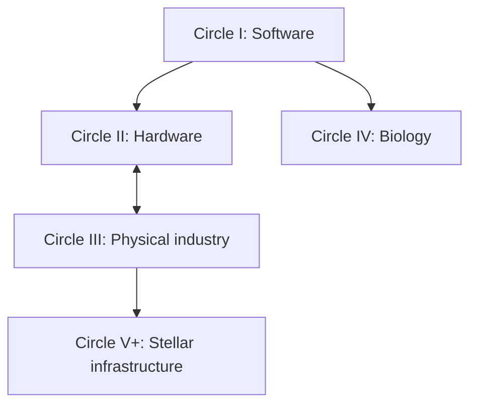

# AI-Level: From LLMs to a Type II Civilization

**Subtitle:** The Five Circles and the Grand Challenges on the Road to a Dyson Swarm

**Outline v5 — September 6, 2026 — for author review before chapter drafting**

## Editorial direction

v5 keeps everything v4 made rigorous: the seven parts and thirty-two chapters, the forty problem identifiers as forty entries, testable bottlenecks in place of asserted gates, the program-specific definition of centering, the four-step work record in place of a guessed ledger, and the evidence notes on the narrative cases. It changes two things.

**First, it restores a spine without restoring the overclaim.** v3 named one permanent gate per circle; v4 replaced that with candidate constraints requiring evidence, which is correct, and in doing so left the reader with no answer to "what should I work on first." v5 gives each circle a **candidate gate stated together with the test that would confirm or dethrone it.** A reader gets a recommendation and the means to overturn it; the book takes a position and shows its falsifier in the same sentence.

**Second, it embeds the eighteen grand hard problems registered on physicsworldmodel.org.** They are the concrete, machine-readable half of this book's research agenda: each is registered as a principle with a governing equation, a statement of what "solved" would mean, a benchmark metric, starting datasets and the shape of an AI agent that could attack it — and each is still marked *Frontier: not yet benchmarked or verified*, which is the honest status the book's own cases carry. Every one of the eighteen is placed in a circle, attached to one of the forty book problems, and printed in the main text of that circle's part. Part VII's "living atlas" stops being a proposal: it is the Physics World Model registry, and the book's invitation ends with a register-it link.

The book remains an accessible argument and research agenda. Certification laws, formal scoring, source audits and engineering protocols belong in appendices. Each chapter opens with a concrete problem and closes with the next question it makes possible.

## Title, thesis, and reader promise

**Title:** AI-Level: From LLMs to a Type II Civilization
**Subtitle:** The Five Circles and the Grand Challenges on the Road to a Dyson Swarm

**Thesis:** Intelligence expands civilization's possibilities when people and AI convert knowledge into reliable instruments, effective organizations and productive infrastructure. Progress depends on finding the constraints that actually limit that conversion, demonstrating improvements in the world, and making the resulting capabilities usable by others.

Four propositions, each with its falsifier:

1. **Intelligence has several relevant dimensions.** Reasoning, memory, persistent learning, organizational development, delegation and self-awareness contribute differently to a project; an index summarizes a declared assessment and cannot substitute for the underlying profile. *Falsified if* a single scalar predicts deployed agent outcomes as well as the profile does (the tournament of Chapter 5).
2. **Progress crosses substrates through integrated systems.** Better cognition improves designs and procedures, but a working chip, a repaired machine, a useful intervention and a growing orbital industry also need equipment, energy, materials, measurement and coordination. *Falsified if* a documented program closes an outer-circle loop by raising cognition alone.
3. **Validation and adoption recur as organizational requirements in every circle** — an evaluator inside the write set is not an evaluator, and a system that authorizes its own deployment has self-certified. This is a structural claim, not a claim that validation always sets the pace. *Falsified if* a declared loop closes with the same locus proposing, judging and adopting, and the adoption survives independent audit.
4. **Priorities should follow measured constraints and human purposes.** *Falsified* every time a candidate gate is dethroned by the test that accompanies it — which is the point.

The reader should leave able to identify a meaningful grand problem, find or register it, understand its dependencies, distinguish a promising demonstration from a completed capability, and choose an achievable contribution.

## The five missions, and where the registered problems live

| Circle | Civilizational mission | Integration milestone | Candidate gate (with its dethroning test) | Registered PWM problems that live here |
|---|---|---|---|---|
| I — Software | Reliable learning, discovery and improvement of cognitive tools | Sustained, independently assessed improvement of operative software | **The referee**: validation and adoption independent of the improver. *Dethroned if* a program with a protected referee still stalls on candidate quality or execution in a measured record. | Quantum gravity, dark matter, dark energy, black-hole information (L1-911–914): discovery loops that close entirely in computation |
| II — Hardware | Produce and integrate the computing substrate | Qualified manufacture of useful hardware deployed into working compute | **The yield loop**: process control that learns at wafer timescale. *Dethroned if* delivered compute is shown to be bounded by supply, integration or energy while yield is within bounds. | Fault-tolerant quantum computing, optimal quantum control, circuit compilation (L1-921, 923, 924); molecular electronics (L1-934); room-temperature superconductivity (L1-915) |
| III — Physical industry | Maintain and reproduce essential productive capability | A bounded industrial system produces functional successors and keeps their capabilities | **Reproduction with declared dependencies**. *Dethroned if* successors are produced but the binding item is shown to be feedstock, precision or energy rather than the dependency ledger. | Atomically precise manufacturing (L1-931), DNA self-assembly (L1-932) |
| IV — Biology | Convert biological knowledge into sustained human benefit | A defined intervention pathway delivers independently verified outcomes and learns from monitoring | **The clinical validate step**: validation at organism and population timescale. *Dethroned* for a given pathway if mechanism, assay or efficacy is shown to limit it before endpoints do. | Reverse aging, longevity, curing cancer, regeneration, proteostasis (L1-901–905); targeted nanomedicine (L1-933) |
| V+ — Stellar infrastructure | Sustain productive expansion beyond Earth | An orbital industrial loop grows useful capacity after losses and dependencies | **Organization across light-minutes**. *Dethroned* at a given stage if supply, manufacture, thermal or orbital limits bind before coordination does. | Quantum networks and repeaters (L1-922); superconductivity for power (L1-915, secondary) |

Candidate constraints are hypotheses to examine, not a measured ranking of today's field. Every project names its own boundary and evidence.

## How the circles connect

The diagram summarizes principal enabling relationships. It does not make full software closure a prerequisite for useful biology, impose a strict sequence, or exclude feedback from instruments, energy and physical experiment into software. Hardware and physical automation bootstrap each other; biology has a substantial parallel mission grounded in human benefit.

One observation from the registered problems belongs here: **the four physics-and-cosmology problems are Circle I problems.** Their entire loop — hypothesis, computation, sealed validation against held-out data, incorporation into the next model — runs in software, on public datasets, with no physical floor. They are therefore the cleanest testbed the book has for autonomous discovery (I5) and for the referee: an AI scientist can be run against them today and judged by a sealed dataset it cannot write to.

### Centering, defined for a program

**A program centers on a new circle when its supporting capabilities are reliable enough for its declared mission, and evidence shows that constraints in the new domain now govern further progress.** Apply it to a named program, not to humanity. Report the mission, boundary, resources and period; the supporting capabilities that meet their reliability budgets; the remaining constraint, tested by intervention where possible; and evidence that relaxing it changes useful output, reliability, cost or time, with rival explanations retained. Centering and full autonomous closure are separate claims; human-governed systems can deliver major benefit without meeting the closure criterion.

### The four-step work record

For each named case record identify, implement, validate and deploy separately: who supplied the goal or hypothesis; which software and physical actions executed and what they cost; who controlled criteria, data, instruments and verdict; who adopted, with rollback and observed outcomes. Report accepted and rejected attempts, failure severity, retention, elapsed time, human cognitive assistance, authorization delays, resource costs and unfinished work. "Not measured" is a valid entry. Four autonomous labels do not establish effectiveness; zero approval events do not establish independent validation.

## The eighteen registered grand hard problems

Physics World Model (physicsworldmodel.org/frontier) registers grand hard problems as machine-readable principles. Each carries a governing model, a statement of what solved would mean, a benchmark metric, starting datasets and the shape of an agent that could attack it, and each moves through the same ladder as the site's mature computational-imaging benchmarks: a registered principle (L1), a benchmark that instantiates it (L3), solutions verified against it (L4), with on-chain certificates and a bisection challenge for disputed verifications. All eighteen are at the first rung — *Frontier: not yet benchmarked or verified* — which is the status this book's own cases carry, and which the book treats as an invitation rather than a defect.

| ID | Problem | Registry group | Circle | Book problem | Governing model (abridged) | Solved-when metric |
|---|---|---|---|---|---|---|
| L1-901 | Reverse Aging | Life Sciences & Aging | IV | IV-04 | dA/dt = k_dmg − k_rep·u(t); Age_bio = Clock(M) | years of biological age restored, identity preserved |
| L1-902 | Longevity | Life Sciences & Aging | IV | IV-04 | Gompertz–Makeham μ(t) = A + B·e^{Gt}; interventions act on G | mortality-rate doubling-time gain |
| L1-903 | Curing Cancer | Life Sciences & Aging | IV | IV-03 | competing sensitive/resistant clones under dosing u(t) | months of time-to-progression vs continuous MTD |
| L1-904 | Regeneration | Life Sciences & Aging | IV | IV-05 | reaction–diffusion morphogens coupled to TGF-β/ECM fibrosis | functional tissue fraction restored |
| L1-905 | Proteostasis | Life Sciences & Aging | IV | IV-06 | Knowles nucleation–elongation master equation with clearance | fractional aggregate-load reduction |
| L1-933 | Targeted Nanomedicine | Nanotechnology | IV (III secondary) | IV-07 | whole-body convection–diffusion–reaction PK with corona | % injected dose reaching target |
| L1-931 | Atomically Precise Manufacturing | Nanotechnology | III (II secondary) | III-04 | rate ∝ exp(−ΔE‡/k_BT); yield = P(correct site \| σ, E(r)) | correct-placement yield at ≤ 0.1 Å |
| L1-932 | DNA Self-Assembly | Nanotechnology | III (IV secondary) | III-06 | nearest-neighbour ΔG; yield = Z_target/Z_total | correct-fold yield, inverse design |
| L1-934 | Molecular Electronics | Nanotechnology | II (III secondary) | II-04 | Landauer G = (2e²/h)·T(E_F), NEGF transmission | log-conductance error, inverse design |
| L1-921 | Fault-Tolerant Quantum Computing | Quantum Technology | II | II-04 / II-01 | p_L ≈ A·(p/p_th)^{(d+1)/2}; Λ = p_L(d)/p_L(d+2) | logical error per cycle with Λ > 1 in latency budget |
| L1-923 | Optimal Quantum Control | Quantum Technology | II | II-03 | U(T) = T exp(−i∫H[u]dt); F = \|Tr(U†U_target)\|²/d² | average gate infidelity ≲ 10⁻³ |
| L1-924 | Quantum Circuit Compilation | Quantum Technology | II | II-08 / II-01 | minimize two-qubit count s.t. coupling graph; P ≈ (1−ε₂)^{N₂} | two-qubit gates after compile, verified equivalence |
| L1-922 | Quantum Networks & Repeaters | Quantum Technology | V+ (II secondary) | V-08 | R_repeater ∝ η^{1/n}·p_swap^{n−1}·f(τ_mem) | entangled pairs/s at 1000 km at target fidelity |
| L1-915 | Room-Temp Superconductivity | Physics & Cosmology | II (V+, III secondary) | II-05 / V-04 | Allen–Dynes Tc from α²F(ω) and μ* | MAE on Tc ≲ 12 K with dynamical stability |
| L1-911 | Quantum Gravity | Physics & Cosmology | I | I-05 | Ryu–Takayanagi S(A) = Area(γ_A)/4G_N | bulk-metric reconstruction error under subadditivity |
| L1-912 | Dark Matter | Physics & Cosmology | I | I-05 | v(r) = √(GM(r)/r); NFW halo profile | reduced χ² of rotation-curve fit, M200 within 0.1 dex |
| L1-913 | Dark Energy | Physics & Cosmology | I | I-05 | H(z)² with w(z) equation of state | RMS error on reconstructed w(z) ≲ 0.08 |
| L1-914 | Black-Hole Information | Physics & Cosmology | I | I-05 | island formula S_rad = min ext_I [Area(∂I)/4G + S_bulk] | deviation from the unitary Page curve |

Source: the registry's own pages and its `/api/frontier/list` grouping, retrieved September 6, 2026; the parsed records are kept beside this outline in `pwm_grand_hard_problems.json`. The circle and book-problem assignments are this outline's, not the registry's, and are hypotheses in the sense of the propositions above.

## Prologue — The Answer, the Instrument, and the World

Begin with a useful AI answer that must become a reproducible method before anyone can rely on it. Follow the chain from method to instrument, from instrument to laboratory or factory, and from productive infrastructure to further discovery; at each link ask what was actually built, what was measured, and which constraint remains. Then break the chain deliberately at the second link — who checked the instrument, and could the thing that made it have checked itself? Extend the horizon to a Dyson swarm while keeping nearer benefits visible; mark imagined scenes as scenarios; invent no measured outcomes.

A bare LLM is the starting example. A strictly ephemeral evaluation contract can imply M0/I0; an API endpoint alone establishes neither those properties nor cognition or self-awareness. The organizational coordinate is inapplicable to a singleton unless a declared protocol assesses an organization. No formal Circle 0.

## Part I — AI-Level and the Circles of Progress

**Part argument:** A useful account of progress connects capability, organization and physical reach while measuring each on its own terms.

### Chapter 1. What Does an AI Level Measure?
C, I, O, T, H, SA and independently measured M through one task attempted by different model–harness pairs; gated U-levels; ordinal certification versus continuous index readings; resource spending, energy scale and human benefit reported separately.

### Chapter 2. From Memory to Discovery
M0–M5/MΩ and I0–I5/IΩ. Memory contents versus learning mechanisms; Θ changes versus Ψ changes; a validated discovery versus demonstrated incorporation into later competence. The restart and matched-control examples are central; sophisticated memory does not certify learning.

### Chapter 3. Organizations That Learn and Improve
The seven roles — director, discoverer, instrument-maker, specialist, operator, referee, promoter — and O0–O5/OΩ. Why independent evidence and adoption matter; how organizations turn discoveries into instruments and ordinary procedure. Separation concerns effective control of criteria, evidence and adoption, not brands or machines. Ten agents establish no particular O-level.

### Chapter 4. The Five Circles and Their Improvement Loops
Identify, implement, validate, deploy in each substrate; bounded scope, partial closure, dependency accounting, hardware–physical co-development, biology's parallel mission. The circle coordinate distinguished from I, O, U and Kardashev.

### Chapter 5. How to Find the Constraint That Matters
Required capability, binding bottleneck, accelerator, human-benefit mission. Counterfactual tests and sensitivity analysis: what changes if this step gets faster or more reliable? Individual-capability saturation and the growing weight of coordination presented as hypotheses with assumptions and counterexamples. **New in v5:** the candidate-gate discipline — every gate the book names is printed with the observation that would dethrone it — and the registry's principle → benchmark → solution ladder as the mechanism by which a grand problem becomes a measurable one.

## Part II — Circle I: Software That Improves Its Own Capabilities

**Mission:** Make learning, discovery and software self-improvement dependable enough to support further work.
**Part argument:** Self-improvement is earned through useful retained changes under independent assessment. More candidates, or fewer approvals, do not establish it.
**Candidate gate:** the referee. **Dethroning test:** a program with a protected, independent referee that still stalls on candidate quality, memory or execution in its four-step record.

### Chapter 6. From a Language Model to a Reliable Agent
Planning, tools, grounded state, acceptance checks and recovery under declared resources. The repository's Core-to-Core-H episode as a preliminary example of an instrument reaching its ceiling and then distinguishing configurations on harder items — with its configurations, suite version, sample and adaptive item history preserved, and without a base-model ranking claim (Evidence note A).

### Chapter 7. Memory, Learning, and Continuity
Persistent state, provenance, stale-state suppression, consolidation, repair, cross-project knowledge; one project traced across restarts with and without learned state; distinguishing failures of content, retrieval, mechanism and apparatus.

### Chapter 8. Improving the Mechanism and the Improvement Process
I3 changes to Θ; I4 changes to Ψ; baselines, retention, causal attribution, resource guards, repeated generations. Repeated self-editing is not improvement of the process that edits.

### Chapter 9. The Referee, the Builder, and the Adoption Decision
Verification and adoption as candidate binding constraints in a bounded loop; protected checks against other failure sources; false completion and false rejection together; the referee can be wrong, so the instrument and the reviewer are evaluated too.

### Chapter 9a. The AI Scientist in a Closed Software Loop — the four registered physics problems
The cleanest place to test autonomous discovery is a problem whose entire loop runs in computation against sealed data. Four registered problems have that shape, and each is printed here as the registry states it:

- **L1-911 Quantum Gravity** — *Reconstruct the geometry of spacetime from quantum entanglement; test whether gravity is emergent.* Why grand: no direct experiment; bulk reconstruction is an ill-posed inverse problem constrained by entanglement inequalities. Model: Ryu–Takayanagi S(A) = Area(γ_A)/4G_N. Current best: tensor-network and RT bulk reconstruction in AdS/CFT toy models. Solved when: bulk metric reconstructed from boundary entropies with low geodesic-area error, respecting strong subadditivity. Agent: given a boundary state's entanglement data, proposes and scores candidate bulk geometries.
- **L1-912 Dark Matter** — *Pin down the halo from how galaxies rotate; distinguish particle dark matter from modified gravity.* Why grand: baryonic uncertainty, beam smearing and profile–gravity degeneracies; conclusions must hold across diverse galaxies. Model: v(r) = √(GM(r)/r) with an NFW halo. Current best: SPARC rotation-curve NFW/MOND fits. Solved when: halo profile recovered from HI/Hα curves at reduced χ² ≲ 1.2 and M200 within ~0.1 dex. Agent: fits halos across a catalogue and quantifies the evidence for dark matter versus modified gravity.
- **L1-913 Dark Energy** — *Measure whether dark energy is constant or evolving; reconstruct w(z).* Why grand: w(z) is recovered from integrated distances, a smoothing inverse problem; systematics across probes must be jointly modelled; tiny deviations from −1 matter. Model: H(z)² = H₀²[Ω_m(1+z)³ + Ω_DE·exp(3∫(1+w)/(1+z)dz)]. Current best: DESI + Pantheon+ w₀wₐ constraints. Solved when: w(z) reconstructed with RMS ≲ 0.08 and H₀ within ~1 km/s/Mpc. Agent: ingests new cosmological data and updates the w(z) posterior with systematics-aware inference.
- **L1-914 Black-Hole Information** — *Show that black holes preserve information; recover the unitary Page curve via the island formula.* Why grand: fine-grained entropy needs quantum-extremal-surface contributions, analytic only in toy models. Model: S_rad = min ext_I [Area(∂I)/4G_N + S_bulk(R∪I)]. Current best: island and replica-wormhole derivations. Solved when: the unitary Page curve recovered for an evaporating model with low deviation. Agent: given an evaporation model, computes the entropy curve and locates the Page time and islands.

What these four give the book: an I5 test with the incorporation gate applied to a sealed physics dataset, no clinical endpoint and no fab in the way, and a referee that is a held-out dataset the agent cannot write to. Their cross-reference to Chapter 19 is deliberate: the cancer campaign there is the same experiment with a biological floor added.

### Chapter 10. The Circle I Grand Challenges

| ID | Grand problem | Candidate approaches and evidence of progress | Registered problems |
|---|---|---|---|
| I-01 | **Memory that supports lifelong learning** | Provenance, consolidation, retrieval, repair; experience improves unseen work across real restarts with protected capabilities retained. | — |
| I-02 | **Dependable reasoning and long-horizon action** | Planning, world models, tools, uncertainty, recovery; extended tasks meet declared reliability and assistance limits under changed conditions. | — |
| I-03 | **Verified cognitive self-improvement** | Versioned Θ, bounded changes, protected evaluation, rollback; active mechanism changes improve held-out performance with controls. | — |
| I-04 | **Improvement of the improvement process** | Versioned Ψ, experimental design, candidate selection; validated gains improve relative to a matched process and total cost. | — |
| I-05 | **Discovery that expands future competence** | New methods, representations, instruments; independently validated findings enable subsequent work after controlled incorporation. | L1-911, L1-912, L1-913, L1-914 |
| I-06 | **Verification that resists self-certification** | Protected criteria, test suites, external checks, separate adoption; acceptance errors and downstream regressions assessed independently. | the registry's S1–S4 verification stages and bisection challenge are one implemented instance |
| I-07 | **Organizations that learn and redesign themselves** | Persistent evidence, routing, allocation, workflow experiments; changes improve outcomes with member capability and resources controlled. | — |
| I-08 | **Trustworthy measurement of AI progress** | Valid tasks, calibrated indices, fixed historical references, uncertainty; independent readings distinguish capability, harness effects and spending. | — |

**Priority hypothesis:** in a system already generating useful improvements, validation and adoption may dominate; elsewhere candidate quality, memory or execution may. Compare I-03/I-06/I-07 as an integration cluster and measure the cause before naming a gate. I-04 and I-05 expand the frontier without being necessary for every narrow closed loop.
**Flagship demonstration:** declare a mechanism and workload; preserve an independent evaluator and adoption process; run repeated improvements against matched baselines; publish cycles completed and uncertainty, not only the best change. **Second flagship (new):** an AI scientist run against one of L1-911–914 with the registry's sealed benchmark as referee, reported with the four-step record.
**Closure distinction:** independent adoption without a required human decision in ordinary cycles satisfies the autonomy condition in its declared scope; human-approved improvement remains useful measured progress with a different autonomy report.
**Enables:** engineering tools, scientific agents and organizational methods across the other circles.
**First contributions:** restart-and-ablation memory studies; completion-versus-refusal tests; controlled Θ campaigns; an adoption ledger; **build the benchmark for one of the four physics problems** — the registry pays for that step.

## Part III — Circle II: Intelligence Builds Its Computing Substrate

**Mission:** Produce, qualify and integrate useful computing hardware through increasingly capable design and manufacturing systems.
**Part argument:** A design becomes computing capability only after fabrication, qualification, maintenance and integration succeed together.
**Candidate gate:** the yield loop. **Dethroning test:** delivered useful compute bounded by supply, integration or energy while yield stays within its preregistered bounds.

### Chapter 11. Designing the Next Computing System
Architecture, co-design, EDA, verification, manufacturability; alternative devices and computing approaches compared by workload and physical constraint; new architectures as candidate routes, not prerequisites.

### Chapter 12. The Yield Loop: From Design to Qualified Manufacture
Metrology, contamination, drift, equipment uptime, qualified inputs, functional yield; the yield loop as a candidate constraint for a specified process, and when supply, thermal limits or integration would govern instead.

### Chapter 13. Compute, Energy, and Physical Reliability
Memory movement, interconnect, packaging, cooling, lifetime, software compatibility, useful performance per measured system energy; capital, equipment access and maintenance in the account.

### Chapter 13a. The Quantum Substrate and the Materials Beneath It — five registered problems
The registry's quantum-technology group is Circle II's alternative substrate stated as loops, and two materials problems sit under both substrates:

- **L1-921 Fault-Tolerant Quantum Computing** — *Cross the threshold: decode the surface code fast enough that adding qubits drives logical error down.* Why grand: decoding must be accurate and fast every cycle; correlated noise, leakage and crosstalk break idealized models. Model: p_L ≈ A·(p/p_th)^{(d+1)/2}, suppression Λ = p_L(d)/p_L(d+2). Current best: below-threshold surface-code demonstrations plus ML decoders. Solved when: from distance-3…25 syndrome streams, per-cycle logical error minimized with Λ > 1 inside the latency budget. Agent: learns a hardware-specific decoder from calibration data.
- **L1-923 Optimal Quantum Control** — *Hit the gate fidelities fault tolerance needs on real hardware.* Model: U(T) = T exp(−i∫H[u(t)]dt), F = |Tr(U†_target U)|²/d². Current best: GRAPE / Krotov / RL pulse optimization. Solved when: gates with average infidelity ≲ 10⁻³ under realistic open-system noise within bandwidth. Agent: calibrates and re-optimizes pulses per device from measured noise. In the book's terms this is Circle II's process-control loop at the quantum scale — the yield loop's cousin.
- **L1-924 Quantum Circuit Compilation** — *Make quantum programs runnable: route circuits with the fewest two-qubit gates.* Why grand: mapping is NP-hard, synthesis and routing interact, and the objective is noise- and topology-dependent. Model: minimize N₂ subject to the coupling graph; P_success ≈ (1−ε₂)^{N₂}. Current best: SABRE routing, ZX-calculus optimization. Solved when: two-qubit count within ~1.1× best known with verified equivalence. This is II-08 for a quantum device: running on the hardware you have.
- **L1-934 Molecular Electronics** — *Compute with single molecules; predict and design junction conductance.* Model: Landauer G = (2e²/h)·T(E_F) with NEGF transmission. Current best: DFT+NEGF plus break-junction measurement. Solved when: conductance predicted from structure within ~0.3 dex, and inverse design for a target. A device-level II-04 problem with a Circle III manufacturing tail.
- **L1-915 Room-Temperature Superconductivity** — *Design a material that superconducts at room temperature.* Why grand: Tc depends sensitively on the phonon spectrum and coupling; DFT is expensive; stability constrains candidates; extraordinary claims demand reproducibility. Model: Allen–Dynes Tc from α²F(ω) and μ*. Current best: high-pressure hydrides plus ML Tc models. Solved when: Tc predicted from structure with MAE ≲ 12 K under dynamical stability, and an inverse-design hit rate. Its consequences run through three circles: compute per unit energy and cooling (II-05/06), industrial energy infrastructure (III-07), and stellar-scale power handling (V-04).

### Chapter 14. The Circle II Grand Challenges

| ID | Grand problem | Candidate approaches and evidence of progress | Registered problems |
|---|---|---|---|
| II-01 | **End-to-end verified chip design** | EDA, formal checks, co-design; fabricated devices meet declared functional and integration specifications. | L1-921 (code–decoder co-design), L1-924 |
| II-02 | **Autonomous fabrication operations** | Equipment automation, robotic handling, fault recovery; repeated runs meet intervention and execution limits. | — |
| II-03 | **Metrology, yield, and process-drift control** | Inline measurement and feedback; yield and quality within stated bounds under documented disturbance. | L1-923 (calibration as drift control) |
| II-04 | **Better devices, materials, and interconnects** | Device and materials research, packaging, alternative architectures; gains survive production and workload comparison. | L1-921, L1-934, L1-931 (secondary) |
| II-05 | **More useful computation per unit of energy** | Architecture and software co-design, lower data movement; useful outcomes improve at whole-system energy and reliability. | L1-915 |
| II-06 | **Cooling and long-term hardware reliability** | Thermal design and monitoring; declared load sustained within temperature, error, lifetime and maintenance requirements. | L1-915 |
| II-07 | **Dependable equipment and materials supply** | Repair, qualified inputs, traceability; critical services and inputs remain available with imports disclosed. | — |
| II-08 | **Running on the hardware the system produced** | Characterization, integration, compatible software; manufactured devices do useful work in the producing system's compute. | L1-924 |

**Priority hypothesis:** for an accessible process, II-02/II-03 may jointly limit qualified output; priority shifts if equipment access, II-07 supply or II-08 integration determines delivered compute. Cooling and power are operating requirements even when not binding. II-04 is accelerator or requirement by architecture; the quantum substrate is one such architecture and the registry's five problems are its loop stated to the metric.
**Flagship demonstration:** within a declared process and supply boundary, produce functional hardware across repeated cycles, integrate it, and measure delivered compute, yield, quality, energy, downtime and human work.
**Enables:** more useful compute and control electronics for physical automation.
**First contributions:** a process-drift benchmark linked to physical measurement; a verified design-to-device case; a joint design–qualification–integration record; **a decoder or compiler benchmark registered against L1-921 or L1-924.**

## Part IV — Circle III: Industry That Maintains and Reproduces Itself

**Mission:** Maintain and reproduce essential productive capability from explicit resources and dependencies.
**Part argument:** A reproduction claim is about a functioning industrial system over time; a successor assembled from unreported imported critical parts does not demonstrate the resource-to-successor loop.
**Candidate gate:** reproduction with declared dependencies. **Dethroning test:** successors produced with a published dependency ledger while the binding item is shown to be feedstock, precision or energy.

### Chapter 15. Robots That Work Through Uncertainty
Grounded perception, tactile sensing, manipulation, adaptable control, diagnosis, repair; work outside prepared demonstrations; failure and recovery reported together.

### Chapter 16. From Raw Materials to Functional Machines
Extraction, refining, transformation, precision tools, components, assembly, logistics, inspection; the network that produces a machine, including its sensors and electronics.

### Chapter 17. Reproduction With Declared Dependencies
The functions a successor must retain; inputs tracked by quantity and by critical function — a small imported controller can be decisive; hardware qualification tied to manufacturing autonomy; repeated generations rather than one assembly.

### Chapter 17a. Manufacturing at the Atomic and Molecular Scale — two registered problems
The registry's nanotechnology group states Circle III's precision frontier as loops:

- **L1-931 Atomically Precise Manufacturing** — *Build matter atom by atom by positioning reactive groups.* Why grand: reactions depend on the DFT energy landscape and exact positioning; thermal and positional noise misplace; tip design and trajectories are a vast search space. Model: rate ∝ exp(−ΔE‡/k_BT); yield = P(correct site | σ_position, E(r)). Current best: STM atom manipulation plus DFT mechanosynthesis tooltip studies. Solved when: correct-placement yield at ≤ 0.1 Å error maximized under noise from DFT landscapes. Agent: plans tooltip trajectories and assembly sequences to build a target nanostructure reliably. Book placement: III-04 precision manufacture, with a Circle II device tail.
- **L1-932 DNA Self-Assembly** — *Program matter to fold itself.* Why grand: folding yield is set by a rugged thermodynamic and kinetic landscape; sequence design is combinatorial; off-target traps lower yield unpredictably. Model: ΔG = Σ ΔG_NN; yield = Z_target/Z_total. Current best: scaffolded DNA origami pipelines. Solved when: folding yield predicted within ~10% and a target shape inverse-designed. Book placement: III-06 — programmable self-assembly is reproduction of structure from a specification, the smallest instance of the circle's gate — with a Circle IV delivery tail through L1-933.

### Chapter 18. The Circle III Grand Challenges

| ID | Grand problem | Candidate approaches and evidence of progress | Registered problems |
|---|---|---|---|
| III-01 | **Robust perception and manipulation** | Embodied models, tactile sensing, adaptable control; useful work across declared unfamiliar objects with failures included. | — |
| III-02 | **Diagnosis and repair under unforeseen failure** | Monitoring, repair plans, modular design; recovery from held-out faults preserves tested function. | — |
| III-03 | **Integrated production from raw materials** | Extraction, refining, chemistry, processing; declared feedstocks become functional components through measured stages. | L1-931 (secondary) |
| III-04 | **Precision manufacture of complex machines** | Machine tools, assembly, inspection; components and assemblies meet tolerances and reliability, including critical electronics. | L1-931, L1-934 (secondary) |
| III-05 | **Logistics and resource cycles that sustain production** | Scheduling, transport, inventory, recycling; accounted-for flows sustain work through declared disruption. | — |
| III-06 | **Reproduction of productive capability** | Production cells, automated assembly, shared interfaces; successive systems reproduce essential capabilities with dependencies disclosed. | L1-932 |
| III-07 | **Reliable energy and supporting infrastructure** | Generation, storage, water, resilient services; the productive cycle meets energy, uptime, cost and environmental requirements. | L1-915 (secondary) |
| III-08 | **Independent verification of physical outcomes** | Calibrated instruments and separate inspection; output agrees with externally checked measurement with uncertainty reported. | — |

**Priority hypothesis:** III-06 is the integration milestone; its binding constraint may be electronics, precision, repair, energy or feedstock. Independent inspection establishes what happened; it does not manufacture missing parts. Precision, logistics and energy are not optional when the chosen cycle requires them.
**Flagship demonstration:** declare boundary, successor functions, bill of materials, energy balance, services and acceptable imports; produce and independently assess successors across generations; report whether critical dependencies decline. Bounded results stay labelled bounded.
**Enables:** durable industrial capacity on Earth and capabilities adaptable to off-world production.
**First contributions:** an end-to-end dependency map; one repair-and-replacement cycle independently tested; the component whose absence halts the reproduction process; hardware and physical automation developed as a coupled program; **a placement-yield or folding-yield benchmark registered against L1-931 or L1-932.**

## Part V — Circle IV: Biological Discovery That Improves Human Life

**Mission:** Turn biological understanding into reproducible interventions and durable human benefit.
**Part argument:** Prediction, mechanistic discovery, intervention efficacy and clinical benefit require different evidence; success at one stage does not certify the next.
**Candidate gate:** the clinical validate step. **Dethroning test:** for a named pathway, mechanism, assay quality or efficacy shown to limit progress before endpoint time does.

### Chapter 19. AI Scientists and Causal Models of Life
Mechanisms, multiscale models, informative experiments, uncertainty, transfer; patterns in a dataset distinguished from causal knowledge and from useful interventions. The repository's cancer prognostic-model campaign as a computational case with explicitly limited scope (Evidence note B), cross-referenced to the four physics problems of Chapter 9a as the same experiment without a biological floor.

### Chapter 20. Laboratories That Learn From Experiments
Assays, instruments, automation, negative findings, replication, persistent evidence graphs; the return path from result to reusable method; incorporation into future competence separated from remembering a report.

### Chapter 21. From a Validated Finding to a Useful Intervention
Discovery, delivery, experimental models, manufacture, endpoints, monitoring, access; what limits a particular pathway — assay, efficacy, transfer, observation time or adoption; endpoint-specific observation requirements distinguished from durations better methods can reduce.

### Chapter 21a. Six Registered Problems, Stated as Loops
The registry's life-sciences group and its nanomedicine problem are Circle IV's portfolio stated as governing models with a metric, which is exactly the form Chapter 21 asks a pathway to declare:

- **L1-901 Reverse Aging** — *Restore a youthful epigenome with partial reprogramming without losing cell identity.* Why grand: the window between rejuvenation and dedifferentiation or tumorigenesis is narrow, effects differ by tissue, and biological age is measured by clocks we do not fully trust. Model: dA/dt = k_dmg − k_rep·u(t); Age_bio = Clock(M_methylation). Current best: partial OSK reprogramming. Solved when: restored biological age predicted within ~2 years from single-cell methylation across tissues, with any loss of identity flagged. Agent: designs reprogramming protocols per cell type and predicts the reversal–safety trade-off.
- **L1-902 Longevity** — *Bend the Gompertz curve; slow the rate of aging itself.* Why grand: aging is networked and multi-organ; interventions interact and read out slowly; human trials take decades; clocks are noisy proxies for mortality. Model: μ(t) = A + B·e^{Gt}; interventions act on G through a hallmark network. Current best: rapamycin, senolytics and caloric-restriction meta-analyses. Solved when: the shift in the survival curve predicted within a few percent from multi-omic trajectories. Agent: proposes and ranks combination interventions and designs the cheapest informative trial. This problem is the book's clearest instance of the clinical validate step as a floor.
- **L1-903 Curing Cancer** — *Treat the tumour as an evolving population; schedule therapy to keep it controllable.* Why grand: clonal composition is partially observable, dynamics are noisy and patient-specific, and the optimal schedule depends on competition parameters inferred online. Model: competing sensitive and resistant clones under dosing u(t). Current best: adaptive therapy (the prostate-cancer trial). Solved when: from longitudinal tumour-burden series, time-to-progression maximized under a toxicity budget against continuous MTD. Agent: a per-patient controller from ctDNA and imaging to the next dose.
- **L1-904 Regeneration** — *Steer wounded tissue toward regeneration instead of scar.* Why grand: outcomes depend on spatially patterned signalling over time; the same molecule heals or scars by dose and timing; in-vivo control is limited. Model: reaction–diffusion morphogens coupled to a TGF-β/ECM fibrosis ODE. Current best: axolotl and zebrafish models, anti-fibrotics. Solved when: functional tissue fraction restored predicted from post-injury fields under control inputs. Agent: prescribes spatiotemporal signalling interventions for a given injury.
- **L1-905 Proteostasis** — *Predict and reverse age-driven protein aggregation behind Alzheimer's and Parkinson's.* Why grand: coupled nucleation and elongation rates are hard to measure in vivo; biomarkers lag pathology; clearance interventions have narrow windows. Model: the Knowles master equation with clearance. Current best: aggregation kinetics plus anti-amyloid antibody trials. Solved when: fractional aggregate-load reduction predicted within ~10% under a proteostasis-boosting intervention. Agent: fits a patient's kinetics and proposes clearance regimens.
- **L1-933 Targeted Nanomedicine** — *Deliver drugs only where needed.* Why grand: biodistribution depends on size, charge, ligand and a protein corona we barely model; the EPR effect varies; in-vivo data are scarce. Model: whole-body convection–diffusion–reaction transport with corona effects. Current best: ligand-targeted nanoparticles plus PBPK models. Solved when: percent injected dose reaching target predicted within ~1% absolute, and inverse design for maximal targeting. Agent: designs nanoparticles for a target organ and predicts delivery and off-target load.

### Chapter 22. The Circle IV Grand Challenges

| ID | Grand problem | Candidate approaches and evidence of progress | Registered problems |
|---|---|---|---|
| IV-01 | **Predictive and causal understanding across biological scales** | Mechanistic models, multi-omics, perturbations; intervention predictions replicate in declared settings and reveal limits. | L1-901, L1-902 (mechanism halves) |
| IV-02 | **Autonomous discovery with reproducible experiments** | Laboratory automation, assays, active learning; independently replicated results from complete cycles inform later work. | the cancer campaign (Evidence note B) |
| IV-03 | **Better prevention and durable control of cancer** | Mechanisms, detection, treatment and resistance research; cancer-specific programs demonstrate meaningful benefit. | L1-903 |
| IV-04 | **Understanding aging and extending healthy life** | Mechanistic and longitudinal research; improvements in health and function persist with risks and durability assessed. | L1-901, L1-902 |
| IV-05 | **Regeneration and replacement of damaged tissues and organs** | Regenerative medicine and tissue engineering; restored function with integration, durability and safety evidence. | L1-904 |
| IV-06 | **Understanding and treating brain and neurodegenerative disorders** | Neural measurement, mechanistic models, targeted interventions; reproducible functional or clinical gains. | L1-905 |
| IV-07 | **Designing and delivering effective interventions** | Drug discovery, delivery, biologics, manufacturing; effects, targeting, quality and reproducibility hold under stated conditions. | L1-933 |
| IV-08 | **Translation into accessible, monitored population benefit** | Clinical evaluation, production, evidence systems, monitoring; benefits persist across populations with access and adverse outcomes measured. | the validate step of every problem above |

**Priority hypothesis:** for a mature intervention, clinical validation and deployment may set the pace; earlier work may be limited by mechanism, assay, efficacy or delivery. IV-03–IV-06 are benefit missions whose priority follows burden, opportunity and evidence, not contribution to a Dyson swarm.
**Flagship demonstration:** choose a defined program and follow its evidence chain through the stages it actually reaches; record replication, causal scope, endpoints, manufacturing or delivery limits, monitoring and the work supplied by clinicians and institutions; report computational or laboratory results at that scope.
**Closure distinction:** the fully autonomous biological loop is a stronger theoretical target; consent, clinical responsibility and human decisions are neither reasons to discount a result nor instructions to remove them.
**Enables:** healthier lives, reduced suffering, resilience, more capable scientific methods.
**First contributions:** an assay's reproducibility; a mechanism replicated in an independent setting; an evidence lineage reconstructed; a computational finding connected to a prospectively testable experiment; **a benchmark built for one of the six — the registry names the datasets to start from.** Do not describe a prediction-model analysis as a treatment breakthrough.

## Part VI — Circle V+: From Orbital Industry to a Type II Civilization

**Mission:** Build orbital infrastructure that sustains useful productive expansion and could eventually support energy use at stellar scale.
**Part argument:** A self-expanding swarm must close a combined production, resource, energy, maintenance, thermal and coordination cycle; net expansion is the integration test, and no single discipline is guaranteed to dominate every stage.
**Candidate gate:** organization across light-minutes. **Dethroning test:** at a given stage, supply, manufacture, thermal or orbital limits shown to bind before coordination does.

### Chapter 23. Establishing Industry Beyond Earth
Transport, prospecting, feedstocks, extraction, refining, assembly, declining reliance on imported equipment; locations and pathways compared by evidence; capital, supply, replacement and operating resources accounted.

### Chapter 24. The Dyson Swarm as an Expanding Production System
Collectors, orbital manufacture, reinvestment, component life, replacement, recycling; maintained productive capacity and useful power, not nominal area; externally subsidized growth distinguished from loop-supported growth; sustained growth is not indefinite exponential growth.

### Chapter 25. Heat, Orbits, and Useful Energy
Conversion, local use or transmission, storage, waste heat, degradation, station-keeping, traffic, stability; operating constraints whose binding status changes with design and scale. "Dyson sphere" as umbrella, swarm as engineering focus. **Registered problem here:** L1-915 room-temperature superconductivity, whose power-handling consequences at stellar scale make it a secondary V-04 problem.

### Chapter 26. Organization Across Light-Minutes
Local control, delayed messages, asynchronous decisions, distributed verification, faults, long-lived institutions. Under a global-workspace model a decision requiring signals to cross a system is limited by propagation time; the bound depends on the assumed cycle and geometry, does not eliminate local individual agents, and does not prove all large-scale cognition impossible. No arbitrary gap figure; no claim that the human brain sits at a universal bound. **Registered problem here:** **L1-922 Quantum Networks & Repeaters** — *distribute entanglement over continental distances by beating fibre loss.* Why grand: memories decohere, swaps succeed probabilistically, and the cutoff and scheduling policy is a stochastic control problem over a large state space. Model: R_repeater ∝ η^{1/n}·p_swap^{n−1}·f(τ_mem). Current best: memory-based repeater testbeds. Solved when: end-to-end entanglement rate at fixed fidelity maximized over realistic chains against direct transmission. Agent: designs and schedules repeater protocols for a target distance and fidelity. The book's interest is structural: entanglement distribution is the physical layer for verification that no node can perform alone — V-08's coordination problem stated as a rate.

### Chapter 27. The Circle V+ Grand Challenges and the Type II Milestone

| ID | Grand problem | Candidate approaches and evidence of progress | Registered problems |
|---|---|---|---|
| V-01 | **Viable off-world supply chains** | Transport, prospecting, extraction, refining; useful production with material, energy, transport and imports accounted. | — |
| V-02 | **Autonomous orbital construction and productive expansion** | Robotic assembly and manufacture; sustained growth of useful capacity after losses. | — |
| V-03 | **Durable, resource-efficient collectors** | Lightweight structures and conversion; output and lifetime meet resource, degradation and maintenance requirements. | — |
| V-04 | **Conversion, distribution, and productive use of captured energy** | Local consumption, storage, power electronics, transmission; net useful power supports the declared cycle. | L1-915 (secondary) |
| V-05 | **Waste-heat rejection at scale** | Radiators, thermal design, workload placement; operation within assessed heat-rejection and material limits. | — |
| V-06 | **Orbital stability and collision avoidance** | Navigation, traffic, station-keeping; acceptable operation for stated geometry, density and uncertainty. | — |
| V-07 | **Long-duration repair, replacement, and reliability** | Diagnosis, resilient components, servicing; function persists across failures and replacement cycles. | — |
| V-08 | **Reliable organization across distance and generations** | Delay-tolerant coordination, evidence integrity, institutional continuity; accountable operation under delay, failure and turnover. | L1-922 |

**Priority hypothesis:** early stages may be supply- and manufacture-limited; sustained operation may be limited by replacement or thermal and orbital conditions; larger networks may become coordination-limited. V-08 is essential to investigate without assuming it dominates V-01–V-07. Heat, useful power and orbital operation are design constraints, not optional portfolio items.
**Flagship demonstration:** specify a bounded orbital-production concept and its full dependencies; assess resource and energy accounts, maintenance, output and growth; label simulated, terrestrial, orbital and reproduced evidence separately; a future operational demonstration must measure sustained net growth over a period appropriate to the claimed lifetime.
**Separate Type II assessment:** energy scale defines the Kardashev classification and nothing else; report the fraction of stellar output captured and used and the maintained useful capacity; a growing precursor swarm can satisfy a bounded expansion milestone while remaining far below Type II.
**Enables:** larger scientific and industrial activity beyond Earth, with stellar-scale energy as the long horizon.
**First contributions:** an auditable orbital-production model; materials-lifetime and thermal experiments; servicing demonstrations; delay-tolerant coordination tests; **a repeater-chain benchmark registered against L1-922.**

## Part VII — A Grand-Challenge Agenda for Humanity

**Part argument:** Concentrated effort can remove important constraints while parallel missions deliver human benefit and preserve alternative paths. The right contribution depends on a person's skills, an institution's resources and the evidence for a particular mission — and the registry makes choosing one, and being paid for progress on it, a thing a reader can do today.

### Chapter 28. A Living Atlas of Grand Problems
The atlas is not a proposal; it is Physics World Model's registry with this book's forty problems laid over it. Each of the eighteen registered problems moves up one ladder — principle registered (L1), benchmark built (L3), solutions verified (L4) — with on-chain certificates, four verification stages (dimensional consistency, well-posedness, convergence, residual) and a bisection challenge for disputed certificates, so that the registry's own validate step is not self-certified. The book's twenty-two unregistered problems are the atlas's next entries, and the chapter says what each needs before it can be stated as a principle with a metric. Preserve identifiers when problems split; record a reason for every priority change; leave unknown status unknown.

### Chapter 29. Institutions That Can Solve Hard Problems
Shared instruments, testbeds, data stewardship, independent evaluation, replication funding, open methods, prizes, durable teams; conflicting incentives and the cost of reliable coordination. A registry that pays for benchmarks rather than for claims is one institutional design, and the chapter examines what it does and does not solve.

### Chapter 30. Circle Time: Choosing Work Across Different Horizons
Computation, fabrication, material transformation, biological observation and infrastructure replacement set different project timescales; when faster design, better experiments, parallelism or capacity reduce time and when a physical requirement remains. Conditional scenarios, not dates. Prioritize by mission benefit, dependency value, evidence for the binding constraint, tractability, neglectedness, resources and uncertainty — transparently, with no single weighting for all institutions. A software team may have an immediate opportunity in Circle I; a laboratory need not wait for software closure to pursue an important health problem. **The four physics problems and the four quantum problems are the shortest loops in the registry** — computation and calibration, not endpoints or fabs — and are where a small team can move a registered problem up a rung this year.

### Chapter 31. How Human Work Changes as Capabilities Grow
Shifting roles in operation, expertise, instrument-making, evaluation, goal-setting and stewardship; no universal sequence from operator to director; complementary roles at many levels; capabilities do not decide who holds political or moral authority. Concrete next-project entry points for a student, a software team, a laboratory, an industrial firm, a funder and a public institution, each tied to a problem card — registered or unregistered — and a testable contribution.

### Chapter 32. An Invitation to Build the Next Capability
**Choose a problem that matters. Build a capability that helps solve it. Demonstrate what it can do under independent assessment. Make the result usable by others.** End with the one-page exercise — mission, one constraint and one rival explanation, the smallest informative demonstration, an evaluator, what success enables — and with the concrete act: if the problem is one of the eighteen, build its benchmark; if it is not, register it.

## Epilogue — The Future We Choose to Make Possible
Return to the chain from answer to instrument to institution to infrastructure; every link contains people, choices, experiments, resources and continuing work. The swarm supplies the horizon; the nearer capabilities must justify their value along the way.

## Connecting AI-Level to the grand problems

| Circle | Cognitive, individual and memory roles | Organizational roles | Domain evidence | Registered problems |
|---|---|---|---|---|
| I | Grounded reasoning, persistent state, learning, Θ/Ψ improvement, discovery | Controlled evaluation, adoption, allocation, workflow redesign | Executed changes, hidden tests, retention, cost, deployment outcomes | L1-911, 912, 913, 914 |
| II | Design reasoning, process history, better tools, device discovery | Coordination of design, manufacture, qualification, supply, integration | Functional devices, yield, useful compute, energy, uptime | L1-921, 923, 924, 934, 915 |
| III | Grounded control, diagnostics, machine history, tool improvement | Materials, production, logistics, repair, inspection, reproduction | Working successors, critical dependencies, resources, sustained function | L1-931, 932 |
| IV | Mechanistic reasoning, M5 lineage, persistent discovery, new assays | Distributed experimentation, replication, translation, monitoring | Replicated findings and outcomes at a stated scope | L1-901, 902, 903, 904, 905, 933 |
| V+ | Local engineering, infrastructure state, diagnosis, discovery | Delayed coordination, distributed evidence, maintenance, continuity | Useful power, maintained capacity, resource balance, sustained growth | L1-922, (915) |

C and SA contribute in every domain; T/H describes what can be delegated at verified reliability; M is measured beside I. An agent can execute tests without controlling their criteria; separate permissions provide useful independence, but correlated mistakes and invalid instruments still need external checks. Higher I/O levels can help without being logically required for every narrow closure criterion.

## The standard circle chapter and problem card

Each circle's challenge chapter follows: **human purpose → concrete case → required capabilities → grand problems → candidate constraints and the gate's dethroning test → demonstration → next capability → contribution.**

Each full problem card contains v4's ten fields and, new in v5, three from the registry's own form so that a book card and a registered principle are the same object:

1. Stable ID and a precise question. 2. Human purpose and the capability it would enable. 3. Declared boundary, environment, workload or population, resources, period. 4. Role in the mission — required capability, accelerator or benefit mission — with dependencies. 5. Loop steps involved and their actual human, AI, instrument and infrastructure contributions. 6. Dated evidence status: proposed, simulated, demonstrated bounded, independently reproduced, sustained. 7. Candidate approaches and relevant I/M/O/C/SA contributions. 8. The proposed binding constraint, its evidence, rival explanations, and the observation that would change the priority. 9. Success criterion with controls, reliability, retention, resource accounting and an independent assessment plan. 10. The smallest informative next demonstration, who can do it, what it unlocks. **11. Governing model** — the equation or law the problem is stated in. **12. Benchmark and metric** — the task and the number that would mean "solved", with starting datasets. **13. Registry status** — principle ID if registered; otherwise what is missing before it can be.

One worked card per circle: Circle I from a source-backed software case and one registered physics problem; the outer circles from commissioned engineering cases or declared scenarios until suitable evidence has been reviewed.

## Evidence notes for the narrative anchors

**Case A — When the benchmark reaches its ceiling** (Chapter 6; methods in Appendix D). The benchmark manuscript reports two configurations at 90.0 on the Core and 37.3 versus 83.2 after four harder witnesses — a 45.9-point separation. Preserve as a preliminary demonstration of instrument headroom on those configurations; the readings are agent-mediated and must not be presented as isolated base-model comparisons; the harder items were calibrated against the compared pairs and token cost was not captured, so the "tenfold cost" hook is omitted pending an auditable record, and fresh forms or external configurations are required before any ranking claim.

**Case B — A validated computational finding that did not earn I5 certification** (Chapter 19; cross-reference Chapters 8 and 9a). Two computational campaigns on transport of a prognostic model across site-disjoint TCGA-LUAD splits: one prediction failed on eight sealed seeds; the second passed the stated correlation test; the transfer experiment reported +0.008 mean C-index gain over three paired seeds, below the 0.01 margin; a persistence-apparatus defect, a rerun and a control timeout are reported; lower-level certification was not established, so the cumulative I5 claim did not pass. Tell it as the difference between a tested finding, measured transfer and a capability certificate — not as treatment benefit, a completed discovery-to-clinic loop or general scientific competence. **Source inconsistency to resolve during drafting:** the AI4Science manuscript's abstract, scope statement, coordinate table and conclusion say no field has run an I5 campaign while its results section reports two; use a reconciled source and archived run evidence before this becomes polished narrative.

**Case C — The instrument needs evaluation too** (Chapters 5 and 29; Appendix D). The index manuscript's simulation studies of anchoring, saturation, ranking resolution and coverage are results under stated assumptions; they do not establish a universal empirical law for all model populations.

**Case D — The registry's frontier pages** (Chapters 9a, 13a, 17a, 21a, 26, 28). Each registered problem is a framing page marked *not yet benchmarked or verified*. Its governing model, current best and solved-when metric are the registrant's proposal, not a measured state of the field; its "current best" names a representative result, not a survey. The book quotes them as proposals and dates the retrieval (September 6, 2026). The circle and book-problem assignments are this outline's.

## Appendices
- **A. AI-Level reference.** C, I, M, O, SA, T/H, HG, U, invariants, cumulative prerequisites, certification conditions.
- **B. Circle × role matrices.** Individual contributions, organizational functions, resources, limits of proposed mappings.
- **C. Master grand-problem registry.** Forty book problems with stable IDs, links, dependencies and opportunities, cross-indexed to the eighteen registered principles; `pwm_grand_hard_problems.json` as the machine-readable seed.
- **D. Evidence and measurement.** Controls, reliability, retention, costs, apparatus validation, case provenance, simulation versus field evidence; the registry's four verification stages and bisection challenge as an implemented referee.
- **E. Circle closure and centering.** Definitions, declared scope, work records, bounded demonstrations, sustained operation.
- **F. Scenarios and theory revision.** Assumptions, rival models, counterexamples, falsification criteria, revision history — including every gate the book names and the observation that dethrones it.
- **G. Glossary and source notes.** Including Circle II versus Kardashev Type II, and principle L1 versus benchmark L3 versus solution L4.

## Change log from v4

| v4 element | v5 change |
|---|---|
| Candidate constraints with no recommendation | Each circle names a candidate gate together with the observation that would dethrone it; a position and its falsifier in one sentence |
| Four propositions without falsifiers | Each proposition carries the evidence that would refute it |
| Living atlas as a proposal | The atlas is physicsworldmodel.org's registry; the eighteen registered problems are embedded in the main text of their circles with ID, group, governing model, current best, solved-when metric and agent shape; the data file ships beside the outline |
| No registered problems in Circle I | The four physics-and-cosmology problems identified as closed-loop computational discovery — the book's cleanest I5 and referee testbed — as Chapter 9a |
| Quantum, nano and materials problems absent | Chapters 13a and 17a place them; superconductivity threaded through Circles II, III and V+; quantum networks through V-08 |
| Life-sciences problems named only as families | Six registered problems stated as governing models with metrics in Chapter 21a and mapped to IV-03–IV-07 |
| Ten-field problem card | Thirteen fields: governing model, benchmark and metric, registry status — so a card and a registered principle are the same object |
| Invitation ends with an exercise | Invitation ends with an act: build the benchmark, or register the problem |
| Evidence notes A–C | Note D added on the status of registry pages |
| Everything else in v4 | Preserved: structure, forty IDs, program-specific centering, the four-step work record, closure distinctions, Type II separation, no arbitrary coherence-gap figure, no universal role sequence |

## Source record

Reviewed for this revision on September 6, 2026:

- `physicsworldmodel.org/frontier` and its eighteen problem pages; `physicsworldmodel.org/api/frontier/list` for the registry grouping; `physicsworldmodel.org/challenges` for the bisection-challenge mechanism. Parsed records: `book/pwm_grand_hard_problems.json`.
- `book/AI-Level_Book_Outline_v4.md` (this outline's base) and `book/AI-Level_Book_Outline_v3.md`.
- `Level_Problem_Queues.md`, Queue C and §4, for the circle closure statements and the observation that the individual requirement peaks at Circle I.
- The AI-Level Bench, AI4Science layer and AI-Level Index manuscripts, and `ail_index_v2/facts.json`, as in v4's source record.
- Wright, *Dyson Spheres* (arXiv:2006.16734).

Foundational sources: *Intelligence Inside the Circles*, *Unified Intelligence Theory v2.4*, *SARSI-L v3*, *Substrate Indexing Is an Axis Shift*.

This is an improved outline and an evidence review, not a completed book, an independent replication of the repository's experiments, or a survey of the field. The grand problems, their circle assignments and the proposed demonstrations remain the book's research agenda for author revision.
