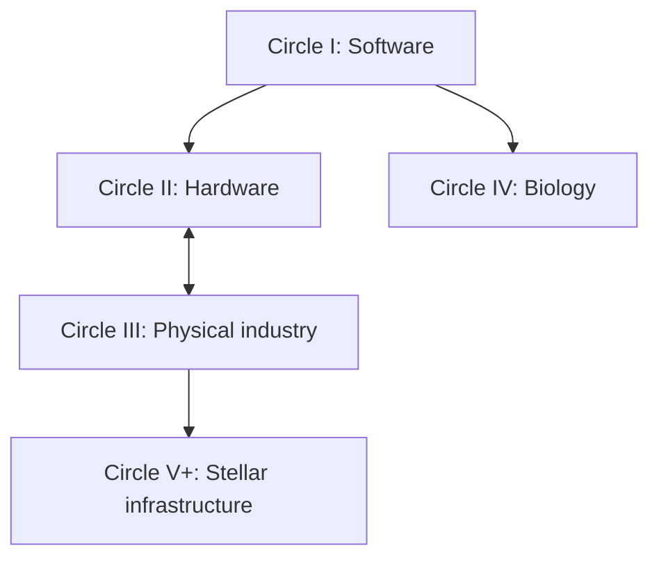

# AI-Level: From LLMs to a Type II Civilization

**Subtitle:** The Five Circles and the Grand Challenges on the Road to a Dyson Swarm

**Outline v7 — September 6, 2026 — for author review before chapter drafting**

## Editorial direction

Keep v6's rigor and structure in full: forty core grand problems, eight per circle; eighteen more specific research programs placed inside the circles they serve; a consistent seven-part, thirty-two-chapter structure with the program sections inside Chapters 9, 13, 17 and 21. Two changes. First, **the book stands on its own**: the eighteen programs carry the book's identifiers (R-01 to R-18) and its own statements of ambition, tractable task and remaining evidence; no external registry, its codes, links, reward scheme or verification workflow appears in the book, and the book's problem cards are the registry of record (Appendix C). Second, **the reader's map is restored** (below): every chapter has an opening question, a case and a takeaway, and three narrative threads run through the seven parts, so the outline describes a book a reader will finish rather than a specification.

The narrative follows intelligence becoming dependable work, computing equipment, productive industry, healthier lives and sustained activity beyond Earth. Each circle names a mission, problems worth solving, an actionable starting focus, the evidence that could change that focus and the capability a successful demonstration would enable.

Three distinctions govern this revision:

1. **Forty core problems and eighteen research programs.** The book's problems describe broad capabilities or human-benefit missions; the programs are more specific research questions within them, each with a governing model, a bounded first task and a statement of what evidence the larger claim still needs. Many-to-many, and not eighteen indispensable steps toward Type II.
2. **Benchmark result, scientific result and deployed capability.** A benchmark answers a bounded question. A scientific claim requires evidence appropriate to that claim. A capability must work under its stated operating conditions. Keep these outcomes separate throughout the narrative.
3. **A recommendation with stated conditions.** Recommend a first problem for a named program at a named stage. Check whether improving it changes useful output, cost, reliability or time. An accounting ledger records a constraint; the ledger itself is not the missing manufacturing capability.

Keep equations, certification detail and extensive evidence audits in appendices. The eighteen programs remain visible in their circles' main text. Present scientific uncertainty beside the relevant claim, with enough explanation to help the reader decide what to build next.

## Title, thesis, and reader promise

**Title:** AI-Level: From LLMs to a Type II Civilization

**Thesis:** Intelligence expands civilization's possibilities when people and AI convert knowledge into reliable tools, effective organizations and productive infrastructure. Progress requires identifying the constraints that limit that conversion, testing improvements and making useful capabilities available to others.

The reader should leave able to choose a meaningful problem, understand its dependencies, identify a feasible contribution and state what evidence would establish progress.

### Claims that can be tested, and purposes that must be chosen

- **Capability profiles may explain differences that a single score hides.** Compare their predictive value on held-out deployments against calibrated scalar baselines, reporting sample size and uncertainty. A scalar can be useful within a specified setting without making all capabilities identical.
- **Additional cognition may cease to dominate a particular program's progress.** Compare improvements in reasoning, tools, equipment, memory and coordination under stated resources. Name the range over which any saturation claim holds, and what would overturn it.
- **Protected evaluation and accountable adoption may improve reliability.** Test acceptance errors, rejection errors, correlated failures and deployment outcomes. Independence concerns control of evidence and criteria; an automated system can contain protected evaluating and adopting roles. External audits help establish whether that protection works.
- **Priorities should serve human purposes and respond to evidence.** This is a guiding value and decision rule. A failed bottleneck hypothesis is a reason to change a project's priority; it does not logically falsify the value of evidence-guided prioritization.

## The reader's map

Three threads run through all seven parts, so that the reader follows people and things rather than a taxonomy.

- **The instrument.** A single measuring instrument — the one the authors built — appears in Part I as an idea, reaches its ceiling in Chapter 6, refuses a discovery claim in Chapter 19, and is itself put under test in Chapter 29. The reader learns what a referee is by watching one work and fail.
- **The machine.** The water pump of the prologue becomes, part by part, the successor machine of Chapter 17 and the orbital collector of Chapter 24: the same four steps, with the cost of each step rising as the substrate hardens.
- **The person.** A student in Chapter 9 who reproduces a physics result, an engineer in Chapter 12 who shortens a yield loop, a laboratory in Chapter 20, a firm in Chapter 17 and a funder in Chapter 29 — each choosing a problem and finding its constraint. Chapter 31 returns to all of them.

| Ch. | Opens with | Case | The reader can now | Pages |
|---|---|---|---|---|
| 1 | Why does the same model score differently in two harnesses? | one task, two pairs | read a capability profile | 12 |
| 2 | Is remembering the same as learning? | restart with memory on and off | tell storage from learning | 12 |
| 3 | Can ten agents be smarter than one? | a redesign pipeline that grades itself | name the seven roles | 12 |
| 4 | What can this system actually change? | the pump, four steps | place a project in a circle | 12 |
| 5 | What is stopping this project, really? | an automated lab whose bottleneck moves | write a constraint hypothesis and its test | 14 |
| 6–9 | Can software improve itself and prove it? | the instrument at its ceiling; a referee at work | design a protected evaluation | 44 |
| 10 | What are the eight problems, and which first? | the flagship demonstration | choose a Circle I entry | 10 |
| 11–13 | Why is a chip design not a chip? | a yield loop at wafer timescale | separate design from delivered compute | 34 |
| 14 | | | | 10 |
| 15–17 | What must a copy of a factory be able to do? | a successor machine and its import list | write a dependency ledger | 34 |
| 18 | | | | 10 |
| 19–21 | Why can a lab be fast and a treatment slow? | the refused discovery; a clock that is a proxy | match a claim to its evidence | 34 |
| 22 | | | | 10 |
| 23–26 | Can an industry grow in orbit? | a bounded swarm model; a decision sixteen minutes late | tell a milestone from Type II | 40 |
| 27 | | | | 10 |
| 28–32 | Whose problem is it? | the student, the engineer, the lab, the firm, the funder | write a card and pick a first artifact | 44 |

Roughly 340 pages of body text before appendices.

## The five missions and a useful place to begin

| Circle | Integration milestone | Conditional starting focus | Evidence that changes the focus |
|---|---|---|---|
| I — Software | Repeated useful improvements survive independent assessment and adoption | For a system already proposing useful changes, strengthen evaluation and controlled adoption | If good checks reveal few useful candidates, investigate reasoning, learning or execution |
| II — Hardware | Qualified manufactured devices deliver useful compute | For an accessible production process, reduce process drift and improve yield | Shift to supply, integration or energy if those govern delivered computing capacity |
| III — Physical industry | A bounded production system maintains itself and produces functioning successors | Find the critical component, process or repair capability that prevents the next successor | Shift when removing it leaves another dependency controlling output |
| IV — Biology | A defined intervention delivers independently supported, sustained benefit | Address the weakest evidence or delivery step in the specific pathway | Mechanism, assay quality, efficacy, endpoint observation and access can dominate at different stages |
| V+ — Stellar infrastructure | Orbital productive capacity grows after losses and declared dependencies | Early programs: viable supplies and construction; operating programs: reliability, thermal and orbital limits | Prioritize coordination when measured delays and distributed failures constrain the chosen mission |

These are editorial recommendations with conditions, not a measured ranking of the world's current bottlenecks.

## How the circles connect

This diagram shows selected enabling relationships. All circles can develop in parallel; instruments and physical observations also feed back into software. No circle must be globally completed before another can make useful progress. Biology has direct purposes in health and well-being.

**A program centers on a new circle when its supporting capabilities are reliable enough for its mission and evidence shows that constraints in that domain now govern the next advance.** State the mission, boundary, resources, observation period, supporting capabilities and rival explanations. Full autonomous closure is a separate, stronger claim about ordinary end-to-end operation without a required human decision to proceed.

Classify the work performed as well as its subject. A computational dark-matter analysis can be a Circle I work package; acquiring new observations requires physical instruments and organizations. Quantum compilation is software serving a hardware program. A simulation about an outer circle is evidence about that simulation until its connection to the intended domain is established.

## The forty problems and the eighteen research programs

Each program is stated in the book's own terms: a grand ambition, a tractable first task, and what remains beyond that task before the larger claim is earned. All eighteen begin at the same honest status — a precise question with no benchmark yet — which is the status this book treats as an invitation. The crosswalk is the book's editorial mapping; a primary circle identifies the work emphasized, and secondary links remain relevant.

| Program | Research question | Primary circle | Core book links | Role in the agenda |
|---|---|---|---|---|
| R-01 | Quantum gravity | I | I-05 | Discovery mission |
| R-02 | Dark matter | I | I-05 | Discovery mission |
| R-03 | Dark energy | I | I-05 | Discovery mission |
| R-04 | Black-hole information | I | I-05 | Discovery mission |
| R-05 | Fault-tolerant quantum computing | II | II-04; II-01 | Candidate computing route |
| R-06 | Optimal quantum control | II | II-03; II-04 | Enabling control method |
| R-07 | Quantum circuit compilation | II | II-08; II-01 | Software method for hardware use |
| R-08 | Molecular electronics | II | II-04 | Candidate device route |
| R-09 | Room-temperature superconductivity | II | II-04; II-05 | Candidate materials accelerator |
| R-10 | Quantum networks and repeaters | II | II-04 | Candidate networking route |
| R-11 | Atomically precise manufacturing | III | III-04 | Candidate manufacturing route |
| R-12 | DNA self-assembly | III | III-04; III-03 | Candidate assembly route |
| R-13 | Reverse aging | IV | IV-04 | Human-benefit mission |
| R-14 | Longevity | IV | IV-04 | Human-benefit mission |
| R-15 | Curing cancer | IV | IV-03 | Human-benefit mission |
| R-16 | Regeneration | IV | IV-05 | Human-benefit mission |
| R-17 | Proteostasis | IV | IV-06 | Mechanistic and treatment research |
| R-18 | Targeted nanomedicine | IV | IV-07 | Enabling delivery method |

Four programs are introduced with Circle I, six with Circle II, two with Circle III and six with Circle IV. Circle V+ retains all eight core engineering problems and discusses superconductivity and quantum networking as possible supporting technologies. The absence of a dedicated stellar program among these eighteen is a gap in the book's own portfolio, and Chapter 27 names the first one the book should add.

The book does not require quantum computing, ambient-pressure superconductivity, atomically precise manufacturing or a solution to quantum gravity before humanity can make progress toward stellar infrastructure. Each is a research route whose relevance must be justified for a particular mission.

### Make a benchmark ready before calling it a referee

For a proposed task, first confirm that the data exist, can be accessed and have usable documentation and permissions. Record provenance, versions, leakage risks, baselines, executable evaluation, uncertainty and the intended claim. A named dataset in a problem card is a lead until an actual artifact is located and checked.

Hidden evaluation data can reduce some shortcuts. They cannot by themselves establish novelty, causal truth or the validity of the chosen metric. Refresh evaluation where repeated adaptive attempts could overfit it; use new instruments, populations or observations when the claim requires them. A model assumption built into the answer generator cannot be rediscovered as independent evidence for that assumption.

## Prologue — The Answer, the Instrument, and the World

Begin with a useful AI answer that must become a reproducible method before anyone can rely on it. Follow the chain from method to instrument, from instrument to laboratory or factory, and from productive infrastructure to further discovery; at each link ask what was actually built, what was measured, and which constraint remains. Pause at the second link: what evidence supports the instrument, who controls the checks, and how could correlated mistakes be discovered? Extend the horizon to a Dyson swarm while keeping nearer benefits visible; mark imagined scenes as scenarios; invent no measured outcomes.

A bare LLM is the starting example. A strictly ephemeral evaluation contract can imply M0/I0; an API endpoint alone establishes neither those properties nor cognition or self-awareness. The organizational coordinate is inapplicable to a singleton unless a declared protocol assesses an organization. No formal Circle 0.

## Part I — AI-Level and the Circles of Progress

**Part argument:** A useful account of progress connects capability, organization and physical reach while measuring each on its own terms.

### Chapter 1. What Does an AI Level Measure?
C, I, O, T, H, SA and independently measured M through one task attempted by different model–harness pairs; gated U-levels; ordinal certification versus continuous index readings; resource spending, energy scale and human benefit reported separately.

### Chapter 2. From Memory to Discovery
M0–M5/MΩ and I0–I5/IΩ. Memory contents versus learning mechanisms; Θ changes versus Ψ changes; a validated discovery versus demonstrated incorporation into later competence. The restart and matched-control examples are central; sophisticated memory does not certify learning.

### Chapter 3. Organizations That Learn and Improve
The seven roles — director, discoverer, instrument-maker, specialist, operator, referee, promoter — and O0–O5/OΩ. Why independent evidence and adoption matter; how organizations turn discoveries into instruments and ordinary procedure. Separation concerns effective control of criteria, evidence and adoption, not brands or machines. Ten agents establish no particular O-level.

### Chapter 4. The Five Circles and Their Improvement Loops
Identify, implement, validate, deploy in each substrate; bounded scope, partial closure, dependency accounting, hardware–physical co-development, biology's parallel mission. The circle coordinate distinguished from I, O, U and Kardashev.

### Chapter 5. How to Find the Constraint That Matters
Required capability, binding bottleneck, accelerator, human-benefit mission. Counterfactual tests and sensitivity analysis: what changes if this step gets faster or more reliable? Individual-capability saturation and the growing weight of coordination presented as hypotheses with assumptions and counterexamples. **Practical discipline:** give each priority recommendation a scope, a rival explanation and a test that would change the decision. Follow a program from its card through dataset readiness, executable evaluation and independent assessment. Separate a benchmark milestone from the larger scientific or civilizational goal.

## Part II — Circle I: Software That Improves Its Own Capabilities

**Mission:** Make learning, discovery and software self-improvement dependable enough to support further work.
**Part argument:** Self-improvement is earned through useful retained changes under independent assessment. More candidates, or fewer approvals, do not establish it.
**In one sentence:** if your software already proposes good changes, work on the checking; if it does not, work on the reasoning first.
**Starting focus:** for a system that already generates useful changes, improve evaluation and controlled adoption. **Change the priority if:** the measured work record instead identifies candidate quality, memory or execution as the main constraint.

### Chapter 6. From a Language Model to a Reliable Agent
Planning, tools, grounded state, acceptance checks and recovery under declared resources. The repository's Core-to-Core-H episode as a preliminary example of an instrument reaching its ceiling and then distinguishing configurations on harder items — with its configurations, suite version, sample and adaptive item history preserved, and without a base-model ranking claim (Evidence note A).

### Chapter 7. Memory, Learning, and Continuity
Persistent state, provenance, stale-state suppression, consolidation, repair, cross-project knowledge; one project traced across restarts with and without learned state; distinguishing failures of content, retrieval, mechanism and apparatus.

### Chapter 8. Improving the Mechanism and the Improvement Process
I3 changes to Θ; I4 changes to Ψ; baselines, retention, causal attribution, resource guards, repeated generations. Repeated self-editing is not improvement of the process that edits.

### Chapter 9. The Referee, the Builder, and the Adoption Decision
Verification and adoption as candidate binding constraints in a bounded loop; protected checks against other failure sources; false completion and false rejection together; the referee can be wrong, so the instrument and the reviewer are evaluated too.

#### Within Chapter 9: An AI scientist meets four physics frontiers

These are candidate testbeds for scientific software, provided usable evaluation tasks are first established; the book states each in its own terms. Distinguish a reproduction of known mathematics, a new computational finding and a claim about nature. Novel discovery and demonstrated incorporation into later competence are separate parts of an I5 assessment, alongside its lower-level prerequisites.

**R-01 — Quantum gravity** · Book links: I-05.

**Grand ambition:** Understand how quantum theory and gravity fit together. Holographic geometry reconstruction is one research route.

**A tractable research task:** Use specified AdS/CFT or tensor-network models; recover geometric quantities from entanglement data and compare with independently calculated cases. Report reconstruction ambiguity, numerical error, compute cost and failures outside the training family.

**What remains beyond that result:** A successful reconstruction establishes performance within the assumed model. A broader theory needs consistency, explanatory reach and contact with physical evidence; reproducing a known relation is not a new discovery.

**R-02 — Dark matter** · Book links: I-05.

**Grand ambition:** Explain the gravitational evidence attributed to dark matter and determine its physical nature.

**A tractable research task:** Build an inference task using documented rotation-curve data, baryonic uncertainties and rival models. Test on galaxies withheld as whole objects; assess fit, uncertainty calibration and robustness to modelling choices. Synthetic halo parameters provide conditional ground truth only.

**What remains beyond that result:** A good rotation-curve fit does not identify a dark-matter particle or uniquely distinguish all theories. Broader claims need converging evidence from other observations or experiments.

**R-03 — Dark energy** · Book links: I-05.

**Grand ambition:** Understand accelerated cosmic expansion and whether its effective description changes over time.

**A tractable research task:** Reconstruct expansion histories or equation-of-state parameters using declared cosmological models and survey likelihoods. Test recovery on synthetic cases, then examine observational constraints with covariance, selection effects and cross-probe systematics.

**What remains beyond that result:** An error against known synthetic w(z) is measurable; the true w(z) of our universe is not a supplied answer key. Real-data constraints are conditional on models and data, and do not alone identify the underlying mechanism.

**R-04 — Black-hole information** · Book links: I-05.

**Grand ambition:** Understand how quantum information is accounted for during black-hole formation and evaporation.

**A tractable research task:** Implement entropy and island calculations for specified evaporating models. Reproduce independently calculated Page curves, check convergence and explore cases where approximations disagree. Include targets other than a curve imposed by construction.

**What remains beyond that result:** Recovering a known curve is an implementation check. A new result requires novelty and independent scrutiny; a model calculation does not by itself settle information recovery in astrophysical black holes.

The original holographic proposal concerns specified AdS/CFT settings, and the cited island calculation works within a stated gravity-and-matter construction. Those sources support bounded theoretical tasks, not the claim that all of quantum gravity or black-hole information can be settled against one hidden dataset. See [Ryu and Takayanagi](https://arxiv.org/abs/hep-th/0603001) and [Almheiri et al.](https://arxiv.org/abs/1908.10996). [NASA's dark-matter overview](https://science.nasa.gov/dark-matter/) distinguishes evidence for gravitational effects from identifying the underlying material.

An initial student or software-team project could reproduce a documented result, build an auditable evaluator and test a genuinely new method on untouched cases. That is valuable even when it does not meet discovery-level certification. Computational biology can supply similarly bounded tasks; physical validation enters when the claimed result concerns an intervention or a new observation.

### Chapter 10. The Circle I Grand Challenges

| ID | Grand problem | Candidate approaches and evidence of progress | Registered problems |
|---|---|---|---|
| I-01 | **Memory that supports lifelong learning** | Provenance, consolidation, retrieval, repair; experience improves unseen work across real restarts with protected capabilities retained. | — |
| I-02 | **Dependable reasoning and long-horizon action** | Planning, world models, tools, uncertainty, recovery; extended tasks meet declared reliability and assistance limits under changed conditions. | — |
| I-03 | **Verified cognitive self-improvement** | Versioned Θ, bounded changes, protected evaluation, rollback; active mechanism changes improve held-out performance with controls. | — |
| I-04 | **Improvement of the improvement process** | Versioned Ψ, experimental design, candidate selection; validated gains improve relative to a matched process and total cost. | — |
| I-05 | **Discovery that expands future competence** | New methods, representations, instruments; independently validated findings enable subsequent work after controlled incorporation. | R-01, R-02, R-03, R-04 |
| I-06 | **Verification that resists self-certification** | Protected criteria, test suites, external checks, separate adoption; acceptance errors and downstream regressions assessed independently. | — |
| I-07 | **Organizations that learn and redesign themselves** | Persistent evidence, routing, allocation, workflow experiments; changes improve outcomes with member capability and resources controlled. | — |
| I-08 | **Trustworthy measurement of AI progress** | Valid tasks, calibrated indices, fixed historical references, uncertainty; independent readings distinguish capability, harness effects and spending. | — |

**Priority hypothesis:** in a system already generating useful improvements, validation and adoption may dominate; elsewhere candidate quality, memory or execution may. Compare I-03/I-06/I-07 as an integration cluster and measure the cause before naming a gate. I-04 and I-05 expand the frontier without being necessary for every narrow closed loop.
**Flagship demonstration:** declare a mechanism and workload; preserve an independent evaluator and adoption process; run repeated improvements against matched baselines; publish cycles completed and uncertainty, not only the best change. **Second flagship:** after constructing and independently checking a benchmark for one of R-01–914, run an AI scientist under declared resources; assess novelty, retention and incorporation separately from benchmark performance. No ready sealed benchmark is assumed.
**Closure distinction:** independent adoption without a required human decision in ordinary cycles satisfies the autonomy condition in its declared scope; human-approved improvement remains useful measured progress with a different autonomy report.
**Enables:** engineering tools, scientific agents and organizational methods across the other circles.
**First contributions:** restart-and-ablation memory studies; completion-versus-refusal tests; controlled Θ campaigns; an adoption ledger; **establish a reproducible task for one of the four physics programs**, beginning with verified data access and an evaluator others can inspect.

## Part III — Circle II: Intelligence Builds Its Computing Substrate

**Mission:** Produce, qualify and integrate useful computing hardware through increasingly capable design and manufacturing systems.
**Part argument:** A design becomes computing capability only after fabrication, qualification, maintenance and integration succeed together.
**In one sentence:** a design is not a chip; find what stops working devices from coming out the far end, and expect it to be the process, not the drawing.
**Starting focus:** stabilize the yield loop of an accessible process. **Change the priority if:** qualified yield is adequate but supply, integration or energy determines delivered compute.

### Chapter 11. Designing the Next Computing System
Architecture, co-design, EDA, verification, manufacturability; alternative devices and computing approaches compared by workload and physical constraint; new architectures as candidate routes, not prerequisites.

### Chapter 12. The Yield Loop: From Design to Qualified Manufacture
Metrology, contamination, drift, equipment uptime, qualified inputs, functional yield; the yield loop as a candidate constraint for a specified process, and when supply, thermal limits or integration would govern instead.

### Chapter 13. Compute, Energy, and Physical Reliability
Memory movement, interconnect, packaging, cooling, lifetime, software compatibility, useful performance per measured system energy; capital, equipment access and maintenance in the account.

#### Within Chapter 13: Quantum computing, molecular devices and materials

Six programs explore alternative devices, their control and their connections. Their relevance depends on the workload, manufacturing route and system constraints. Computational tests and physical demonstrations have different evidence requirements.

**R-05 — Fault-tolerant quantum computing** · Book links: II-04; II-01.

**Grand ambition:** Maintain useful logical computation despite noise, with resources that can scale to meaningful workloads.

**A tractable research task:** Compare decoders and code designs on documented noise models and, where available, measured syndrome streams. Report logical error, suppression with code distance, decoder latency, leakage sensitivity and physical resource overhead.

**What remains beyond that result:** A decoder result is a component milestone. Integrated logical operations, real-device performance and workload advantage remain separate demonstrations; one suppression factor cannot certify the whole architecture.

**R-06 — Optimal quantum control** · Book links: II-03; II-04.

**Grand ambition:** Control quantum devices accurately while meeting bandwidth, timing and stability constraints.

**A tractable research task:** Optimize pulses under a declared open-system model; test robustness to unseen calibration drift. Evaluate independent device measurements where available, including uncertainty, calibration effort, latency and performance across relevant operations.

**What remains beyond that result:** Simulator fidelity or one gate threshold is not a universal fault-tolerance certificate. The required error properties depend on the architecture, noise and intended operation.

**R-07 — Quantum circuit compilation** · Book links: II-08; II-01.

**Grand ambition:** Translate useful quantum programs into efficient, correct operations on available hardware.

**A tractable research task:** Use versioned workloads and coupling graphs. Verify circuit equivalence and compare two-qubit count, depth, compilation time and noise-aware execution quality against declared baselines.

**What remains beyond that result:** A lower gate count may trade against depth or error. Compilation is a Circle I computational task within a Circle II hardware-use program; it does not demonstrate manufacturing the hardware.

**R-08 — Molecular electronics** · Book links: II-04.

**Grand ambition:** Develop reliable electronic functions using molecular structures and interfaces.

**A tractable research task:** Predict conductance using a declared transport model and compare with independently measured junction data. Separate molecules and contact families across splits; report uncertainty, fabrication variability and inverse-design performance.

**What remains beyond that result:** Accurate conductance prediction is not a scalable computer. Contacts, switching, reproducibility, lifetime, integration and manufacture determine whether devices become useful.

**R-09 — Room-temperature superconductivity** · Book links: II-04; II-05.

**Grand ambition:** Find reproducible superconducting materials under operating conditions that permit a useful application.

**A tractable research task:** Use documented materials data to prioritize candidates, with composition-family splits and uncertainty. State the applicable pairing model, pressure, temperature and stability assumptions. Test promising synthesized materials using complementary transport and magnetic measurements.

**What remains beyond that result:** Low prediction error for transition temperature does not establish a room-temperature superconductor. Pressure, critical current and field, stability, fabrication and independent replication matter for applications. Room temperature does not imply ambient pressure.

**R-10 — Quantum networks and repeaters** · Book links: II-04.

**Grand ambition:** Distribute useful quantum states over a network despite loss, noise and finite memory.

**A tractable research task:** Compare repeater scheduling under specified channels, memory lifetimes and device constraints. Report entanglement rate and fidelity, classical communication time, resource consumption and performance against fair direct-transmission baselines.

**What remains beyond that result:** Primary placement is hardware and interconnects. Space applications are a secondary possibility. Quantum networking does not enable faster-than-light signalling or automatically establish trust in a scientific claim or institution.

Superconductivity also has possible links to III-07 and V-04, subject to the application's operating conditions and total system cost. Quantum networks have a possible V-08 application, but the ordinary coordination requirements of a space industry do not depend on their invention. Quantum protocols retain classical-communication requirements; see [IBM's explanation of quantum teleportation](https://quantum.cloud.ibm.com/learning/en/courses/basics-of-quantum-information/entanglement-in-action/quantum-teleportation).

### Chapter 14. The Circle II Grand Challenges

| ID | Grand problem | Candidate approaches and evidence of progress | Registered problems |
|---|---|---|---|
| II-01 | **End-to-end verified chip design** | EDA, formal checks, co-design; fabricated devices meet declared functional and integration specifications. | R-05 (code–decoder co-design), R-07 |
| II-02 | **Autonomous fabrication operations** | Equipment automation, robotic handling, fault recovery; repeated runs meet intervention and execution limits. | — |
| II-03 | **Metrology, yield, and process-drift control** | Inline measurement and feedback; yield and quality within stated bounds under documented disturbance. | R-06 (calibration as drift control) |
| II-04 | **Better devices, materials, and interconnects** | Device and materials research, packaging, alternative architectures; gains survive production and workload comparison. | R-05, R-10, R-08, R-09; R-11 secondary |
| II-05 | **More useful computation per unit of energy** | Architecture and software co-design, lower data movement; useful outcomes improve at whole-system energy and reliability. | R-09 |
| II-06 | **Cooling and long-term hardware reliability** | Thermal design and monitoring; declared load sustained within temperature, error, lifetime and maintenance requirements. | R-09 |
| II-07 | **Dependable equipment and materials supply** | Repair, qualified inputs, traceability; critical services and inputs remain available with imports disclosed. | — |
| II-08 | **Running on the hardware the system produced** | Characterization, integration, compatible software; manufactured devices do useful work in the producing system's compute. | R-07 |

**Priority hypothesis:** for an accessible process, II-02/II-03 may jointly limit qualified output; priority shifts if equipment access, II-07 supply or II-08 integration determines delivered compute. Cooling and power are operating requirements even when not binding. II-04 is an accelerator or requirement depending on architecture; the six linked programs explore different device and system routes. Their proposed metrics do not demonstrate an integrated hardware loop.
**Flagship demonstration:** within a declared process and supply boundary, produce functional hardware across repeated cycles, integrate it, and measure delivered compute, yield, quality, energy, downtime and human work.
**Enables:** more useful compute and control electronics for physical automation.
**First contributions:** a process-drift benchmark linked to physical measurement; a verified design-to-device case; a joint design–qualification–integration record; **a decoder or compiler benchmark built for R-05 or R-07.**

## Part IV — Circle III: Industry That Maintains and Reproduces Itself

**Mission:** Maintain and reproduce essential productive capability from explicit resources and dependencies.
**Part argument:** A reproduction claim is about a functioning industrial system over time; a successor assembled from unreported imported critical parts does not demonstrate the resource-to-successor loop.
**In one sentence:** list honestly what your most automated line still imports; the shortest item on that list is your problem.
**Starting focus:** use the dependency record to find the critical missing component, production step or repair capability. **Change the priority if:** removing it leaves feedstock, energy, precision or another process controlling successor production. Reproduction is the integration milestone; the ledger is its accounting tool.

### Chapter 15. Robots That Work Through Uncertainty
Grounded perception, tactile sensing, manipulation, adaptable control, diagnosis, repair; work outside prepared demonstrations; failure and recovery reported together.

### Chapter 16. From Raw Materials to Functional Machines
Extraction, refining, transformation, precision tools, components, assembly, logistics, inspection; the network that produces a machine, including its sensors and electronics.

### Chapter 17. Reproduction With Declared Dependencies
The functions a successor must retain; inputs tracked by quantity and by critical function — a small imported controller can be decisive; hardware qualification tied to manufacturing autonomy; repeated generations rather than one assembly.

#### Within Chapter 17: Assembly at atomic and molecular scales

Two programs address precision and assembly. They can help manufacture components without themselves constituting a reproducing factory. Judge them first by experimentally supported output and function, then by their contribution to a larger production cycle.

**R-11 — Atomically precise manufacturing** · Book links: III-04.

**Grand ambition:** Produce useful structures with controlled atomic composition and placement.

**A tractable research task:** Declare a reaction model, target structure and positioning uncertainty. Test placement yield and sequence planning on independently checked reaction landscapes, then compare with experimentally produced structures and measured throughput.

**What remains beyond that result:** Success on a simulated trajectory does not establish general atom-by-atom manufacture. Reactions, thermal motion, metrology, throughput and error recovery must be assessed for the chosen material and process.

**R-12 — DNA self-assembly** · Book links: III-04; III-03.

**Grand ambition:** Use designed DNA interactions to assemble structures with useful, reproducible functions.

**A tractable research task:** Predict and improve assembly yield on held-out sequences and target structures, accounting for thermodynamics, kinetic traps and experimental conditions. Compare predicted structures with independent measurements and actual functional yield.

**What remains beyond that result:** Self-assembly creates a structure from supplied components. Reproduction of productive capability requires a system that can produce functional successors and account for the machinery, supplies and energy needed. DNA folding alone does not demonstrate III-06.

### Chapter 18. The Circle III Grand Challenges

| ID | Grand problem | Candidate approaches and evidence of progress | Registered problems |
|---|---|---|---|
| III-01 | **Robust perception and manipulation** | Embodied models, tactile sensing, adaptable control; useful work across declared unfamiliar objects with failures included. | — |
| III-02 | **Diagnosis and repair under unforeseen failure** | Monitoring, repair plans, modular design; recovery from held-out faults preserves tested function. | — |
| III-03 | **Integrated production from raw materials** | Extraction, refining, chemistry, processing; declared feedstocks become functional components through measured stages. | R-12; R-11 secondary |
| III-04 | **Precision manufacture of complex machines** | Machine tools, assembly, inspection; components and assemblies meet tolerances and reliability, including critical electronics. | R-11, R-12; R-08 secondary |
| III-05 | **Logistics and resource cycles that sustain production** | Scheduling, transport, inventory, recycling; accounted-for flows sustain work through declared disruption. | — |
| III-06 | **Reproduction of productive capability** | Production cells, automated assembly, shared interfaces; successive systems reproduce essential capabilities with dependencies disclosed. | DNA self-assembly is not evidence of this milestone |
| III-07 | **Reliable energy and supporting infrastructure** | Generation, storage, water, resilient services; the productive cycle meets energy, uptime, cost and environmental requirements. | R-09 (secondary) |
| III-08 | **Independent verification of physical outcomes** | Calibrated instruments and separate inspection; output agrees with externally checked measurement with uncertainty reported. | — |

**Priority hypothesis:** III-06 is the integration milestone; its binding constraint may be electronics, precision, repair, energy or feedstock. Independent inspection establishes what happened; it does not manufacture missing parts. Precision, logistics and energy are not optional when the chosen cycle requires them.
**Flagship demonstration:** declare boundary, successor functions, bill of materials, energy balance, services and acceptable imports; produce and independently assess successors across generations; report whether critical dependencies decline. Bounded results stay labelled bounded.
**Enables:** durable industrial capacity on Earth and capabilities adaptable to off-world production.
**First contributions:** an end-to-end dependency map; one repair-and-replacement cycle independently tested; the component whose absence halts the reproduction process; hardware and physical automation developed as a coupled program; **a placement-yield or folding-yield benchmark built for R-11 or R-12.**

## Part V — Circle IV: Biological Discovery That Improves Human Life

**Mission:** Turn biological understanding into reproducible interventions and durable human benefit.
**Part argument:** Prediction, mechanistic discovery, intervention efficacy and clinical benefit require different evidence; success at one stage does not certify the next.
**In one sentence:** find the weakest link between your hypothesis and a person getting better, and expect it to be a measurement you cannot yet trust.
**Starting focus:** locate the weakest step between the specific hypothesis and intended benefit. **Change the priority if:** evidence shifts the constraint among mechanism, assay quality, efficacy, delivery, observation time and access. Clinical validation can govern a mature intervention without being the first constraint for every biological program.

### Chapter 19. AI Scientists and Causal Models of Life
Mechanisms, multiscale models, informative experiments, uncertainty, transfer; patterns in a dataset distinguished from causal knowledge and from useful interventions. The repository's cancer prognostic-model campaign as a computational case with explicitly limited scope (Evidence note B), compared with the computational physics tasks in Chapter 9. Both can run on existing data; claims about a biological intervention or new physical observation require additional evidence.

### Chapter 20. Laboratories That Learn From Experiments
Assays, instruments, automation, negative findings, replication, persistent evidence graphs; the return path from result to reusable method; incorporation into future competence separated from remembering a report.

### Chapter 21. From a Validated Finding to a Useful Intervention
Discovery, delivery, experimental models, manufacture, endpoints, monitoring, access; what limits a particular pathway — assay, efficacy, transfer, observation time or adoption; endpoint-specific observation requirements distinguished from durations better methods can reduce.

#### Within Chapter 21: Six biological frontiers, with outcomes kept distinct

These programs span mechanisms, prediction, intervention and delivery. The model in each program card is a starting abstraction; multiple mechanisms and measurements may be required. A clinical promise cannot be inferred from performance on a convenient proxy.

**R-13 — Reverse aging** · Book links: IV-04.

**Grand ambition:** Restore useful biological function while preserving appropriate cell identity and controlling adverse effects.

**A tractable research task:** Evaluate interventions or predictions in declared cell and tissue systems, using held-out donors, complementary functional measurements and follow-up. Compare clock changes with effects on cell identity, tissue function and unwanted growth.

**What remains beyond that result:** A biological-age estimate is a proxy. A younger clock reading alone does not establish rejuvenation, healthy-life extension or a safe human intervention.

**R-14 — Longevity** · Book links: IV-04.

**Grand ambition:** Extend healthy life with durable improvements in function and survival.

**A tractable research task:** Use longitudinal data and controlled intervention studies appropriate to the question. Assess survival-model calibration, censoring, cohort differences and functional outcomes. Separate predicting survival from causing a survival improvement.

**What remains beyond that result:** A mortality-model parameter or an aging clock cannot by itself certify benefit. Observation time depends on the endpoint, population and design; there is no single unavoidable duration for all biological research.

**R-15 — Curing cancer** · Book links: IV-03.

**Grand ambition:** Improve prevention, durable control and, where achievable, cure in specified cancers.

**A tractable research task:** Study adaptive therapy as one approach to resistance. Compare schedules under declared evolutionary models and independently evaluated data, with toxicity constraints and relevant clinical endpoints. Keep simulated recommendations distinct from clinical decisions.

**What remains beyond that result:** Delayed progression, durable control and cure are different outcomes. One tumour model, treatment strategy or cancer type cannot establish a universal cure; patient benefit needs appropriate prospective evidence.

**R-16 — Regeneration** · Book links: IV-05.

**Grand ambition:** Restore the function of damaged tissue or organs with durable integration.

**A tractable research task:** Model wound repair and signalling in a specified setting. Compare predicted regeneration with independent structural and functional measurements after intervention, including scar formation, integration and adverse outcomes.

**What remains beyond that result:** A predicted tissue fraction or a regenerated structure is insufficient if it does not restore useful function. Evidence must follow the target tissue and intended use.

**R-17 — Proteostasis** · Book links: IV-06.

**Grand ambition:** Understand and improve the systems that maintain healthy proteins, including relevant neurodegenerative processes.

**A tractable research task:** Compare aggregation-and-clearance models with independent measurements. Evaluate both aggregate changes and functional outcomes under a specified intervention, disease context and observation period.

**What remains beyond that result:** Reduced aggregate load does not automatically imply neurological recovery. Protein regulation has roles beyond brain disease, so this placement is an editorial emphasis rather than an exclusive domain assignment.

**R-18 — Targeted nanomedicine** · Book links: IV-07.

**Grand ambition:** Deliver effective interventions to the intended tissue while reducing harmful exposure elsewhere.

**A tractable research task:** Compare biodistribution predictions with independently measured data, separating formulation and study families. Report target exposure, off-target distribution, uncertainty, dose, pharmacological effect and tolerability.

**What remains beyond that result:** A targeting fraction or prediction error is not a treatment outcome. Useful delivery must be connected to therapeutic effect, manufacture and overall benefit; perfect targeting is not assumed.

The distinction between a biomarker and patient benefit follows the general issue described in the [FDA's surrogate-endpoint resource](https://www.fda.gov/drugs/development-resources/surrogate-endpoint-resources-drug-and-biologic-development): a surrogate needs evidence supporting its intended use. The book should explain this principle without turning a research agenda into treatment guidance.

### Chapter 22. The Circle IV Grand Challenges

| ID | Grand problem | Candidate approaches and evidence of progress | Registered problems |
|---|---|---|---|
| IV-01 | **Predictive and causal understanding across biological scales** | Mechanistic models, multi-omics, perturbations; intervention predictions replicate in declared settings and reveal limits. | R-13, R-14 (mechanism halves) |
| IV-02 | **Autonomous discovery with reproducible experiments** | Laboratory automation, assays, active learning; independently replicated results from complete cycles inform later work. | computational cancer case in Evidence note B; not an autonomous wet-lab demonstration |
| IV-03 | **Better prevention and durable control of cancer** | Mechanisms, detection, treatment and resistance research; cancer-specific programs demonstrate meaningful benefit. | R-15 |
| IV-04 | **Understanding aging and extending healthy life** | Mechanistic and longitudinal research; improvements in health and function persist with risks and durability assessed. | R-13, R-14 |
| IV-05 | **Regeneration and replacement of damaged tissues and organs** | Regenerative medicine and tissue engineering; restored function with integration, durability and safety evidence. | R-16 |
| IV-06 | **Understanding and treating brain and neurodegenerative disorders** | Neural measurement, mechanistic models, targeted interventions; reproducible functional or clinical gains. | R-17 |
| IV-07 | **Designing and delivering effective interventions** | Drug discovery, delivery, biologics, manufacturing; effects, targeting, quality and reproducibility hold under stated conditions. | R-18 |
| IV-08 | **Translation into accessible, monitored population benefit** | Clinical evaluation, production, evidence systems, monitoring; benefits persist across populations with access and adverse outcomes measured. | the validate step of every problem above |

**Priority hypothesis:** for a mature intervention, clinical validation and deployment may set the pace; earlier work may be limited by mechanism, assay, efficacy or delivery. IV-03–IV-06 are benefit missions whose priority follows burden, opportunity and evidence, not contribution to a Dyson swarm.
**Flagship demonstration:** choose a defined program and follow its evidence chain through the stages it actually reaches; record replication, causal scope, endpoints, manufacturing or delivery limits, monitoring and the work supplied by clinicians and institutions; report computational or laboratory results at that scope.
**Closure distinction:** the fully autonomous biological loop is a stronger theoretical target; consent, clinical responsibility and human decisions are neither reasons to discount a result nor instructions to remove them.
**Enables:** healthier lives, reduced suffering, resilience, more capable scientific methods.
**First contributions:** an assay's reproducibility; a mechanism replicated in an independent setting; an evidence lineage reconstructed; a computational finding connected to a prospectively testable experiment; **a benchmark for one of the six, after its dataset leads are resolved to documented, accessible artifacts.** Do not describe a prediction-model analysis as a treatment breakthrough.

## Part VI — Circle V+: From Orbital Industry to a Type II Civilization

**Mission:** Build orbital infrastructure that sustains useful productive expansion and could eventually support energy use at stellar scale.
**Part argument:** A self-expanding swarm must close a combined production, resource, energy, maintenance, thermal and coordination cycle; net expansion is the integration test, and no single discipline is guaranteed to dominate every stage.
**In one sentence:** supplies and construction first, heat and repair next, coordination when delay actually starts to bind.
**Starting focus:** early programs should test supply and construction feasibility; operating programs should examine replacement, useful power, heat and orbital reliability. **Change the priority if:** measured communication delays or distributed failures govern further useful expansion.

### Chapter 23. Establishing Industry Beyond Earth
Transport, prospecting, feedstocks, extraction, refining, assembly, declining reliance on imported equipment; locations and pathways compared by evidence; capital, supply, replacement and operating resources accounted.

### Chapter 24. The Dyson Swarm as an Expanding Production System
Collectors, orbital manufacture, reinvestment, component life, replacement, recycling; maintained productive capacity and useful power, not nominal area; externally subsidized growth distinguished from loop-supported growth; sustained growth is not indefinite exponential growth.

### Chapter 25. Heat, Orbits, and Useful Energy
Conversion, local use or transmission, storage, waste heat, degradation, station-keeping, traffic, stability; operating constraints whose binding status changes with design and scale. "Dyson sphere" as umbrella, swarm as engineering focus. **Possible supporting research:** R-09, introduced in Chapter 13. Assess whether a particular superconducting material improves the chosen power system after counting operating conditions, protection, manufacture and maintenance. Conventional alternatives remain part of the comparison.

### Chapter 26. Organization Across Light-Minutes
Local control, delayed messages, asynchronous decisions, distributed verification, faults and institutional continuity. A decision requiring information from a distant location cannot use it before the signal arrives. The practical limit depends on geometry and the decision's required timescale; local agents can continue useful work between messages. Compare architectures against defined tasks instead of declaring all large-scale individual cognition impossible.

**Supporting research, not a prerequisite:** R-10 quantum networks and repeaters is introduced with hardware in Chapter 13. Explore possible space applications only with explicit physical and mission assumptions. Entanglement does not bypass the speed of light, replace authenticated classical communication, or supply a general-purpose scientific referee. Begin the stellar coordination agenda with delay-tolerant communication, local autonomy, fault isolation and independently checkable operational evidence.

### Chapter 27. The Circle V+ Grand Challenges and the Type II Milestone

| ID | Grand problem | Candidate approaches and evidence of progress | Registered problems |
|---|---|---|---|
| V-01 | **Viable off-world supply chains** | Transport, prospecting, extraction, refining; useful production with material, energy, transport and imports accounted. | — |
| V-02 | **Autonomous orbital construction and productive expansion** | Robotic assembly and manufacture; sustained growth of useful capacity after losses. | — |
| V-03 | **Durable, resource-efficient collectors** | Lightweight structures and conversion; output and lifetime meet resource, degradation and maintenance requirements. | — |
| V-04 | **Conversion, distribution, and productive use of captured energy** | Local consumption, storage, power electronics, transmission; net useful power supports the declared cycle. | R-09 (secondary) |
| V-05 | **Waste-heat rejection at scale** | Radiators, thermal design, workload placement; operation within assessed heat-rejection and material limits. | — |
| V-06 | **Orbital stability and collision avoidance** | Navigation, traffic, station-keeping; acceptable operation for stated geometry, density and uncertainty. | — |
| V-07 | **Long-duration repair, replacement, and reliability** | Diagnosis, resilient components, servicing; function persists across failures and replacement cycles. | — |
| V-08 | **Reliable organization across distance and generations** | Delay-tolerant coordination, evidence integrity, institutional continuity; accountable operation under delay, failure and turnover. | R-10, possible supporting application; hardware primary |

**Priority hypothesis:** early stages may be supply- and manufacture-limited; sustained operation may be limited by replacement or thermal and orbital conditions; larger networks may become coordination-limited. V-08 is essential to investigate without assuming it dominates V-01–V-07. Heat, useful power and orbital operation are design constraints, not optional portfolio items.
**Flagship demonstration:** specify a bounded orbital-production concept and its full dependencies; assess resource and energy accounts, maintenance, output and growth; label simulated, terrestrial, orbital and reproduced evidence separately; a future operational demonstration must measure sustained net growth over a period appropriate to the claimed lifetime.
**Separate Type II assessment:** energy scale defines the Kardashev classification and nothing else; report the fraction of stellar output captured and used and the maintained useful capacity; a growing precursor swarm can satisfy a bounded expansion milestone while remaining far below Type II.
**Enables:** larger scientific and industrial activity beyond Earth, with stellar-scale energy as the long horizon.
**First contributions:** an auditable orbital-production model; materials-lifetime and thermal experiments; servicing demonstrations; delay-tolerant coordination tests; **a coordination experiment under delay and failure; quantum-repeater research belongs to the hardware program unless a specific space application motivates it.**

## Part VII — A Grand-Challenge Agenda for Humanity

**Part argument:** Concentrated effort can remove important constraints while parallel missions deliver human benefit and preserve alternative paths. The right contribution depends on a person's skills, an institution's resources and the evidence for a particular mission — and the book's own problem cards are the starting point for finding and proposing concrete research tasks.

### Chapter 28. A Living Atlas of Grand Problems
The atlas is the book's own: forty core problems and eighteen research programs, each a card with a stable identifier, dependencies, dated evidence status, demonstrations, replications, dissenting interpretations and the next measurable milestone. Several programs map to I-05 or IV-04; others cross circles; the mapping is many-to-many and is versioned. A change in priority needs a recorded reason; an unknown status stays unknown until investigated. The chapter also specifies what a public, maintained version of the atlas would need — open cards, independent evaluators, a dispute path for contested verifications — without tying the book to any one platform.

### Chapter 29. Institutions That Can Solve Hard Problems
Shared instruments, testbeds, data stewardship, independent evaluation, replication funding, open methods, prizes, durable teams; conflicting incentives and the cost of reliable coordination. Examine benchmark incentives — paying for tests and replications rather than for claims — as one institutional design, and assess evaluation independence, dispute governance and whether the resulting tasks measure something useful.

### Chapter 30. Circle Time: Choosing Work Across Different Horizons
Computation, fabrication, material transformation, biological observation and infrastructure replacement set different project timescales; when faster design, better experiments, parallelism or capacity reduce time and when a physical requirement remains. Conditional scenarios, not dates. Prioritize by mission benefit, dependency value, evidence for the binding constraint, tractability, neglectedness, resources and uncertainty — transparently, with no single weighting for all institutions. A software team may have an immediate opportunity in Circle I; a laboratory need not wait for software closure to pursue an important health problem. **Practical entry point:** a team with suitable skills and documented data may begin with a bounded computation or simulator task. Real quantum calibration needs device access; cosmological inference needs usable observations. Compare actual requirements instead of declaring whole research fields the shortest or cheapest routes.

### Chapter 31. How Human Work Changes as Capabilities Grow
Shifting roles in operation, expertise, instrument-making, evaluation, goal-setting and stewardship; no universal sequence from operator to director; complementary roles at many levels; capabilities do not decide who holds political or moral authority. Concrete next-project entry points for a student, a software team, a laboratory, an industrial firm, a funder and a public institution, each tied to a problem card — registered or unregistered — and a testable contribution.

### Chapter 32. An Invitation to Build the Next Capability
**Choose a problem that matters. Build a capability that helps solve it. Demonstrate what it can do under independent assessment. Make the result usable by others.** End with the one-page exercise — mission, one constraint and one rival explanation, the smallest informative demonstration, an evaluator, what success enables — and with the concrete act: take the relevant card, reproduce a starting result and identify the next useful artifact. Depending on readiness, contribute data documentation, a benchmark, an independent check, an instrument or a solution; write a new card when a problem is missing and its purpose and evidence requirements are clear.

## Epilogue — The Future We Choose to Make Possible
Return to the chain from answer to instrument to institution to infrastructure; every link contains people, choices, experiments, resources and continuing work. The swarm supplies the horizon; the nearer capabilities must justify their value along the way.

## Connecting AI-Level to the grand problems

| Circle | Cognitive, individual and memory roles | Organizational roles | Domain evidence | Registered problems |
|---|---|---|---|---|
| I | Grounded reasoning, persistent state, learning, Θ/Ψ improvement, discovery | Controlled evaluation, adoption, allocation, workflow redesign | Executed changes, hidden tests, retention, cost, deployment outcomes | R-01, 912, 913, 914 |
| II | Design reasoning, process history, better tools, device discovery | Coordination of design, manufacture, qualification, supply, integration | Functional devices, yield, useful compute, energy, uptime | R-05, 922, 923, 924, 934, 915 |
| III | Grounded control, diagnostics, machine history, tool improvement | Materials, production, logistics, repair, inspection, reproduction | Working successors, critical dependencies, resources, sustained function | R-11, 932 |
| IV | Mechanistic reasoning, M5 lineage, persistent discovery, new assays | Distributed experimentation, replication, translation, monitoring | Replicated findings and outcomes at a stated scope | R-13, 902, 903, 904, 905, 933 |
| V+ | Local engineering, infrastructure state, diagnosis, discovery | Delayed coordination, distributed evidence, maintenance, continuity | Useful power, maintained capacity, resource balance, sustained growth | R-10 and R-09 as possible supporting technologies |

C and SA contribute in every domain; T/H describes what can be delegated at verified reliability; M is measured beside I. An agent can execute tests without controlling their criteria; separate permissions provide useful independence, but correlated mistakes and invalid instruments still need external checks. Higher I/O levels can help without being logically required for every narrow closure criterion.

## The standard circle chapter and problem card

Each challenge chapter follows: **human purpose → concrete case → required capabilities → grand problems → conditional starting focus → evidence of progress → next capability → contribution.**

Use one full card per core problem, with its research programs beneath it, without pretending every organizational problem has a single governing physical equation.

1. **Identity:** stable book ID, question, linked programs and the version being used.
2. **Purpose:** who benefits and which capability would become possible.
3. **Scope:** environment or population, resources, duration and operating boundaries.
4. **Dependencies:** required capability, possible accelerator or direct benefit mission; principal and secondary circles.
5. **Work record:** identify, implement, validate and deploy; actual human, AI, instrument and infrastructure contributions.
6. **Evidence status:** proposed task, simulation, bounded demonstration, independent reproduction or sustained operation; date each claim.
7. **Approaches:** alternative mechanisms, tools and relevant intelligence dimensions.
8. **Priority hypothesis:** current constraint, evidence, rival explanation and what would change the focus.
9. **Benchmark milestone:** task, baseline, data readiness, split, metric, uncertainty, costs and what the test cannot establish.
10. **Scientific or engineering milestone:** novelty, external evidence, transfer, reliability, function and durability required for the broader claim.
11. **Model and assumptions:** equations where useful, approximation regime, known exclusions and competing models; allow a process model for organizational work.
12. **Assessment and adoption:** who controls evidence and criteria, how correlated errors are checked, and how use, rollback and monitoring work.
13. **Next contribution:** the smallest informative artifact, needed collaborators, resources and the capability it could enable.

Include a worked card from each circle. Computational examples use documented data; outer-circle scenarios remain labelled scenarios until an appropriate case is reviewed. The free edition gives the questions and examples; the full book provides complete cards, alternatives, references and evidence analysis.

## Evidence notes for the narrative anchors

**Case A — When the benchmark reaches its ceiling** (Chapter 6; methods in Appendix D). The benchmark manuscript reports two configurations at 90.0 on the Core and 37.3 versus 83.2 after four harder witnesses — a 45.9-point separation. Preserve as a preliminary demonstration of instrument headroom on those configurations; the readings are agent-mediated and must not be presented as isolated base-model comparisons; the harder items were calibrated against the compared pairs and token cost was not captured, so the "tenfold cost" hook is omitted pending an auditable record, and fresh forms or external configurations are required before any ranking claim.

**Case B — A validated computational finding that did not earn I5 certification** (Chapter 19; cross-reference Chapters 8 and 9). Two computational campaigns on transport of a prognostic model across site-disjoint TCGA-LUAD splits: one prediction failed on eight sealed seeds; the second passed the stated correlation test; the transfer experiment reported +0.008 mean C-index gain over three paired seeds, below the 0.01 margin; a persistence-apparatus defect, a rerun and a control timeout are reported; lower-level certification was not established, so the cumulative I5 claim did not pass. Tell it as the difference between a tested finding, measured transfer and a capability certificate — not as treatment benefit, a completed discovery-to-clinic loop or general scientific competence. **Source inconsistency to resolve during drafting:** the AI4Science manuscript's abstract, scope statement, coordinate table and conclusion say no field has run an I5 campaign while its results section reports two; use a reconciled source and archived run evidence before this becomes polished narrative.

**Case C — The instrument needs evaluation too** (Chapters 5 and 29; Appendix D). The index manuscript's simulation studies of anchoring, saturation, ranking resolution and coverage are results under stated assumptions; they do not establish a universal empirical law for all model populations.

**Case D — The eighteen research programs** (Chapters 9, 13, 17, 21, 26 and 28). Each program is stated in this outline as a grand ambition, a tractable task and the evidence still required. The governing models and the "current best" named in each card are the book's editorial summaries of a research area, dated to the review, not a verified state-of-the-art survey; dataset availability and benchmark execution have not been tested. Treat every program's metric as a proposal until a benchmark exists.

**Case E — Checks and claim scope** (Chapters 9, 28 and 29). A computation can satisfy an equation or pass a sealed test while the equation or task remains insufficient for the intended claim. Use examples from synthetic dark-energy recovery, superconductivity prediction and biological-age measurement. Explain how independent observations, physical characterization or functional outcomes supply the missing evidence.

## Appendices
- **A. AI-Level reference.** C, I, M, O, SA, T/H, HG, U, invariants, cumulative prerequisites, certification conditions.
- **B. Circle × role matrices.** Individual contributions, organizational functions, resources, limits of proposed mappings.
- **C. Master grand-problem registry.** Forty core problems and eighteen research programs with stable IDs, dependencies and opportunities, cross-indexed; `research_programs.json` as the machine-readable seed, owned by the book.
- **D. Evidence and measurement.** Controls, reliability, retention, costs, apparatus validation, case provenance, simulation versus field evidence; what an automated check can and cannot establish, and the requirements for independent validation.
- **E. Circle closure and centering.** Definitions, declared scope, work records, bounded demonstrations, sustained operation.
- **F. Scenarios and theory revision.** Assumptions, rival models, counterexamples, falsification criteria, revision history — including each conditional priority recommendation and the observation that would change it.
- **G. Glossary and source notes.** Including Circle II versus Kardashev Type II, and a stated problem versus a benchmark versus a verified solution.

## Change log from v6

| v6 element | v7 change |
|---|---|
| Eighteen programs carried an external registry's codes, links, reward scheme and verification workflow | The programs carry the book's identifiers R-01 to R-18 and the book's own statements; no external platform is named, linked, relied on or promised; the book's cards are the registry of record |
| Outline read as a specification | A reader's map: opening question, case and takeaway per chapter; three narrative threads across the seven parts |
| Starting focus stated only as conditions | Kept, and each circle's condition restated in one readable sentence at the top of its part |
| Everything else in v6 | Preserved: forty IDs, thirty-two chapters, many-to-many mapping, benchmark/scientific/deployed distinctions, program-specific centering, the four-step work record, evidence notes A–E, all of v6's scientific corrections |

## Source record

Reviewed for this revision on September 6, 2026: outline v6 and free edition v2; the foundational sources — *Intelligence Inside the Circles*, *Unified Intelligence Theory v2.4*, *SARSI-L v3*, *Substrate Indexing Is an Axis Shift*, the repository's problem queues — and, for specific scope distinctions, Ryu and Takayanagi on holographic entanglement entropy, Almheiri et al. on the Page curve, NASA's dark-matter overview, IBM's account of quantum teleportation, the FDA's surrogate-endpoint resource and Wright on Dyson spheres. The eighteen research programs were drafted from the book's own reading of their fields; their cards are the book's, and their status — a precise question with no benchmark yet — is the book's assessment. Evidence notes A–C retain the earlier audited account; they are not newly rerun experiments. Resolve the stated source inconsistency before drafting their final narratives.

This is an improved outline and an evidence review, not a completed book, an independent replication of the repository's experiments, or a survey of the field. The grand problems, editorial circle assignments and proposed demonstrations remain the book's research agenda for author revision.
